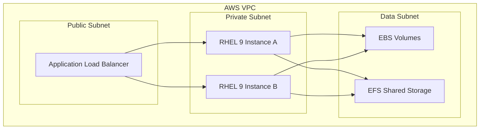

# How to Deploy RHEL 9 on AWS EC2 with Best Practices

Author: [nawazdhandala](https://www.github.com/nawazdhandala)

Tags: RHEL, AWS, EC2, Cloud, Linux

Description: Deploy RHEL 9 on AWS EC2 following best practices for instance selection, storage, networking, and security configuration.

---

Running RHEL 9 on AWS EC2 is a common deployment pattern for enterprise workloads. This guide covers best practices from selecting the right instance type to configuring storage, networking, and security for a production-ready deployment.

## Deployment Architecture



## Step 1: Select the Right AMI

```bash
# Find the official Red Hat RHEL 9 AMI using AWS CLI
aws ec2 describe-images \
  --owners 309956199498 \
  --filters "Name=name,Values=RHEL-9.*_HVM-*-x86_64-*-Hourly2-GP3" \
  --query 'Images | sort_by(@, &CreationDate) | [-1].[ImageId,Name]' \
  --output table

# Or use the Gold Image (requires RHEL subscription through RHUI)
aws ec2 describe-images \
  --owners 309956199498 \
  --filters "Name=name,Values=RHEL-9.*_HVM-*-x86_64-*-Access2-GP3" \
  --query 'Images | sort_by(@, &CreationDate) | [-1].[ImageId,Name]' \
  --output table
```

## Step 2: Launch the Instance

```bash
# Create a key pair for SSH access
aws ec2 create-key-pair --key-name rhel9-key --query 'KeyMaterial' \
  --output text > rhel9-key.pem
chmod 400 rhel9-key.pem

# Launch a RHEL 9 instance with best practice settings
aws ec2 run-instances \
  --image-id ami-0abcdef1234567890 \
  --instance-type m6i.xlarge \
  --key-name rhel9-key \
  --subnet-id subnet-0123456789abcdef0 \
  --security-group-ids sg-0123456789abcdef0 \
  --block-device-mappings '[
    {
      "DeviceName": "/dev/sda1",
      "Ebs": {
        "VolumeSize": 50,
        "VolumeType": "gp3",
        "Iops": 3000,
        "Throughput": 125,
        "Encrypted": true,
        "DeleteOnTermination": true
      }
    }
  ]' \
  --metadata-options "HttpTokens=required,HttpPutResponseHopLimit=1" \
  --tag-specifications 'ResourceType=instance,Tags=[{Key=Name,Value=rhel9-prod}]'
```

## Step 3: Configure the Instance After Launch

```bash
# SSH into the instance
ssh -i rhel9-key.pem ec2-user@<public-ip>

# Update all packages
sudo dnf update -y

# Install useful AWS tools
sudo dnf install -y awscli2

# Configure the timezone
sudo timedatectl set-timezone America/New_York

# Enable automatic security updates
sudo dnf install -y dnf-automatic
sudo sed -i 's/apply_updates = no/apply_updates = yes/' /etc/dnf/automatic.conf
sudo systemctl enable --now dnf-automatic-install.timer
```

## Step 4: Configure EBS Storage Best Practices

```bash
# Attach and mount additional EBS volumes for data
# After attaching via AWS Console or CLI:

# Create a filesystem on the data volume
sudo mkfs.xfs /dev/nvme1n1

# Create mount point and mount
sudo mkdir -p /data
echo '/dev/nvme1n1 /data xfs defaults,noatime 0 0' | sudo tee -a /etc/fstab
sudo mount -a

# Verify the mount
df -hT /data
```

## Step 5: Configure Security

```bash
# Ensure IMDSv2 is required (blocks SSRF attacks)
aws ec2 modify-instance-metadata-options \
  --instance-id i-0123456789abcdef0 \
  --http-tokens required \
  --http-put-response-hop-limit 1

# Configure firewalld (EC2 security groups are the first layer)
sudo systemctl enable --now firewalld
sudo firewall-cmd --permanent --add-service=ssh
sudo firewall-cmd --permanent --add-service=https
sudo firewall-cmd --reload

# Harden SSH configuration
sudo sed -i 's/#PermitRootLogin yes/PermitRootLogin no/' /etc/ssh/sshd_config
sudo sed -i 's/#PasswordAuthentication yes/PasswordAuthentication no/' /etc/ssh/sshd_config
sudo systemctl restart sshd
```

## Step 6: Set Up CloudWatch Monitoring

```bash
# Install the CloudWatch agent
sudo dnf install -y amazon-cloudwatch-agent

# Create the CloudWatch agent configuration
sudo tee /opt/aws/amazon-cloudwatch-agent/etc/config.json > /dev/null <<'CWCONFIG'
{
  "metrics": {
    "namespace": "RHEL9/Custom",
    "metrics_collected": {
      "disk": {
        "measurement": ["used_percent"],
        "resources": ["*"]
      },
      "mem": {
        "measurement": ["mem_used_percent"]
      },
      "cpu": {
        "measurement": ["cpu_usage_active"]
      }
    }
  },
  "logs": {
    "logs_collected": {
      "files": {
        "collect_list": [
          {
            "file_path": "/var/log/messages",
            "log_group_name": "rhel9-system-logs",
            "log_stream_name": "{instance_id}"
          }
        ]
      }
    }
  }
}
CWCONFIG

# Start the CloudWatch agent
sudo /opt/aws/amazon-cloudwatch-agent/bin/amazon-cloudwatch-agent-ctl \
  -a fetch-config -m ec2 \
  -c file:/opt/aws/amazon-cloudwatch-agent/etc/config.json -s
```

## Conclusion

Deploying RHEL 9 on AWS EC2 with best practices means using the official AMI, enforcing IMDSv2, encrypting EBS volumes, configuring security at both the OS and AWS levels, and setting up monitoring. These foundations ensure your RHEL instances are secure, observable, and ready for production workloads.
