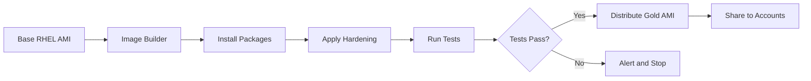

# How to Deploy RHEL Gold Images on AWS with AMI Builder

Author: [nawazdhandala](https://www.github.com/nawazdhandala)

Tags: RHEL, AWS, AMI, EC2 Image Builder, Gold Image, Linux

Description: Create hardened RHEL gold images using EC2 Image Builder for standardized, secure deployments across your AWS environment.

---

Gold images are pre-configured, hardened base images that serve as the standard for all deployments. AWS EC2 Image Builder automates the creation, testing, and distribution of RHEL gold AMIs. This guide walks through setting up an automated image pipeline.

## Image Build Pipeline



## Step 1: Create an Image Builder Component

```bash
# Create a component that installs standard packages
cat <<'COMPONENT' > rhel9-base-component.yaml
name: RHEL9-Base-Config
description: Base configuration for RHEL gold image
schemaVersion: 1.0
phases:
  - name: build
    steps:
      - name: UpdateSystem
        action: ExecuteBash
        inputs:
          commands:
            - dnf update -y

      - name: InstallPackages
        action: ExecuteBash
        inputs:
          commands:
            - dnf install -y vim git tmux htop firewalld aide
            - dnf install -y dnf-automatic amazon-cloudwatch-agent

      - name: HardenSSH
        action: ExecuteBash
        inputs:
          commands:
            - sed -i 's/#PermitRootLogin yes/PermitRootLogin no/' /etc/ssh/sshd_config
            - sed -i 's/#PasswordAuthentication yes/PasswordAuthentication no/' /etc/ssh/sshd_config
            - sed -i 's/#MaxAuthTries 6/MaxAuthTries 3/' /etc/ssh/sshd_config

      - name: ConfigureFirewall
        action: ExecuteBash
        inputs:
          commands:
            - systemctl enable firewalld
            - firewall-offline-cmd --add-service=ssh

      - name: ConfigureSysctl
        action: ExecuteBash
        inputs:
          commands:
            - |
              cat > /etc/sysctl.d/99-hardening.conf << 'SYSCTL'
              net.ipv4.conf.all.send_redirects = 0
              net.ipv4.conf.default.send_redirects = 0
              net.ipv4.conf.all.accept_redirects = 0
              net.ipv4.conf.default.accept_redirects = 0
              net.ipv4.icmp_ignore_bogus_error_responses = 1
              kernel.randomize_va_space = 2
              SYSCTL

      - name: EnableAudit
        action: ExecuteBash
        inputs:
          commands:
            - systemctl enable auditd

  - name: validate
    steps:
      - name: ValidateSSH
        action: ExecuteBash
        inputs:
          commands:
            - grep "PermitRootLogin no" /etc/ssh/sshd_config
            - grep "PasswordAuthentication no" /etc/ssh/sshd_config

      - name: ValidatePackages
        action: ExecuteBash
        inputs:
          commands:
            - rpm -q firewalld aide amazon-cloudwatch-agent
COMPONENT

# Upload the component
aws imagebuilder create-component \
  --name "RHEL9-Base-Config" \
  --semantic-version "1.0.0" \
  --platform Linux \
  --data "$(cat rhel9-base-component.yaml)"
```

## Step 2: Create an Image Recipe

```bash
# Create the image recipe
aws imagebuilder create-image-recipe \
  --name "RHEL9-Gold-Image" \
  --semantic-version "1.0.0" \
  --parent-image "arn:aws:imagebuilder:us-east-1:aws:image/red-hat-enterprise-linux-9-x86/x.x.x" \
  --components '[
    {"componentArn": "arn:aws:imagebuilder:us-east-1:ACCOUNT:component/rhel9-base-config/1.0.0"},
    {"componentArn": "arn:aws:imagebuilder:us-east-1:aws:component/amazon-cloudwatch-agent-linux/x.x.x"}
  ]' \
  --block-device-mappings '[
    {
      "deviceName": "/dev/sda1",
      "ebs": {
        "volumeSize": 50,
        "volumeType": "gp3",
        "encrypted": true
      }
    }
  ]'
```

## Step 3: Create the Image Pipeline

```bash
# Create an infrastructure configuration
aws imagebuilder create-infrastructure-configuration \
  --name "RHEL9-Build-Infra" \
  --instance-profile-name EC2ImageBuilderRole \
  --instance-types m6i.large \
  --terminate-instance-on-failure true

# Create a distribution configuration
aws imagebuilder create-distribution-configuration \
  --name "RHEL9-Distribution" \
  --distributions '[{
    "region": "us-east-1",
    "amiDistributionConfiguration": {
      "name": "rhel9-gold-{{imagebuilder:buildDate}}",
      "launchPermission": {
        "organizationArns": ["arn:aws:organizations::ACCOUNT:organization/o-xxx"]
      }
    }
  }]'

# Create the pipeline
aws imagebuilder create-image-pipeline \
  --name "RHEL9-Gold-Pipeline" \
  --image-recipe-arn "arn:aws:imagebuilder:us-east-1:ACCOUNT:image-recipe/rhel9-gold-image/1.0.0" \
  --infrastructure-configuration-arn "arn:aws:imagebuilder:..." \
  --distribution-configuration-arn "arn:aws:imagebuilder:..." \
  --schedule '{"scheduleExpression":"cron(0 0 1 * ? *)","pipelineExecutionStartCondition":"EXPRESSION_MATCH_ONLY"}'
```

## Step 4: Run the Pipeline

```bash
# Manually trigger a build
aws imagebuilder start-image-pipeline-execution \
  --image-pipeline-arn "arn:aws:imagebuilder:us-east-1:ACCOUNT:image-pipeline/rhel9-gold-pipeline"

# Check the build status
aws imagebuilder list-image-pipeline-images \
  --image-pipeline-arn "arn:aws:imagebuilder:..." \
  --query 'imageSummaryList[0].{State:state.status,AMI:outputResources.amis[0].image}'
```

## Conclusion

EC2 Image Builder automates the creation of hardened RHEL gold images, ensuring every instance in your AWS environment starts from a consistent, secure baseline. Schedule monthly builds to include the latest patches, and distribute the AMIs across your AWS organization automatically.
