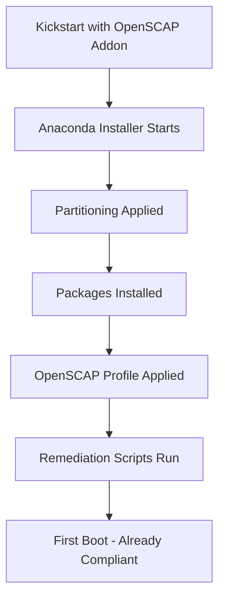

# How to Deploy SCAP-Compliant RHEL Systems with Kickstart

Author: [nawazdhandala](https://www.github.com/nawazdhandala)

Tags: RHEL, SCAP, Kickstart, Compliance, Linux

Description: Deploy RHEL systems that are SCAP-compliant from the first boot using Kickstart automation with the OpenSCAP Anaconda addon.

---

The best time to apply security compliance is during installation. The RHEL installer includes an OpenSCAP addon for Anaconda that can apply a complete security profile during the installation process. This means your server is compliant before it even boots for the first time, no post-installation hardening needed.

## How the OpenSCAP Anaconda Addon Works

The Anaconda installer can evaluate SCAP content during installation and apply remediation as part of the setup process:



## Basic SCAP Kickstart Configuration

Add the OpenSCAP addon to your Kickstart file:

```bash
# The OpenSCAP addon section in Kickstart
%addon org_fedora_oscap
  content-type = scap-security-guide
  profile = xccdf_org.ssgproject.content_profile_stig
%end
```

This is all you need to apply the STIG profile during installation. The addon uses the scap-security-guide content that ships on the installation media.

## Complete Kickstart File with SCAP Compliance

```bash
# RHEL SCAP-Compliant Kickstart
text
lang en_US.UTF-8
keyboard us
timezone America/New_York --utc

# Network
network --bootproto=dhcp --device=link --activate --hostname=scap-server

# Authentication
rootpw --iscrypted $6$randomsalt$hashedpasswordhere
user --name=sysadmin --groups=wheel --iscrypted --password=$6$salt$hash

# Partitioning (SCAP profiles require separate partitions)
clearpart --all --initlabel
part /boot/efi --fstype=efi --size=600
part /boot --fstype=xfs --size=1024
part pv.01 --size=1 --grow

volgroup rhel pv.01
logvol / --vgname=rhel --fstype=xfs --size=20480 --name=root
logvol /tmp --vgname=rhel --fstype=xfs --size=5120 --name=tmp --fsoptions="nodev,nosuid,noexec"
logvol /var --vgname=rhel --fstype=xfs --size=15360 --name=var --fsoptions="nodev,nosuid"
logvol /var/log --vgname=rhel --fstype=xfs --size=10240 --name=var_log --fsoptions="nodev,nosuid,noexec"
logvol /var/log/audit --vgname=rhel --fstype=xfs --size=5120 --name=var_log_audit --fsoptions="nodev,nosuid,noexec"
logvol /var/tmp --vgname=rhel --fstype=xfs --size=5120 --name=var_tmp --fsoptions="nodev,nosuid,noexec"
logvol /home --vgname=rhel --fstype=xfs --size=10240 --name=home --fsoptions="nodev,nosuid"
logvol swap --vgname=rhel --fstype=swap --size=4096 --name=swap

# SELinux
selinux --enforcing

# Firewall
firewall --enabled --ssh

# Packages
%packages
@^minimal-environment
openscap-scanner
scap-security-guide
aide
audit
rsyslog
chrony
%end

# Apply SCAP profile during installation
%addon org_fedora_oscap
  content-type = scap-security-guide
  profile = xccdf_org.ssgproject.content_profile_stig
%end

# Post-installation tasks
%post --log=/root/ks-post.log
# Initialize AIDE database
aide --init
mv /var/lib/aide/aide.db.new.gz /var/lib/aide/aide.db.gz

# Run a compliance scan as verification
mkdir -p /var/log/compliance
oscap xccdf eval \
  --profile xccdf_org.ssgproject.content_profile_stig \
  --results /var/log/compliance/initial-scan.xml \
  --report /var/log/compliance/initial-scan.html \
  /usr/share/xml/scap/ssg/content/ssg-rhel9-ds.xml || true
%end

reboot
```

## Use Different SCAP Profiles

Change the profile line in the addon section to use different compliance frameworks:

```bash
# CIS Level 1 Server
%addon org_fedora_oscap
  content-type = scap-security-guide
  profile = xccdf_org.ssgproject.content_profile_cis_server_l1
%end

# CIS Level 2 Server
%addon org_fedora_oscap
  content-type = scap-security-guide
  profile = xccdf_org.ssgproject.content_profile_cis
%end

# PCI-DSS
%addon org_fedora_oscap
  content-type = scap-security-guide
  profile = xccdf_org.ssgproject.content_profile_pci-dss
%end

# OSPP (NIST 800-53)
%addon org_fedora_oscap
  content-type = scap-security-guide
  profile = xccdf_org.ssgproject.content_profile_ospp
%end
```

## Use Custom SCAP Content

If you have custom or tailored SCAP content:

```bash
# Reference custom content from a URL
%addon org_fedora_oscap
  content-type = datastream
  content-url = http://buildserver.example.com/scap/custom-rhel9-ds.xml
  profile = xccdf_org.ssgproject.content_profile_stig_customized
  tailoring-path = /usr/share/xml/tailoring/custom-tailoring.xml
%end
```

## Use the SSG Kickstart Templates

The scap-security-guide includes pre-built Kickstart files:

```bash
# Install SSG on your build server to access templates
dnf install -y scap-security-guide

# List available Kickstart templates
ls /usr/share/scap-security-guide/kickstart/

# Available templates include:
# ssg-rhel9-stig-ks.cfg
# ssg-rhel9-cis_server_l1-ks.cfg
# ssg-rhel9-cis-ks.cfg
# ssg-rhel9-ospp-ks.cfg
# ssg-rhel9-pci-dss-ks.cfg

# Use one as a starting point
cp /usr/share/scap-security-guide/kickstart/ssg-rhel9-stig-ks.cfg \
  /var/www/html/ks/rhel9-stig.cfg
```

## Validate the Kickstart File

```bash
# Validate syntax
dnf install -y pykickstart
ksvalidator /var/www/html/ks/rhel9-stig.cfg
```

## Serve the Kickstart File

```bash
# Via HTTP
dnf install -y httpd
systemctl enable --now httpd
cp /var/www/html/ks/rhel9-stig.cfg /var/www/html/ks/

# Boot a server with:
# inst.ks=http://buildserver.example.com/ks/rhel9-stig.cfg
```

## Verify After Installation

```bash
# Check the initial compliance scan results
cat /var/log/compliance/initial-scan.xml | grep -c 'result="pass"'
cat /var/log/compliance/initial-scan.xml | grep -c 'result="fail"'

# Run a fresh scan to double-check
oscap xccdf eval \
  --profile xccdf_org.ssgproject.content_profile_stig \
  --results /tmp/verify.xml \
  --report /tmp/verify.html \
  /usr/share/xml/scap/ssg/content/ssg-rhel9-ds.xml || true
```

## Troubleshooting

### Installation fails with SCAP addon

```bash
# Check the Anaconda log on the installed system
cat /var/log/anaconda/ks-script-*.log

# If the addon fails, the installation may still complete
# but without the SCAP profile applied
# Check /root/ks-post.log for post-installation issues
```

### Partitioning conflicts

Some SCAP profiles require specific partition layouts. If your Kickstart partitioning does not match what the profile expects, the addon may report failures. Always check the profile's requirements before building your partition scheme.

Deploying SCAP-compliant systems with Kickstart is the gold standard for secure server provisioning. Every server gets identical hardening, there is no human error in the process, and you have audit evidence from the initial scan built right into the deployment. Set it up once, test it thoroughly, and use it for every new server.
