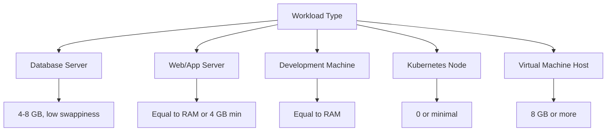
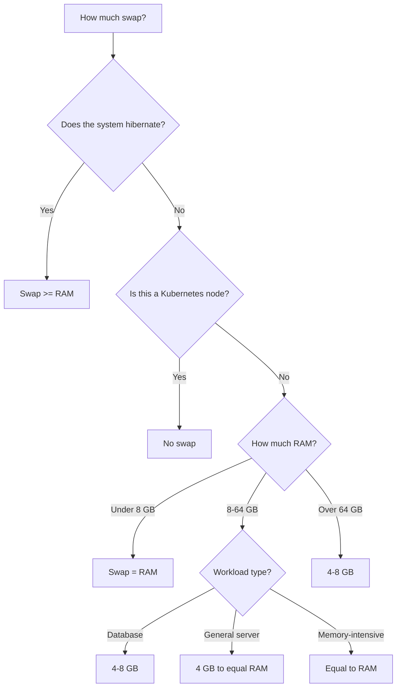

# How to Determine the Right Swap Size for Your RHEL 9 System

Author: [nawazdhandala](https://www.github.com/nawazdhandala)

Tags: RHEL, Swap, Sizing, Memory, Linux

Description: A practical guide to determining the right swap size for RHEL 9 systems based on workload, RAM, and use case.

---

The "how much swap do I need?" question has been debated since the early days of Unix. The old rule of "twice your RAM" made sense when systems had 64 MB of memory. With modern systems running 64 GB, 128 GB, or more, that rule is outdated. Here is how to think about swap sizing on RHEL 9 in a practical way.

## Red Hat's Official Recommendations

Red Hat provides specific guidance for RHEL 9:

| System RAM | Recommended Swap | If Hibernation Needed |
|-----------|-----------------|----------------------|
| 2 GB or less | 2x RAM | 3x RAM |
| 2-8 GB | Equal to RAM | 2x RAM |
| 8-64 GB | At least 4 GB | 1.5x RAM |
| More than 64 GB | At least 4 GB | Not recommended |

These are starting points, not hard rules. Your actual needs depend on what the system does.

## Factors That Affect Swap Sizing

### 1. Workload Type



### 2. Available RAM

The more RAM you have, the less swap matters for normal operation. A 256 GB database server rarely touches swap. But a 4 GB VM running a Java application might rely on swap heavily.

### 3. Overcommit Strategy

The kernel's `vm.overcommit_memory` setting affects how memory is allocated:

```bash
# Check current overcommit setting
sysctl vm.overcommit_memory
```

- `0` (default) - Heuristic overcommit. Kernel estimates if there is enough memory.
- `1` - Always overcommit. Never deny allocations.
- `2` - Strict overcommit. Total allocations limited to swap + (RAM * overcommit_ratio/100).

With strict overcommit (mode 2), swap size directly determines how much memory can be allocated:

```bash
# Check overcommit ratio
sysctl vm.overcommit_ratio
```

```bash
# Calculate commit limit with mode 2
# CommitLimit = Swap + (RAM * overcommit_ratio / 100)
grep CommitLimit /proc/meminfo
```

### 4. Hibernation Requirements

If the system needs to hibernate, swap must be large enough to hold the entire contents of RAM:

```bash
# Check how much RAM is in use
free -h | grep Mem
```

For hibernation, swap should be at least equal to RAM, plus some headroom for swap already in use at the time of hibernation.

## Sizing for Specific Scenarios

### Database Server (PostgreSQL, MySQL)

Databases have their own buffer pools and cache management. Large swap is counterproductive because swapping database pages means terrible query performance.

```
RAM: 64 GB
Recommended swap: 4-8 GB
vm.swappiness: 10
```

The swap here is a safety net, not a regular resource.

### Web Application Server

Web servers benefit from swap as a buffer during traffic spikes:

```
RAM: 16 GB
Recommended swap: 8-16 GB
vm.swappiness: 30
```

### Java Application Server

Java applications can have large heaps. If the JVM heap is set to 12 GB on a 16 GB system, swap provides room for everything else:

```
RAM: 16 GB
JVM Heap: 12 GB
Recommended swap: 8 GB
vm.swappiness: 10
```

### Build Server / CI Runner

Build processes can be bursty. They might use 2 GB most of the time but spike to 12 GB during large compilations:

```
RAM: 16 GB
Recommended swap: 8-16 GB
vm.swappiness: 60 (default is fine)
```

### Kubernetes Worker Node

Kubernetes historically required swap to be disabled. Newer versions support swap, but most clusters still run with swap off:

```
RAM: 32 GB
Recommended swap: 0 (disabled)
```

### Desktop / Workstation

For interactive use, you want enough swap to handle memory-heavy applications without killing your browser session:

```
RAM: 32 GB
Recommended swap: 8 GB
vm.swappiness: 30-40
```

## Analyzing Your Current Needs

### Check Historical Swap Usage

If the system is already running, look at how much swap it actually uses:

```bash
# Current swap usage
free -h

# Historical swap data (if sysstat is running)
sar -S | tail -20

# Peak swap usage from today
sar -S | awk 'NR>2 {print $5}' | sort -rn | head -1
```

### Estimate Based on Memory Pressure

```bash
# Check memory pressure
cat /proc/pressure/memory

# Check if OOM kills have happened
journalctl -k | grep -c "Out of memory"
```

If you see OOM kills or high memory pressure, you probably need more swap (or more RAM).

### Check Overcommit Status

```bash
# See how much memory is committed vs. available
grep -E "CommitLimit|Committed_AS" /proc/meminfo
```

If `Committed_AS` is near or exceeds `CommitLimit`, you are at risk of allocation failures.

## The Decision Flowchart



## Creating Swap Based on Your Decision

Once you have decided on a size, creating it is straightforward.

For an LVM-based swap:

```bash
# Create the swap volume (adjust size to your needs)
lvcreate -L 8G -n swap vg_system
mkswap /dev/vg_system/swap
echo "/dev/vg_system/swap  none  swap  defaults  0 0" >> /etc/fstab
swapon -a
```

For a swap file:

```bash
# Create a swap file (adjust count for desired size in MB)
dd if=/dev/zero of=/swapfile bs=1M count=8192 status=progress
chmod 600 /swapfile
mkswap /swapfile
echo "/swapfile  none  swap  defaults  0 0" >> /etc/fstab
swapon -a
```

## Summary

The right swap size depends on your workload, not a simple formula. For most RHEL 9 servers with 8-64 GB of RAM, 4-8 GB of swap is a reasonable starting point. Database servers need less swap but lower swappiness. Systems that hibernate need swap equal to RAM. Kubernetes nodes typically run without swap. Analyze your historical usage, check for OOM events, and size accordingly. You can always add more swap later using LVM or swap files without downtime.
