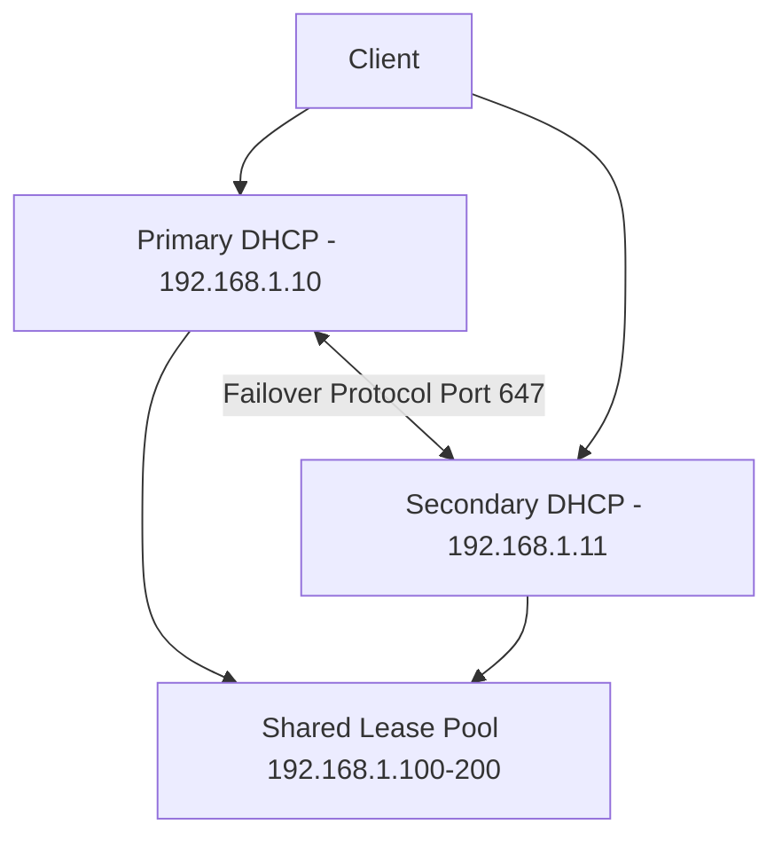

# How to Configure a DHCP Failover Pair for High Availability on RHEL

Author: [nawazdhandala](https://www.github.com/nawazdhandala)

Tags: RHEL, DHCP, Failover, High Availability, Linux

Description: Set up ISC DHCP failover on RHEL so two DHCP servers share the address pool and provide redundancy if one goes down.

---

A single DHCP server is a single point of failure. If it dies, no new devices can get IP addresses, and existing leases eventually expire. ISC DHCP supports a failover protocol where two servers share the address pool and keep their lease databases synchronized. If one goes down, the other takes over automatically.

## How DHCP Failover Works



The two servers communicate over TCP (default port 647) to synchronize lease state. The pool is split between them: the primary handles one portion, the secondary handles the other. If either server goes down, the surviving server can serve the entire pool after a configured delay (MCLT - Maximum Client Lead Time).

## Prerequisites

You need two RHEL servers with ISC DHCP installed:

On both servers:

```bash
dnf install dhcp-server -y
```

Make sure both servers can communicate on TCP port 647 and that the firewall allows it:

```bash
firewall-cmd --permanent --add-port=647/tcp
firewall-cmd --permanent --add-service=dhcp
firewall-cmd --reload
```

Ensure time is synchronized between both servers. Failover is sensitive to clock skew:

```bash
chronyc tracking
```

## Configuring the Primary Server

Edit `/etc/dhcp/dhcpd.conf` on the primary (192.168.1.10):

```bash
cat > /etc/dhcp/dhcpd.conf << 'EOF'
# Global options
option domain-name "example.com";
option domain-name-servers 192.168.1.10, 8.8.8.8;
default-lease-time 3600;
max-lease-time 7200;
authoritative;
log-facility local7;

# Failover configuration
failover peer "dhcp-failover" {
    primary;
    address 192.168.1.10;
    port 647;
    peer address 192.168.1.11;
    peer port 647;

    # Maximum Client Lead Time
    # How long the surviving server waits before taking full control
    max-response-delay 60;
    max-unacked-updates 10;
    mclt 3600;

    # How the pool is split between primary and secondary
    split 128;

    # Load balancing
    load balance max seconds 3;
}

# Subnet with failover
subnet 192.168.1.0 netmask 255.255.255.0 {
    option routers 192.168.1.1;
    option subnet-mask 255.255.255.0;
    option broadcast-address 192.168.1.255;

    pool {
        failover peer "dhcp-failover";
        range 192.168.1.100 192.168.1.200;
    }
}

# Reservations work with failover too
host printer {
    hardware ethernet aa:bb:cc:dd:ee:01;
    fixed-address 192.168.1.30;
}
EOF
```

## Configuring the Secondary Server

Edit `/etc/dhcp/dhcpd.conf` on the secondary (192.168.1.11):

```bash
cat > /etc/dhcp/dhcpd.conf << 'EOF'
# Global options - must match primary
option domain-name "example.com";
option domain-name-servers 192.168.1.10, 8.8.8.8;
default-lease-time 3600;
max-lease-time 7200;
authoritative;
log-facility local7;

# Failover configuration
failover peer "dhcp-failover" {
    secondary;
    address 192.168.1.11;
    port 647;
    peer address 192.168.1.10;
    peer port 647;

    max-response-delay 60;
    max-unacked-updates 10;
    load balance max seconds 3;
}

# Subnet with failover - must match primary
subnet 192.168.1.0 netmask 255.255.255.0 {
    option routers 192.168.1.1;
    option subnet-mask 255.255.255.0;
    option broadcast-address 192.168.1.255;

    pool {
        failover peer "dhcp-failover";
        range 192.168.1.100 192.168.1.200;
    }
}

# Same reservations on both servers
host printer {
    hardware ethernet aa:bb:cc:dd:ee:01;
    fixed-address 192.168.1.30;
}
EOF
```

Note: The secondary does NOT have `mclt` or `split` parameters. Those are primary-only settings.

## Key Failover Parameters

| Parameter | Description |
|-----------|-------------|
| `mclt` | Maximum Client Lead Time - how long the partner can extend a lease beyond what the other server knows about. Only set on primary. |
| `split` | How the pool is divided. 128 = 50/50 split. 256 = primary gets all. 0 = secondary gets all. Only set on primary. |
| `max-response-delay` | How many seconds to wait for a response from the peer before declaring it down. |
| `max-unacked-updates` | How many lease updates can be pending before waiting for acknowledgment. |
| `load balance max seconds` | Seconds of transaction ID hash to use for load balancing. |

## Starting the Failover Pair

Start the primary first:

```bash
# On primary
dhcpd -t -cf /etc/dhcp/dhcpd.conf
systemctl enable --now dhcpd
```

Then start the secondary:

```bash
# On secondary
dhcpd -t -cf /etc/dhcp/dhcpd.conf
systemctl enable --now dhcpd
```

## Verifying Failover Status

Check the logs on both servers:

```bash
journalctl -u dhcpd --no-pager -n 30
```

You should see messages about the failover peer establishing communication and synchronizing.

Look for messages like:
```bash
peer dhcp-failover: I move from recover to startup
peer dhcp-failover: I move from startup to normal
```

"Normal" state means both servers are running and synchronized.

## Testing Failover

1. Connect a client and verify it gets an IP from the pool.

2. Stop the primary server:

```bash
# On primary
systemctl stop dhcpd
```

3. On the client, release and renew:

```bash
dhclient -r eth0 && dhclient eth0
```

4. The client should still get an IP from the secondary server. Check the secondary's logs:

```bash
journalctl -u dhcpd --no-pager -n 10
```

5. Bring the primary back:

```bash
# On primary
systemctl start dhcpd
```

6. Watch the logs on both servers. They should resynchronize their lease databases.

## Handling Multiple Subnets

Each subnet's pool needs its own failover reference:

```bash
subnet 10.10.10.0 netmask 255.255.255.0 {
    option routers 10.10.10.1;

    pool {
        failover peer "dhcp-failover";
        range 10.10.10.50 10.10.10.200;
    }
}
```

All pools reference the same failover peer. You only define one failover peer per server pair.

## Troubleshooting

**"peer holds all free leases"** - This happens when the servers haven't fully synchronized. Wait for the MCLT period to pass, or restart both servers with the primary starting first.

**Failover state stuck in "recover"** - The servers are trying to synchronize. This can take up to MCLT seconds. Check network connectivity between the servers.

**Connection refused on port 647** - Check the firewall on both servers:

```bash
firewall-cmd --list-ports | grep 647
```

**Clock skew warnings** - Synchronize time on both servers:

```bash
chronyc sources
chronyc tracking
```

**Different configuration between servers** - The subnet declarations, pool ranges, and DHCP options must match exactly on both servers. The only differences should be in the failover block (primary vs secondary, address vs peer address).

DHCP failover is one of those things that runs silently in the background until you need it. When a server does go down, you'll be glad you set it up. The initial configuration is a bit fiddly, but once it's running, it requires minimal maintenance.
