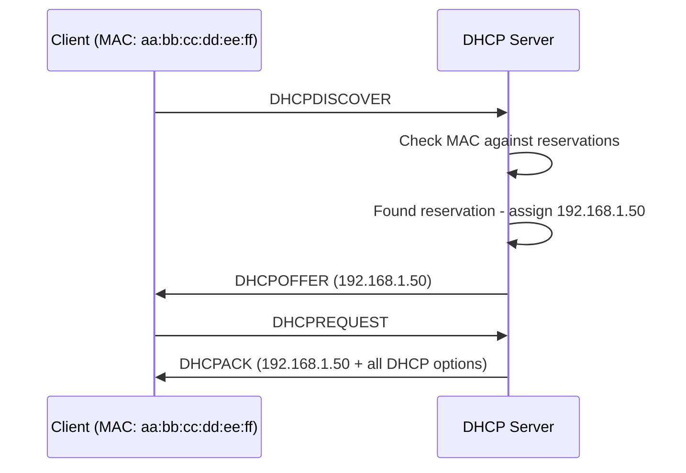

# How to Set Up DHCP Reservations and Static Leases on RHEL

Author: [nawazdhandala](https://www.github.com/nawazdhandala)

Tags: RHEL, DHCP, Static Leases, Linux

Description: Configure DHCP reservations on RHEL to assign consistent IP addresses to specific devices based on their MAC address while still using DHCP for all other settings.

---

DHCP is great for handing out IPs automatically, but some devices need a consistent address. Printers, servers, network gear, monitoring systems - these all work better with a predictable IP. You could configure them statically, but then you lose the benefits of centralized DHCP management (DNS servers, gateways, lease tracking). DHCP reservations give you the best of both worlds: a fixed IP managed through DHCP.

## How Reservations Work



The server matches the client's MAC address to a host declaration and always assigns the same IP. The client still gets all the standard DHCP options (DNS, gateway, NTP, etc.).

## Finding MAC Addresses

Before creating reservations, you need the MAC addresses. On the device itself:

```bash
ip link show
```

Or check the current DHCP leases on your server:

```bash
cat /var/lib/dhcpd/dhcpd.leases
```

From the network (if you have access to the switch):

```bash
# On the DHCP server, check the ARP table
ip neigh show
```

## Creating Reservations

Add host declarations to your dhcpd.conf. Each reservation ties a MAC address to a fixed IP:

```bash
cat >> /etc/dhcp/dhcpd.conf << 'EOF'

# Printer - always gets the same IP
host printer-office {
    hardware ethernet aa:bb:cc:dd:ee:01;
    fixed-address 192.168.1.30;
    option host-name "printer-office";
}

# NAS device
host nas-storage {
    hardware ethernet aa:bb:cc:dd:ee:02;
    fixed-address 192.168.1.40;
    option host-name "nas-storage";
}

# Developer workstation
host dev-workstation-1 {
    hardware ethernet aa:bb:cc:dd:ee:03;
    fixed-address 192.168.1.50;
    option host-name "dev-ws-1";
}

# IP phone
host phone-reception {
    hardware ethernet aa:bb:cc:dd:ee:04;
    fixed-address 192.168.1.60;
    option host-name "phone-reception";
}

# Monitoring server
host monitoring {
    hardware ethernet aa:bb:cc:dd:ee:05;
    fixed-address 192.168.1.15;
    option host-name "monitoring";
}
EOF
```

## Reservations Inside vs Outside the DHCP Range

You have two choices for where to place reserved IPs:

**Inside the DHCP range:** The reserved IP is within the range (e.g., range is 192.168.1.100-200 and reservation is 192.168.1.150). The server will skip that IP for other clients.

**Outside the DHCP range:** The reserved IP is outside the range (e.g., range is 192.168.1.100-200 and reservation is 192.168.1.30). This is the cleaner approach, as it clearly separates reserved and dynamic addresses.

A typical layout:

```
192.168.1.1-49     = Reserved IPs (via DHCP reservations)
192.168.1.50-99    = Statically configured devices (no DHCP)
192.168.1.100-200  = Dynamic DHCP pool
192.168.1.201-254  = Network infrastructure
```

## Per-Host Options

You can set different DHCP options for specific hosts:

```bash
host special-server {
    hardware ethernet aa:bb:cc:dd:ee:10;
    fixed-address 192.168.1.25;

    # Different DNS for this host
    option domain-name-servers 10.0.0.53;

    # Different domain
    option domain-name "special.example.com";

    # PXE boot settings for this host
    next-server 192.168.1.10;
    filename "special-pxelinux.0";
}
```

## Group Declarations

If multiple hosts share the same options, use a group:

```bash
group {
    # Common options for all servers
    option domain-name-servers 10.0.0.53, 10.0.0.54;
    option domain-name "servers.example.com";
    default-lease-time 86400;

    host web-server {
        hardware ethernet aa:bb:cc:dd:ee:20;
        fixed-address 192.168.1.10;
    }

    host db-server {
        hardware ethernet aa:bb:cc:dd:ee:21;
        fixed-address 192.168.1.11;
    }

    host app-server {
        hardware ethernet aa:bb:cc:dd:ee:22;
        fixed-address 192.168.1.12;
    }
}
```

## A Complete Configuration Example

Here's a full dhcpd.conf with both dynamic and reserved addresses:

```bash
cat > /etc/dhcp/dhcpd.conf << 'EOF'
# Global options
option domain-name "example.com";
option domain-name-servers 192.168.1.10, 8.8.8.8;
default-lease-time 3600;
max-lease-time 7200;
authoritative;
log-facility local7;

# Main subnet
subnet 192.168.1.0 netmask 255.255.255.0 {
    # Dynamic range
    range 192.168.1.100 192.168.1.200;
    option routers 192.168.1.1;
    option subnet-mask 255.255.255.0;
    option broadcast-address 192.168.1.255;
}

# Infrastructure reservations
group {
    option domain-name "infra.example.com";

    host switch-core {
        hardware ethernet 00:1a:2b:3c:4d:01;
        fixed-address 192.168.1.2;
    }

    host ap-floor1 {
        hardware ethernet 00:1a:2b:3c:4d:02;
        fixed-address 192.168.1.3;
    }

    host ap-floor2 {
        hardware ethernet 00:1a:2b:3c:4d:03;
        fixed-address 192.168.1.4;
    }
}

# Server reservations
group {
    default-lease-time 86400;
    max-lease-time 172800;

    host web-01 {
        hardware ethernet 00:50:56:aa:bb:01;
        fixed-address 192.168.1.20;
    }

    host db-01 {
        hardware ethernet 00:50:56:aa:bb:02;
        fixed-address 192.168.1.21;
    }
}

# User device reservations
host boss-laptop {
    hardware ethernet ac:de:48:00:11:22;
    fixed-address 192.168.1.50;
}
EOF
```

## Applying Changes

Validate and restart:

```bash
dhcpd -t -cf /etc/dhcp/dhcpd.conf
systemctl restart dhcpd
```

## Verifying Reservations

Have the device renew its lease:

```bash
# On the client
dhclient -r eth0 && dhclient eth0
```

Check the lease file on the server:

```bash
grep -A 10 "aa:bb:cc:dd:ee:01" /var/lib/dhcpd/dhcpd.leases
```

The device should consistently get its reserved IP.

## Troubleshooting

**Client gets a different IP than expected:** Make sure the MAC address in the reservation matches exactly. MAC addresses are case-insensitive but must include colons.

**"No free leases" error for reserved hosts:** If the reserved IP falls within the dynamic range and the range is full, the server might not be able to assign it. Keep reservations outside the dynamic range.

**Changes not taking effect:** Some clients hold onto their old lease. Force a release and renew on the client, or wait for the current lease to expire.

DHCP reservations are simple to set up and eliminate the headache of managing static IPs across dozens or hundreds of devices. Keep your reservation list well-documented (comments in dhcpd.conf work great for this), and you'll always know which device has which IP.
