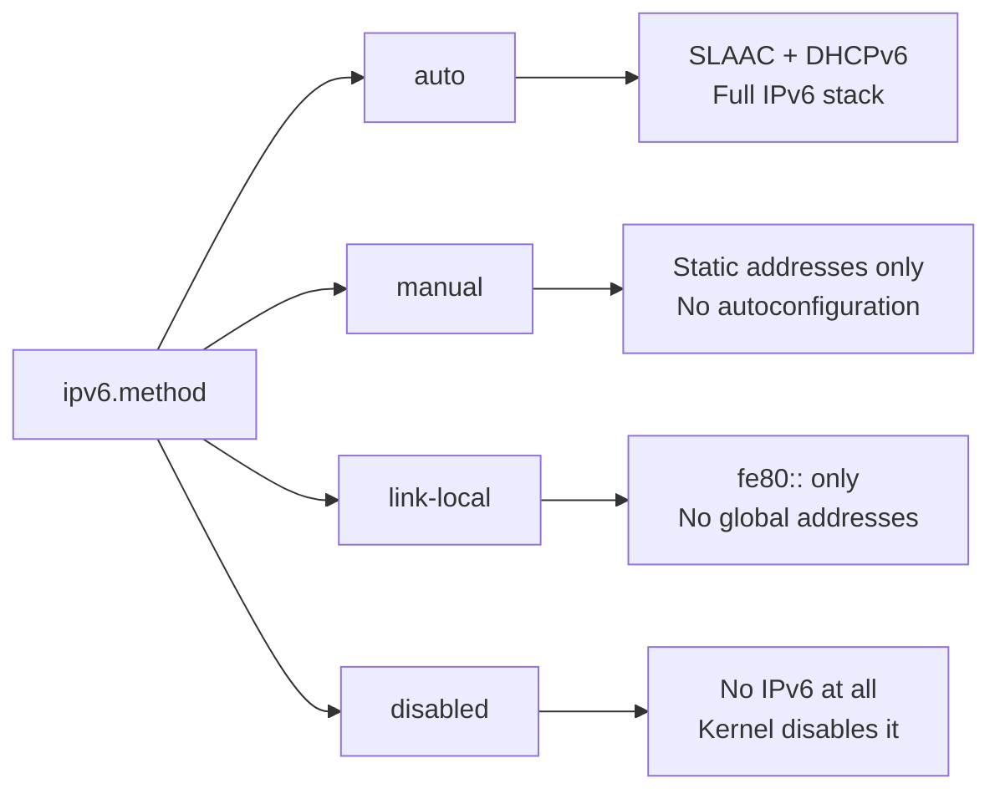

# How to Disable IPv6 on Specific Interfaces Using NetworkManager on RHEL 9

Author: [nawazdhandala](https://www.github.com/nawazdhandala)

Tags: RHEL, IPv6, NetworkManager, Linux

Description: Step-by-step instructions for selectively disabling IPv6 on specific network interfaces through NetworkManager on RHEL 9, while keeping it active on others.

---

There are legitimate reasons to disable IPv6 on certain interfaces. Maybe you have an internal management network that is IPv4-only, or a legacy application that gets confused by IPv6 addresses. The key is doing it selectively per interface rather than killing IPv6 system-wide, which would break things like localhost resolution.

## Why Selective Instead of System-Wide

Disabling IPv6 globally with kernel parameters (`ipv6.disable=1`) is a heavy hammer. It breaks `::1` localhost, can cause issues with SELinux, and some services on RHEL 9 expect IPv6 to be available even if they don't actively use it. Disabling it per-interface through NetworkManager is the cleaner approach.

## Prerequisites

- RHEL 9 system with root or sudo access
- NetworkManager running
- Identify which interfaces need IPv6 disabled

## Checking Current IPv6 State

First, see which interfaces have IPv6 addresses.

```bash
# Show IPv6 addresses on all interfaces
ip -6 addr show

# Check the IPv6 method for a specific connection
nmcli connection show "ens224" | grep ipv6.method
```

## Disabling IPv6 on a Specific Interface with nmcli

The cleanest way to disable IPv6 on a single interface is setting the method to `disabled`.

```bash
# Disable IPv6 on the ens224 interface
sudo nmcli connection modify "ens224" ipv6.method disabled

# Apply the change
sudo nmcli connection up "ens224"
```

That's it. The interface will no longer have any IPv6 addresses, including link-local.

## Verifying IPv6 Is Disabled

```bash
# Check that no IPv6 addresses remain on the interface
ip -6 addr show dev ens224

# The output should be empty (no IPv6 addresses listed)

# Confirm the setting stuck
nmcli connection show "ens224" | grep ipv6.method
# Should show: ipv6.method: disabled
```

## Disabling IPv6 on Multiple Interfaces

If you have several interfaces to change, script it.

```bash
# Disable IPv6 on a list of connections
for conn in "ens224" "ens256" "virbr0"; do
    sudo nmcli connection modify "$conn" ipv6.method disabled
    sudo nmcli connection up "$conn"
    echo "IPv6 disabled on $conn"
done
```

## Keeping Link-Local Only

Sometimes you don't want globally routable IPv6 but still need link-local for protocols like NDP. In that case, use `link-local` instead of `disabled`.

```bash
# Allow only link-local IPv6 (fe80:: addresses)
sudo nmcli connection modify "ens224" ipv6.method link-local

# Apply
sudo nmcli connection up "ens224"

# Verify - should show only an fe80:: address
ip -6 addr show dev ens224
```

## Ignoring IPv6 Autoconfiguration

Another option is to keep IPv6 active but ignore Router Advertisements and DHCP. This is useful when routers on a network send unwanted RA messages.

```bash
# Set to manual but don't assign any address
sudo nmcli connection modify "ens224" ipv6.method ignore

# Apply
sudo nmcli connection up "ens224"
```

Note: The `ignore` method was available in older NetworkManager. On RHEL 9, you might need to use `disabled` instead, as `ignore` may behave differently depending on the NetworkManager version. Check your version with:

```bash
nmcli --version
```

## What Happens Under the Hood

When you set `ipv6.method disabled`, NetworkManager tells the kernel to disable IPv6 on that specific interface. You can verify this in the sysctl values:

```bash
# Check the per-interface sysctl setting
cat /proc/sys/net/ipv6/conf/ens224/disable_ipv6
# 1 means disabled, 0 means enabled
```

NetworkManager manages this automatically. You should not need to set sysctl values directly when using the `disabled` method.

## Interface Configuration Overview

Here is how different IPv6 methods behave on an interface:



## Re-enabling IPv6

If you need to turn IPv6 back on, just set the method back.

```bash
# Re-enable IPv6 with auto-configuration
sudo nmcli connection modify "ens224" ipv6.method auto

# Or re-enable with a static address
sudo nmcli connection modify "ens224" ipv6.method manual
sudo nmcli connection modify "ens224" ipv6.addresses "2001:db8:1::10/64"

# Apply
sudo nmcli connection up "ens224"

# Verify it's back
ip -6 addr show dev ens224
```

## Common Pitfalls

**Don't disable IPv6 on loopback.** The loopback interface (`lo`) needs `::1` for many services to function. NetworkManager doesn't manage loopback, so this should not be an issue, but don't try to force it with sysctl either.

**Don't disable IPv6 globally via GRUB.** Adding `ipv6.disable=1` to the kernel command line is tempting but causes problems. Services that bind to `::1` will fail, and SELinux may throw unexpected denials.

**Check your applications.** Some applications (like certain database replication setups) explicitly use IPv6 link-local addresses for node discovery. Disabling IPv6 on those interfaces will break them.

## Auditing IPv6 Status Across Interfaces

For a quick overview of all your interfaces:

```bash
# Show IPv6 method for all connections
nmcli -f NAME,IPV6.METHOD connection show

# Or check sysctl for all interfaces
sysctl -a 2>/dev/null | grep disable_ipv6
```

## Wrapping Up

Selectively disabling IPv6 per interface is the right way to handle IPv4-only network segments on RHEL 9. Use `nmcli connection modify` with `ipv6.method disabled` and you get clean, persistent, per-interface control. Stay away from kernel-level global disabling unless you have a very specific reason and fully understand the consequences.
