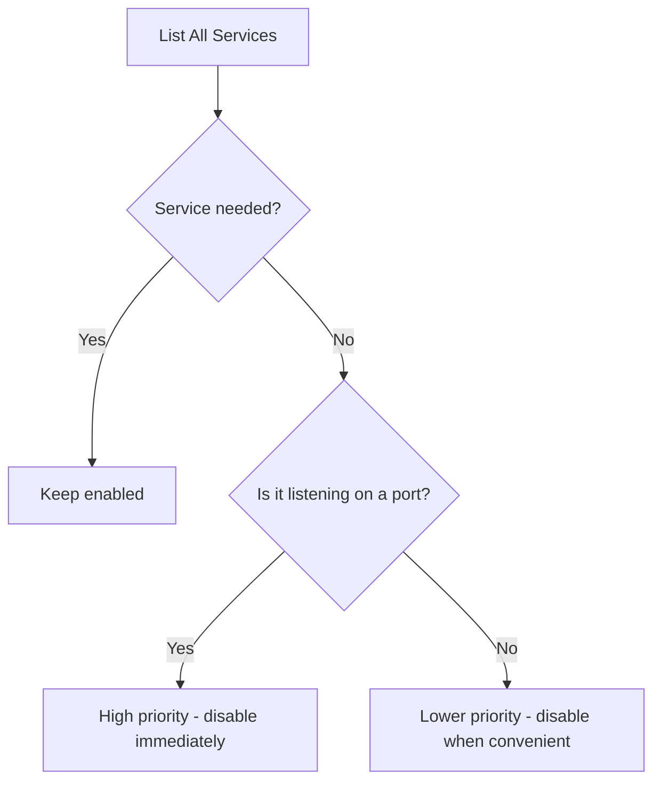

# How to Disable Unused Services and Daemons on RHEL 9 for Better Security

Author: [nawazdhandala](https://www.github.com/nawazdhandala)

Tags: RHEL, Security, Services, Hardening, Linux

Description: A practical guide to identifying and disabling unnecessary services and daemons on RHEL 9 to reduce the attack surface and improve system security.

---

Services that you do not need but leave running are open doors for attackers. Every listening daemon is a potential entry point, and every background process that runs with elevated privileges is an opportunity for exploitation. On RHEL 9, systemd makes it straightforward to audit and disable what you do not need.

## Audit Running Services

Before you disable anything, get a clear picture of what is currently running:

```bash
# List all enabled services
systemctl list-unit-files --state=enabled --type=service

# List all running services
systemctl list-units --type=service --state=running

# List all listening network sockets
ss -tlnp
```



## Services Commonly Disabled on Servers

### Network services you probably do not need

```bash
# Avahi - mDNS service discovery, unnecessary on servers
systemctl disable --now avahi-daemon.service
systemctl disable --now avahi-daemon.socket

# CUPS - printing service
systemctl disable --now cups.service
systemctl disable --now cups-browsed.service

# ModemManager - mobile broadband management
systemctl disable --now ModemManager.service

# Bluetooth
systemctl disable --now bluetooth.service
```

### Desktop and GUI services

```bash
# GNOME Display Manager (if GUI was accidentally installed)
systemctl disable --now gdm.service

# Accounts daemon
systemctl disable --now accounts-daemon.service

# Color management
systemctl disable --now colord.service

# Power management (desktop-oriented)
systemctl disable --now power-profiles-daemon.service
```

### Remote access services you may not need

```bash
# rpcbind - only needed for NFS and NIS
systemctl disable --now rpcbind.service
systemctl disable --now rpcbind.socket

# Cockpit - web-based management (disable if not used)
systemctl disable --now cockpit.socket
```

## Mask Services for Extra Protection

Disabling a service prevents it from starting at boot. Masking goes further by preventing it from being started manually or as a dependency:

```bash
# Mask services that should never run on this system
systemctl mask bluetooth.service
systemctl mask avahi-daemon.service
systemctl mask cups.service

# Verify a service is masked
systemctl is-enabled bluetooth.service
# Should output: masked
```

To undo masking later if needed:

```bash
# Unmask a service
systemctl unmask bluetooth.service
```

## Identify Services Listening on Ports

This is the most important check. Any service listening on a port is reachable over the network:

```bash
# Show all listening TCP sockets with process info
ss -tlnp

# Show all listening UDP sockets
ss -ulnp

# For each listening port, find the owning service
# Example: identify what is on port 111
ss -tlnp | grep :111
```

A well-hardened server should only have a handful of listening services, typically just SSH on port 22 and whatever application the server is meant to run.

## Disable Unnecessary Timers

Systemd timers are the modern replacement for cron jobs. Some default timers may not be needed:

```bash
# List all active timers
systemctl list-timers --all

# Disable timers you do not need
# Example: disable the man-db cache update timer
systemctl disable --now man-db-cache-update.timer
```

## Disable Unnecessary Socket Units

Socket-activated services start on demand when a connection arrives. If you do not need them, disable the socket:

```bash
# List all socket units
systemctl list-unit-files --type=socket

# Disable socket activation for unneeded services
systemctl disable --now rpcbind.socket
systemctl disable --now cockpit.socket
```

## Create a Baseline of Essential Services

For a typical RHEL 9 server, these are the services you generally want to keep:

```bash
# Essential services for most servers
# - sshd.service         (remote access)
# - firewalld.service    (firewall)
# - chronyd.service      (time synchronization)
# - rsyslog.service      (system logging)
# - auditd.service       (security auditing)
# - systemd-journald     (journal logging)
# - NetworkManager       (network configuration)
# - crond.service        (scheduled tasks)

# Verify these are enabled
for svc in sshd firewalld chronyd rsyslog auditd crond; do
    echo "$svc: $(systemctl is-enabled $svc.service 2>/dev/null)"
done
```

## Automate the Audit

Create a script that checks for unexpected services:

```bash
cat > /usr/local/bin/service-audit.sh << 'SCRIPT'
#!/bin/bash
# Audit enabled services against an approved list

APPROVED="auditd chronyd crond dbus-broker firewalld NetworkManager rsyslog sshd systemd-journald"

echo "=== Services enabled but not in approved list ==="
for svc in $(systemctl list-unit-files --state=enabled --type=service --no-legend | awk '{print $1}' | sed 's/.service//'); do
    if ! echo "$APPROVED" | grep -qw "$svc"; then
        echo "  REVIEW: $svc"
    fi
done

echo ""
echo "=== Unexpected listening ports ==="
ss -tlnp | grep -v -E ":(22|323) " | tail -n +2
SCRIPT
chmod +x /usr/local/bin/service-audit.sh
```

Run this script periodically or after any system changes to catch services that get enabled without your knowledge.

## Verify Your Changes

After disabling services, confirm the state:

```bash
# Reboot to verify nothing starts unexpectedly
# (do this during a maintenance window)
systemctl reboot

# After reboot, check again
systemctl list-units --type=service --state=running
ss -tlnp
```

## What Not to Disable

Be careful not to disable services that are critical for system operation:

- **systemd-journald** - System logging, required
- **dbus-broker or dbus-daemon** - Inter-process communication, required by many services
- **NetworkManager** - Network configuration (unless using network scripts)
- **systemd-udevd** - Device management, required
- **systemd-logind** - Login management, required for SSH

If you accidentally disable something critical, you can recover from the GRUB rescue menu or a rescue disk by remounting the filesystem and re-enabling the service.

Disabling unused services is one of those tasks that takes 15 minutes but meaningfully reduces your risk profile. Do it on every new server, document what you disabled and why, and periodically re-audit to make sure nothing has crept back in.
