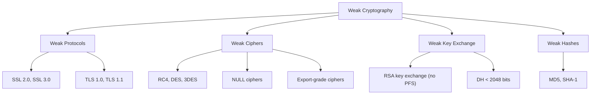

# How to Disable Weak TLS Versions and Ciphers with Crypto Policies on RHEL 9

Author: [nawazdhandala](https://www.github.com/nawazdhandala)

Tags: RHEL, Crypto Policies, TLS, Ciphers, Security Hardening, Linux

Description: Use RHEL 9 crypto policies to disable weak TLS versions and ciphers across all applications, ensuring only strong encryption is used system-wide.

---

Disabling weak TLS versions and cipher suites is a fundamental security hardening step. On RHEL 9, the system-wide crypto policy mechanism makes this easy by allowing you to control TLS settings for all applications from a single configuration. This guide shows you how to identify and disable weak cryptographic settings.

## Identifying Weak TLS Versions and Ciphers



## Checking Current TLS Configuration

### See What is Currently Allowed

```bash
# View current crypto policy
update-crypto-policies --show

# List all allowed TLS ciphers
openssl ciphers -v 2>/dev/null | column -t

# Count the number of allowed cipher suites
openssl ciphers -v 2>/dev/null | wc -l

# Check for specific weak ciphers
openssl ciphers -v 2>/dev/null | grep -iE "RC4|DES|3DES|NULL|EXPORT|MD5"
```

### Check SSH Configuration

```bash
# View allowed SSH ciphers
ssh -Q cipher

# View allowed SSH MACs
ssh -Q mac

# View allowed key exchange algorithms
ssh -Q kex

# Check the running sshd configuration
sudo sshd -T | grep -E "^ciphers|^macs|^kexalgorithms"
```

## Using the DEFAULT Policy

The RHEL 9 DEFAULT policy already disables many weak options:

```bash
# Check current policy
update-crypto-policies --show

# If not already on DEFAULT
sudo update-crypto-policies --set DEFAULT
```

DEFAULT disables:
- SSL 2.0, SSL 3.0
- TLS 1.0, TLS 1.1
- RC4, DES, 3DES
- NULL ciphers
- Export-grade ciphers
- RSA key exchange (no forward secrecy)
- DSA keys

## Going Further: Removing Additional Weak Options

### Disable CBC Mode Ciphers

CBC mode ciphers are vulnerable to padding oracle attacks:

```bash
sudo tee /etc/crypto-policies/policies/modules/NO-CBC.pmod << 'EOF'
# Disable CBC mode ciphers
cipher = -AES-256-CBC -AES-128-CBC -CAMELLIA-256-CBC -CAMELLIA-128-CBC
EOF

sudo update-crypto-policies --set DEFAULT:NO-CBC
```

### Disable SHA-1

```bash
sudo tee /etc/crypto-policies/policies/modules/NO-SHA1.pmod << 'EOF'
# Disable SHA-1 everywhere
hash = -SHA1
sign = -RSA-SHA1 -ECDSA-SHA1 -RSA-PSS-SHA1
mac = -HMAC-SHA1
EOF

sudo update-crypto-policies --set DEFAULT:NO-SHA1
```

### Disable 128-bit Ciphers (256-bit Only)

```bash
sudo tee /etc/crypto-policies/policies/modules/AES256-ONLY.pmod << 'EOF'
# Only allow 256-bit symmetric encryption
cipher = -AES-128-GCM -AES-128-CCM -AES-128-CBC -AES-128-CTR
EOF

sudo update-crypto-policies --set DEFAULT:AES256-ONLY
```

### Combined Hardening Module

```bash
sudo tee /etc/crypto-policies/policies/modules/HARDENED.pmod << 'EOF'
# Combined hardening module

# No CBC mode
cipher = -AES-256-CBC -AES-128-CBC -CAMELLIA-256-CBC -CAMELLIA-128-CBC

# No SHA-1
hash = -SHA1
sign = -RSA-SHA1 -ECDSA-SHA1 -RSA-PSS-SHA1
mac = -HMAC-SHA1 -UMAC-64

# Minimum 3072-bit keys
min_rsa_size = 3072
min_dh_size = 3072
EOF

sudo update-crypto-policies --set DEFAULT:HARDENED
```

## Verifying the Changes

After applying a policy change:

```bash
# Restart affected services
sudo systemctl restart sshd
sudo systemctl restart httpd 2>/dev/null
sudo systemctl restart nginx 2>/dev/null

# Verify TLS ciphers (should not show weak ones)
openssl ciphers -v 2>/dev/null | grep -iE "RC4|DES|3DES|NULL|CBC|SHA1"

# Test SSH ciphers
ssh -Q cipher | grep -i cbc
# Should return nothing if CBC is disabled

# Test a TLS connection
openssl s_client -connect localhost:443 < /dev/null 2>/dev/null | \
    grep -E "Protocol|Cipher"
```

## Scanning for Weak TLS on Your Systems

Create a script to scan your services for weak TLS:

```bash
#!/bin/bash
# /usr/local/bin/tls-strength-check.sh
# Check TLS configuration of local services

echo "=== TLS Strength Check ==="
echo "Date: $(date)"
echo "Policy: $(update-crypto-policies --show)"
echo ""

# Check local HTTPS
if ss -tlnp | grep -q ":443"; then
    echo "--- HTTPS (port 443) ---"
    openssl s_client -connect localhost:443 < /dev/null 2>/dev/null | \
        grep -E "Protocol|Cipher|Server public key"
    echo ""

    # Test for weak protocols
    for proto in ssl3 tls1 tls1_1; do
        result=$(openssl s_client -connect localhost:443 -$proto < /dev/null 2>&1)
        if echo "$result" | grep -q "BEGIN CERTIFICATE"; then
            echo "WARNING: $proto is supported (should be disabled)"
        else
            echo "OK: $proto is disabled"
        fi
    done
fi

echo ""
echo "--- SSH ---"
sudo sshd -T 2>/dev/null | grep -E "^ciphers|^macs|^kexalgorithms"

echo ""
echo "--- Allowed OpenSSL Ciphers ---"
openssl ciphers -v 2>/dev/null | wc -l
echo "cipher suites available"

echo ""
echo "--- Checking for weak ciphers ---"
WEAK=$(openssl ciphers -v 2>/dev/null | grep -iE "RC4|DES|3DES|NULL|EXPORT|MD5")
if [ -n "$WEAK" ]; then
    echo "WARNING: Weak ciphers found:"
    echo "$WEAK"
else
    echo "OK: No weak ciphers found in allowed list"
fi
```

## Common Compliance Requirements

| Standard | TLS Requirement |
|----------|----------------|
| PCI DSS 4.0 | TLS 1.2+ only |
| NIST SP 800-52 Rev 2 | TLS 1.2+ with approved ciphers |
| HIPAA | Strong encryption (TLS 1.2+ recommended) |
| FedRAMP | TLS 1.2+ with FIPS-approved algorithms |

All of these can be met with at least the DEFAULT policy, and most are better served by DEFAULT:NO-SHA1 or the FUTURE policy.

## Troubleshooting

### Connection Failures After Policy Change

```bash
# Check what the application is trying to use
openssl s_client -connect service:port -debug < /dev/null 2>&1 | head -30

# Check the journal for TLS errors
sudo journalctl --since "10 minutes ago" | grep -i "ssl\|tls\|cipher\|handshake"
```

### Finding Which Policy Blocks a Specific Cipher

```bash
# Check if a specific cipher is allowed
openssl ciphers -v 2>/dev/null | grep "CIPHER_NAME"

# Compare between policies
sudo update-crypto-policies --set DEFAULT
openssl ciphers -v > /tmp/default-ciphers.txt

sudo update-crypto-policies --set DEFAULT:HARDENED
openssl ciphers -v > /tmp/hardened-ciphers.txt

diff /tmp/default-ciphers.txt /tmp/hardened-ciphers.txt
```

## Summary

Disabling weak TLS versions and ciphers on RHEL 9 is straightforward with system-wide crypto policies. The DEFAULT policy already provides good protection. For stronger requirements, create custom policy modules that disable CBC mode, SHA-1, or 128-bit ciphers. Verify your changes with OpenSSL and SSH queries, and regularly scan your services to confirm only strong cryptography is in use.
