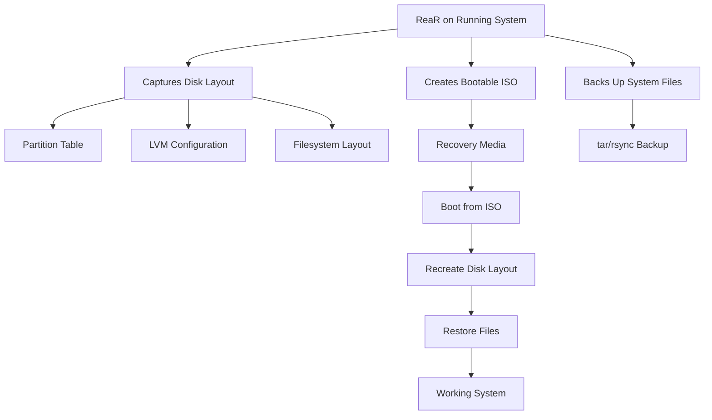

# How to Set Up Disaster Recovery with ReaR on RHEL

Author: [nawazdhandala](https://www.github.com/nawazdhandala)

Tags: RHEL, ReaR, Disaster Recovery, Backup, Linux

Description: Configure Relax-and-Recover (ReaR) on RHEL to create bootable disaster recovery images for bare-metal system restoration.

---

ReaR (Relax-and-Recover) creates bootable recovery images that can restore a RHEL system to bare metal. It captures the disk layout, bootloader configuration, and system files, so you can rebuild a system from scratch on identical or different hardware.

## What ReaR Does



## Installation

```bash
# Install ReaR
sudo dnf install rear genisoimage syslinux-extlinux

# Verify installation
rear --version
```

## Basic Configuration

```bash
# /etc/rear/local.conf
# ReaR configuration for ISO-based recovery

# Output format: create a bootable ISO image
OUTPUT=ISO

# Where to store the ISO
OUTPUT_URL=file:///backup/rear

# Backup method: use tar to back up files
BACKUP=NETFS

# Where to store the backup archive
BACKUP_URL=file:///backup/rear

# Include these directories in the backup
BACKUP_PROG_INCLUDE=(
    '/boot'
    '/etc'
    '/home'
    '/opt'
    '/root'
    '/srv'
    '/usr'
    '/var'
)

# Exclude these from the backup
BACKUP_PROG_EXCLUDE=(
    '/tmp/*'
    '/var/tmp/*'
    '/var/cache/*'
    '/backup/*'
)

# Keep old backups (number of backups to retain)
NETFS_KEEP_OLD_BACKUP_COPY=3
```

## Creating a Recovery Image

```bash
# Create the backup directory
sudo mkdir -p /backup/rear

# Create the recovery image and backup
sudo rear -v mkbackup

# This creates:
# - A bootable ISO image
# - A tar archive of the system
# Both in /backup/rear/
```

Check the output:

```bash
ls -lh /backup/rear/
# rear-hostname.iso     (bootable recovery ISO)
# backup.tar.gz         (system file backup)
# backup.log            (backup log)
```

## Configuration for NFS Backup

Store recovery images on a remote NFS server:

```bash
# /etc/rear/local.conf
OUTPUT=ISO
OUTPUT_URL=nfs://backup.example.com/backup/rear

BACKUP=NETFS
BACKUP_URL=nfs://backup.example.com/backup/rear

BACKUP_PROG_INCLUDE=(
    '/boot' '/etc' '/home' '/opt' '/root' '/srv' '/usr' '/var'
)
```

## Configuration for USB Recovery

Create a bootable USB recovery drive:

```bash
# /etc/rear/local.conf
OUTPUT=USB
USB_DEVICE=/dev/disk/by-label/REAR-000

BACKUP=NETFS
BACKUP_URL=usb:///dev/disk/by-label/REAR-000
```

Prepare the USB device:

```bash
# Format the USB drive for ReaR
sudo rear format /dev/sdc
```

## Scheduling Automatic Backups

```bash
# Create a cron job for weekly ReaR backups
sudo crontab -e
```

```bash
# Create ReaR backup every Sunday at 3 AM
0 3 * * 0 /usr/sbin/rear mkbackup >> /var/log/rear/cron.log 2>&1
```

## Performing a Recovery

1. Boot from the ReaR ISO (burn to CD/DVD or mount via virtual media)
2. At the boot menu, select "Recover"
3. Log in as root (no password needed)
4. Run the recovery:

```bash
# Start the recovery process
rear -v recover
```

ReaR will:
- Recreate the disk partitions
- Recreate LVM volumes
- Create filesystems
- Restore all files from the backup
- Reinstall the bootloader

5. Reboot:

```bash
reboot
```

## Verifying the Recovery Image

```bash
# Verify the backup without actually recovering
sudo rear dump

# Check that the ISO is valid
file /backup/rear/rear-$(hostname).iso

# List what would be recovered
sudo rear -v checklayout
```

## Testing Recovery

It is critical to test your recovery process:

```bash
# Create a VM with similar specs to your production server
# Boot from the ReaR ISO
# Run the recovery
# Verify the system works
```

## Advanced: Recovery to Different Hardware

```bash
# /etc/rear/local.conf
# Enable migration to different hardware
MIGRATION_MODE=true

# Map old disk to new disk during recovery
# This is done interactively during the recovery process
```

## Wrapping Up

ReaR is the standard disaster recovery tool for RHEL. It is supported by Red Hat and handles the hardest part of disaster recovery: recreating the disk layout and bootloader configuration. The actual file restore is just tar, but the value of ReaR is everything else. Test your recovery images regularly. A backup you have never tested is not really a backup.
