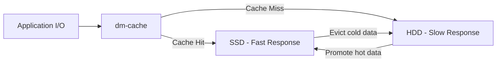

# How to Set Up dm-cache for SSD Caching of HDD Volumes on RHEL

Author: [nawazdhandala](https://www.github.com/nawazdhandala)

Tags: RHEL, dm-cache, SSD, Caching, Linux

Description: Learn how to use dm-cache on RHEL to accelerate HDD storage with SSD caching, combining HDD capacity with SSD speed.

---

If you have servers with large HDD arrays but want SSD-like performance for frequently accessed data, dm-cache gives you the best of both worlds. It uses an SSD as a cache layer in front of your HDDs, automatically keeping hot data on the fast device while cold data stays on the slow one.

## How dm-cache Works

dm-cache is a device-mapper target that sits between your application and the underlying storage. It intercepts I/O and decides whether to serve it from the fast SSD cache or the slow HDD origin.



dm-cache supports two caching modes:
- **writeback** - Writes go to SSD first, then lazily flushed to HDD (faster, but data at risk if SSD fails)
- **writethrough** - Writes go to both SSD and HDD simultaneously (safer, but slower writes)

## Prerequisites

You need:
- An HDD-backed volume group with a logical volume (the origin)
- An SSD with unused space for the cache
- Both devices in the same volume group, or a way to add the SSD

```bash
# Check your current storage layout
lsblk
pvs
vgs
lvs
```

## Step 1: Add the SSD to the Volume Group

If the SSD is not already in the volume group:

```bash
# Create a physical volume on the SSD
pvcreate /dev/nvme0n1p1

# Add it to the existing volume group
vgextend vg_data /dev/nvme0n1p1
```

## Step 2: Create the Cache Data LV

This is the LV on the SSD that stores cached data:

```bash
# Create a cache data LV on the SSD
# Use the --devices flag to ensure it lands on the SSD
lvcreate -L 50G -n cache_data vg_data /dev/nvme0n1p1
```

## Step 3: Create the Cache Metadata LV

The metadata LV stores the mapping between cache blocks and origin blocks:

```bash
# Create cache metadata LV (1/1000 of cache size, minimum 8 MB)
lvcreate -L 512M -n cache_meta vg_data /dev/nvme0n1p1
```

## Step 4: Create the Cache Pool

Combine the data and metadata LVs into a cache pool:

```bash
# Convert to a cache pool
lvconvert --type cache-pool --cachemode writethrough \
    --poolmetadata vg_data/cache_meta vg_data/cache_data
```

The `--cachemode` options:
- `writethrough` - safe default, no data loss if SSD fails
- `writeback` - faster but requires SSD reliability

## Step 5: Attach the Cache to the Origin LV

```bash
# Attach cache to the origin logical volume
lvconvert --type cache --cachepool vg_data/cache_data vg_data/lv_data
```

This converts `lv_data` into a cached volume. The operation is non-destructive - existing data is preserved.

## Verify the Setup

```bash
# Check the cache configuration
lvs -a -o lv_name,lv_size,cache_mode,cache_policy vg_data

# Detailed cache status
lvs -o lv_name,cache_total_blocks,cache_used_blocks,cache_dirty_blocks,cache_read_hits,cache_read_misses,cache_write_hits,cache_write_misses vg_data/lv_data
```

## One-Command Setup (Simpler Method)

LVM can handle all the intermediate steps automatically:

```bash
# Create cache pool and attach in one step
lvcreate --type cache -L 50G --cachemode writethrough \
    -n cache_data vg_data/lv_data /dev/nvme0n1p1
```

This creates the cache data LV, metadata LV, pool, and attaches it all in one command.

## Choosing Cache Mode

| Mode | Write Speed | Read Speed | Data Safety |
|------|------------|------------|-------------|
| writethrough | Same as HDD | SSD for cached data | Safe - HDD always current |
| writeback | SSD speed | SSD for cached data | Risk if SSD fails |

For production with important data, start with writethrough. Switch to writeback only if you need write performance and have SSD redundancy.

Change the mode on a live cache:

```bash
# Switch to writeback mode
lvchange --cachemode writeback vg_data/lv_data

# Switch back to writethrough
lvchange --cachemode writethrough vg_data/lv_data
```

## Choosing Cache Policy

dm-cache supports different policies for deciding what to cache:

- **smq** (default on RHEL) - Stochastic multiqueue, good for most workloads
- **cleaner** - Flushes cache to prepare for removal

```bash
# Check current policy
lvs -o cache_policy vg_data/lv_data
```

The `smq` policy is the recommended default. It adapts to workload patterns automatically.

## Sizing the Cache

General guidelines:
- 10-20% of the origin size covers most hot data for typical workloads
- Database servers might benefit from larger caches (20-50%)
- Sequential workloads (backups, video) do not benefit much from caching

```bash
# Check origin size to calculate cache size
lvs -o lv_name,lv_size vg_data/lv_data
```

## Monitoring Cache Performance

```bash
# Show cache hit/miss statistics
dmsetup status vg_data-lv_data | awk '{print "Read hits:", $8, "Read misses:", $9, "Write hits:", $10, "Write misses:", $11}'
```

```bash
# Calculate hit ratio
lvs -o cache_read_hits,cache_read_misses vg_data/lv_data
```

A healthy cache should have a hit ratio above 80% for random I/O workloads.

## Summary

dm-cache on RHEL lets you add SSD caching to HDD volumes with minimal disruption. Use `writethrough` mode for safety, `writeback` for performance with redundant SSDs. Size the cache at 10-20% of the origin for most workloads. Monitor hit ratios to verify the cache is effective, and use the `smq` policy for automatic workload adaptation.
