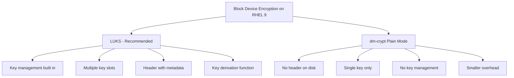

# How to Configure dm-crypt for Low-Level Block Device Encryption on RHEL 9

Author: [nawazdhandala](https://www.github.com/nawazdhandala)

Tags: RHEL, dm-crypt, Block Device Encryption, cryptsetup, Security, Linux

Description: Use dm-crypt directly on RHEL 9 for low-level block device encryption without the LUKS header, useful for specific use cases like encrypted swap and temporary volumes.

---

While LUKS is the recommended encryption format for most use cases, dm-crypt (the kernel-level encryption subsystem) can also be used directly without a LUKS header. This "plain mode" dm-crypt is useful for specific scenarios like ephemeral encrypted swap, temporary volumes, and situations where you want to avoid the overhead of a LUKS header. This guide covers dm-crypt configuration on RHEL 9.

## dm-crypt vs LUKS



| Feature | LUKS | dm-crypt Plain |
|---------|------|----------------|
| Header on disk | Yes (16 MB for LUKS2) | No |
| Multiple passphrases | Yes (up to 32) | No |
| Key derivation | Argon2id/PBKDF2 | Simple hash |
| Deniable encryption | No (header identifies it) | Yes (no header) |
| Key management | Built-in | Manual |
| Recommended for | Most use cases | Swap, temp volumes |

## Using dm-crypt in Plain Mode

### Basic Encrypted Volume

```bash
# Open a device with dm-crypt plain mode
# You will be prompted for a passphrase
sudo cryptsetup open --type plain /dev/sdb plain_encrypted

# The device is now available at /dev/mapper/plain_encrypted

# Create a filesystem
sudo mkfs.xfs /dev/mapper/plain_encrypted

# Mount it
sudo mkdir -p /mnt/plain-encrypted
sudo mount /dev/mapper/plain_encrypted /mnt/plain-encrypted
```

### Specifying Encryption Parameters

```bash
# Open with specific cipher, key size, and hash
sudo cryptsetup open --type plain \
    --cipher aes-xts-plain64 \
    --key-size 512 \
    --hash sha256 \
    /dev/sdb plain_encrypted
```

**Important:** With plain mode, you must use the exact same parameters every time you open the device. If you use different parameters, the data will be unreadable. There is no header to store these settings.

### Using a Key File

```bash
# Generate a key file
sudo dd if=/dev/urandom of=/root/plain-crypt.key bs=64 count=1
sudo chmod 400 /root/plain-crypt.key

# Open with a key file instead of a passphrase
sudo cryptsetup open --type plain \
    --cipher aes-xts-plain64 \
    --key-size 512 \
    --key-file /root/plain-crypt.key \
    /dev/sdb plain_encrypted
```

## Encrypted Swap with dm-crypt

One of the most common uses for plain dm-crypt is encrypted swap with a random key:

```bash
# Disable existing swap
sudo swapoff -a

# Set up encrypted swap with a random key
# Each boot gets a new random key, so old swap data is unrecoverable
sudo cryptsetup open --type plain \
    --cipher aes-xts-plain64 \
    --key-size 512 \
    --key-file /dev/urandom \
    /dev/sda4 swap_crypt

# Format as swap
sudo mkswap /dev/mapper/swap_crypt

# Enable swap
sudo swapon /dev/mapper/swap_crypt
```

### Making It Persistent with crypttab

```bash
# Add to /etc/crypttab for automatic setup at boot
echo "swap_crypt /dev/sda4 /dev/urandom swap,cipher=aes-xts-plain64,size=512" | \
    sudo tee -a /etc/crypttab

# Update /etc/fstab
echo "/dev/mapper/swap_crypt none swap defaults 0 0" | \
    sudo tee -a /etc/fstab
```

## Temporary Encrypted Volumes

For ephemeral data that only needs to exist for the current session:

```bash
#!/bin/bash
# Create a temporary encrypted volume

# Create a file to use as a block device
dd if=/dev/zero of=/tmp/encrypted-container bs=1M count=512

# Set up as a loop device
LOOP=$(sudo losetup --find --show /tmp/encrypted-container)

# Open with dm-crypt using a random key
sudo cryptsetup open --type plain \
    --cipher aes-xts-plain64 \
    --key-size 512 \
    --key-file /dev/urandom \
    "$LOOP" temp_encrypted

# Create filesystem and mount
sudo mkfs.ext4 /dev/mapper/temp_encrypted
sudo mkdir -p /mnt/temp-secure
sudo mount /dev/mapper/temp_encrypted /mnt/temp-secure

echo "Temporary encrypted volume ready at /mnt/temp-secure"
echo "Loop device: $LOOP"
```

Clean up when done:

```bash
#!/bin/bash
# Clean up temporary encrypted volume

sudo umount /mnt/temp-secure
sudo cryptsetup close temp_encrypted
sudo losetup -d /dev/loop0  # use the correct loop device
rm /tmp/encrypted-container
```

## dm-crypt with Integrity Protection

RHEL 9 supports dm-integrity combined with dm-crypt for authenticated encryption:

```bash
# Create an encrypted device with integrity protection
sudo cryptsetup open --type plain \
    --cipher aes-gcm-random \
    --key-size 256 \
    --integrity aead \
    /dev/sdb integrity_encrypted
```

Note: Authenticated encryption adds integrity checking but has a performance cost and requires more disk space for the integrity metadata.

## Low-Level dm-crypt with dmsetup

For the most control, you can use `dmsetup` directly:

```bash
# Generate a random key
KEY=$(dd if=/dev/urandom bs=64 count=1 2>/dev/null | xxd -p -c128)

# Get the device size in 512-byte sectors
SECTORS=$(blockdev --getsz /dev/sdb)

# Create the dm-crypt mapping directly
echo "0 $SECTORS crypt aes-xts-plain64 $KEY 0 /dev/sdb 0" | \
    sudo dmsetup create manual_crypt

# The device is now at /dev/mapper/manual_crypt
```

This approach is rarely needed but can be useful for testing or very specific configurations.

## Closing dm-crypt Devices

```bash
# Unmount first
sudo umount /mnt/plain-encrypted

# Close the dm-crypt mapping
sudo cryptsetup close plain_encrypted

# Verify it is closed
ls /dev/mapper/plain_encrypted 2>&1
```

## Checking Device Status

```bash
# View dm-crypt device status
sudo cryptsetup status plain_encrypted

# Output shows cipher, key size, offset, etc.

# List all device-mapper targets
sudo dmsetup ls --target crypt

# View detailed table
sudo dmsetup table plain_encrypted
```

## Performance Benchmarking

```bash
# Benchmark different ciphers
sudo cryptsetup benchmark

# Output shows encryption/decryption speeds for various algorithms
# Use this to choose the best cipher for your hardware
```

## Security Considerations

1. **Plain mode has no key stretching.** The passphrase is hashed once, making it vulnerable to brute force. Use LUKS for passphrase-based encryption.

2. **You must remember the exact parameters.** Unlike LUKS, there is no header to store cipher settings. Document them carefully.

3. **No key slot management.** You cannot add or change passphrases without re-encrypting.

4. **Best suited for automated/ephemeral use** where a key file or random key is used instead of a passphrase.

## Summary

dm-crypt plain mode on RHEL 9 provides low-level block device encryption without a LUKS header. It is best suited for encrypted swap with random keys, temporary encrypted volumes, and scenarios where LUKS header overhead is undesirable. For most persistent data encryption, LUKS is the better choice because it provides key management, multiple passphrases, and stores encryption parameters in the header.
