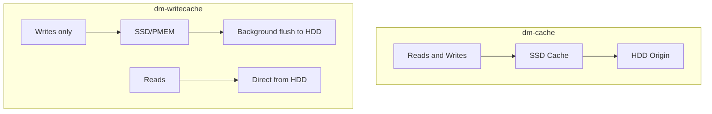

# How to Configure dm-writecache for Write-Intensive Workloads on RHEL

Author: [nawazdhandala](https://www.github.com/nawazdhandala)

Tags: RHEL, dm-writecache, Caching, Linux

Description: Learn how to set up dm-writecache on RHEL to accelerate write-intensive workloads by directing writes to fast SSD or persistent memory devices.

---

While dm-cache handles both reads and writes, dm-writecache is specifically optimized for write acceleration. It captures all writes on a fast device (SSD or persistent memory) and flushes them to the slower backing device in the background. This is ideal for workloads where write latency is the bottleneck.

## dm-writecache vs dm-cache



| Feature | dm-cache | dm-writecache |
|---------|----------|--------------|
| Caches reads | Yes | No |
| Caches writes | Yes | Yes |
| Best for | Mixed workloads | Write-heavy workloads |
| Complexity | Higher | Lower |
| Supported backing | Block devices | Block devices |
| Supported cache | SSD | SSD, PMEM |

## When to Use dm-writecache

- Database transaction logs (sequential writes)
- Application logging to disk
- Build systems with heavy compilation output
- Any workload where write latency matters more than read latency

## Prerequisites

You need:
- A slow origin device (HDD-backed LV)
- A fast cache device (SSD or NVMe)
- Both in the same LVM volume group

```bash
# Check current setup
lsblk
vgs
lvs
```

## Step 1: Prepare the Devices

Add the SSD to the volume group if needed:

```bash
# Add SSD to the volume group
pvcreate /dev/nvme0n1p1
vgextend vg_data /dev/nvme0n1p1
```

## Step 2: Create the Writecache LV

Create a logical volume on the SSD for write caching:

```bash
# Create writecache LV on the SSD
lvcreate -L 20G -n writecache vg_data /dev/nvme0n1p1
```

## Step 3: Attach the Writecache

Attach the writecache to an existing origin LV:

```bash
# Convert lv_data to use writecache
# The origin filesystem must be unmounted or the LV must not be active
umount /data
lvconvert --type writecache --cachevol vg_data/writecache vg_data/lv_data
mount /data
```

## One-Step Creation

You can also create the writecache LV and attach it in one command:

```bash
# Create and attach writecache in one step
lvcreate --type writecache -L 20G -n writecache \
    --cachevol writecache vg_data/lv_data /dev/nvme0n1p1
```

## Verify the Configuration

```bash
# Check that writecache is active
lvs -a -o lv_name,lv_size,segtype vg_data

# Detailed status
dmsetup status vg_data-lv_data
```

The status output shows writecache statistics including blocks used and errors.

## Sizing the Writecache

The writecache needs to be large enough to absorb write bursts. If the cache fills up, writes go directly to the slow device and you lose the performance benefit.

Guidelines:
- For bursty workloads: size to hold 5-10 minutes of peak write throughput
- For sustained writes: at least 10% of the origin
- For transaction logs: 2-5 GB is usually sufficient

## Checking Writecache Performance

```bash
# View writecache statistics
dmsetup status vg_data-lv_data
```

The output includes:
- Number of blocks used in the cache
- Number of blocks free
- Any error counts

## Tuning Writecache Parameters

You can adjust writecache behavior through dm-writecache table parameters. Some tunable values:

```bash
# View current writecache table
dmsetup table vg_data-lv_data
```

Key parameters:
- `high_watermark` - cache usage percentage to trigger aggressive flushing
- `low_watermark` - cache usage percentage to stop flushing
- `writeback_jobs` - number of concurrent writeback operations

## Monitoring with a Script

```bash
#!/bin/bash
# /usr/local/bin/writecache-monitor.sh
# Monitor dm-writecache health

for lv in $(lvs --noheadings -o lv_path --select 'segtype=writecache' 2>/dev/null); do
    DM_NAME=$(lvs --noheadings -o lv_dm_path "$lv" | tr -d ' ')
    DM_SHORT=$(basename "$DM_NAME")

    STATUS=$(dmsetup status "$DM_SHORT" 2>/dev/null)
    if [ -n "$STATUS" ]; then
        echo "=== $lv ==="
        echo "$STATUS"
        echo ""
    fi
done
```

## Removing the Writecache

To detach the writecache (flushes all pending writes first):

```bash
# Unmount the filesystem
umount /data

# Remove writecache (flushes data to origin first)
lvconvert --uncache vg_data/lv_data

# Remount
mount /data
```

The `--uncache` operation is safe - it flushes all cached writes to the origin before removing the cache.

## Important Considerations

### Data Safety

dm-writecache is inherently less safe than writethrough caching because writes are only on the SSD until they are flushed. If the SSD fails before flushing:

- With battery-backed or power-loss-protected SSDs: data is safe
- Without protection: recent writes can be lost

Use enterprise-grade SSDs with power loss protection for writecache in production.

### Filesystem Requirements

dm-writecache works with any filesystem, but the origin LV must be unmounted (or the volume deactivated) when attaching or detaching the cache.

### SSD Wear

All writes go to the SSD first, which increases SSD wear compared to dm-cache (where only hot data is cached). Monitor SSD health:

```bash
# Check SSD health
smartctl -a /dev/nvme0n1 | grep -i "wear\|written\|life"
```

## Summary

dm-writecache on RHEL is the right choice when write latency is your primary bottleneck. It is simpler than dm-cache, has lower overhead, and works especially well with NVMe devices. Size the cache to absorb your write bursts, use enterprise SSDs with power loss protection, and monitor SSD wear over time. For mixed read/write workloads, dm-cache is usually the better choice.
