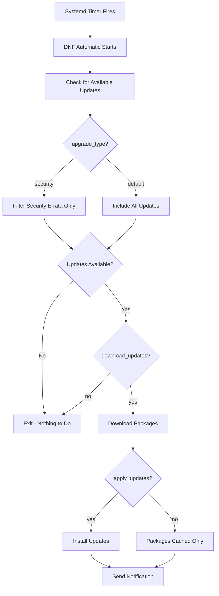

# How to Use DNF Automatic for Unattended Security Updates on RHEL

Author: [nawazdhandala](https://www.github.com/nawazdhandala)

Tags: RHEL, DNF, Automatic Updates, Security, Linux

Description: Learn how to set up DNF Automatic on RHEL to keep your systems patched with security updates without manual intervention, including configuration, timers, and notification options.

---

If you manage more than a handful of RHEL servers, you already know the pain of keeping them all patched. Logging into each box, running `dnf update`, waiting around - it gets old fast. That is where DNF Automatic comes in. It handles unattended updates for you, and you can scope it to security patches only, which is usually what matters most in production.

I have been running this on dozens of RHEL servers for a while now, and it works well once you get the configuration right. Let me walk you through the whole setup.

## Installing DNF Automatic

The package is available in the base RHEL repositories. Nothing special needed here.

```bash
# Install the dnf-automatic package
sudo dnf install dnf-automatic -y
```

Verify it is installed:

```bash
# Check the installed version
rpm -qi dnf-automatic
```

## Understanding the Configuration File

The main configuration lives at `/etc/dnf/automatic.conf`. Let me break down the important sections.

```bash
# Open the configuration file for editing
sudo vi /etc/dnf/automatic.conf
```

Here is what a solid security-only configuration looks like:

```ini
[commands]
# What kind of upgrade to perform:
# default                            = all available upgrades
# security                           = only security upgrades
upgrade_type = security

# Whether to automatically apply updates when they are available
apply_updates = yes

# Whether to automatically download updates when they are available
download_updates = yes

[emitters]
# How to notify about applied updates
# emit_via = stdio       - print to stdout
# emit_via = email       - send email
# emit_via = motd        - update /etc/motd
# emit_via = command     - run a custom command
emit_via = stdio

[email]
# Email settings if you chose emit_via = email
email_from = root@example.com
email_to = admin@example.com
email_host = localhost

[base]
# This section can override settings from /etc/dnf/dnf.conf
# debuglevel = 1
# skip_broken = True
```

### Key Settings Explained

The two settings that matter most are `upgrade_type` and `apply_updates`. Setting `upgrade_type = security` means DNF will only grab packages flagged as security errata. Setting `apply_updates = yes` tells it to actually install them, not just download.

If you are nervous about fully automatic installs, you can set `apply_updates = no` and `download_updates = yes`. This way packages get cached locally, and you just need to run `dnf update` to apply them - they will install instantly since they are already downloaded.

## Configuring the Systemd Timer

DNF Automatic runs via a systemd timer, not a cron job. There are actually a few different timer units you can use:

```bash
# List available dnf-automatic timers
systemctl list-unit-files | grep dnf-automatic
```

You will see these timers:

- `dnf-automatic.timer` - Downloads and applies updates (respects your config)
- `dnf-automatic-download.timer` - Only downloads, never installs
- `dnf-automatic-install.timer` - Downloads and installs regardless of config
- `dnf-automatic-notifyonly.timer` - Only notifies about available updates

For security-only auto-patching, enable the main timer:

```bash
# Enable and start the dnf-automatic timer
sudo systemctl enable --now dnf-automatic.timer
```

Check that the timer is active:

```bash
# Verify the timer status
systemctl status dnf-automatic.timer
```

You can also see when it will next run:

```bash
# Show all active timers and their schedules
systemctl list-timers dnf-automatic.timer
```

By default, the timer fires about one hour after boot and then once every 24 hours. If you want to change the schedule, override the timer:

```bash
# Create a timer override
sudo systemctl edit dnf-automatic.timer
```

Add your custom schedule. For example, to run at 3 AM every day:

```ini
[Timer]
OnCalendar=
OnCalendar=*-*-* 03:00:00
RandomizedDelaySec=30m
```

The `RandomizedDelaySec` adds a random delay up to 30 minutes so all your servers do not slam the repos at once.

```bash
# Reload systemd after editing timer overrides
sudo systemctl daemon-reload
sudo systemctl restart dnf-automatic.timer
```

## How the Update Flow Works

Here is a visual overview of what happens when the timer fires:



## Setting Up Email Notifications

If you want email alerts when updates get applied, tweak the emitter section:

```ini
[emitters]
# Send email notifications for applied updates
emit_via = email

[email]
# Configure the email sender, recipient, and SMTP host
email_from = rhel-updates@mycompany.com
email_to = sysadmin-team@mycompany.com
email_host = smtp.mycompany.com
```

Make sure your server can actually send mail through that SMTP host. Test it first:

```bash
# Quick test to verify mail delivery works
echo "Test from $(hostname)" | mail -s "DNF Automatic Test" sysadmin-team@mycompany.com
```

## Testing Your Configuration

Before you trust this to run unattended, do a dry run:

```bash
# Run dnf-automatic manually to test the configuration
sudo dnf-automatic /etc/dnf/automatic.conf
```

This will execute the full workflow once using your config. Watch the output to make sure it is picking up security updates and applying them correctly.

You can also check what security updates are currently available:

```bash
# List available security updates
sudo dnf updateinfo list security

# Get a summary of available security advisories
sudo dnf updateinfo summary
```

## Checking Update History

After DNF Automatic has been running for a while, you will want to verify that updates are actually being applied:

```bash
# Show recent DNF transaction history
sudo dnf history list --reverse | tail -20

# Show details of the last transaction
sudo dnf history info last
```

The journal also captures DNF Automatic runs:

```bash
# Check journal logs for dnf-automatic activity
journalctl -u dnf-automatic.service --since "7 days ago"
```

## Excluding Packages from Automatic Updates

Sometimes you need to hold back certain packages, like a database server or a custom kernel. Add exclusions in the `[base]` section:

```ini
[base]
# Prevent these packages from being automatically updated
excludepkgs = kernel*, postgresql*
```

Or you can set this globally in `/etc/dnf/dnf.conf`:

```bash
# Add package exclusions to the main DNF config
echo "excludepkgs=kernel*,postgresql*" | sudo tee -a /etc/dnf/dnf.conf
```

## Handling Reboots After Kernel Updates

Security updates sometimes include kernel patches, and those need a reboot to take effect. DNF Automatic will not reboot your server on its own. You need to handle that separately.

Check if a reboot is needed:

```bash
# Check if currently running kernel differs from the installed one
CURRENT=$(uname -r)
LATEST=$(rpm -q kernel --qf '%{VERSION}-%{RELEASE}.%{ARCH}\n' | sort -V | tail -1)
echo "Running: $CURRENT"
echo "Installed: $LATEST"
```

If you want automated reboots during a maintenance window, you can set up a separate cron job or use `needs-restarting`:

```bash
# Check if a reboot is needed after updates
sudo needs-restarting -r
echo $?
# Exit code 0 = no reboot needed
# Exit code 1 = reboot recommended
```

## Tips from Production Experience

A few things I have learned running this across many servers:

1. **Start with download-only mode.** Set `apply_updates = no` for the first week and review what it pulls down. Once you are comfortable, flip it to `yes`.

2. **Stagger your timers.** Do not let all servers update at the same time. Use different `OnCalendar` values or a generous `RandomizedDelaySec`.

3. **Monitor the results.** Whether through email, a log aggregator, or your monitoring stack, make sure you know when updates happen and when they fail.

4. **Exclude carefully.** If you exclude too many packages, you defeat the purpose of automated security patching.

5. **Test in staging first.** If you have a staging environment, let it update a day or two ahead of production.

## Wrapping Up

DNF Automatic is one of those tools that earns its keep quietly. Set it up once, tune the configuration to your needs, and it keeps your RHEL systems patched against known security vulnerabilities without you having to lift a finger. Just remember to monitor the results and handle reboots when kernel patches land.
