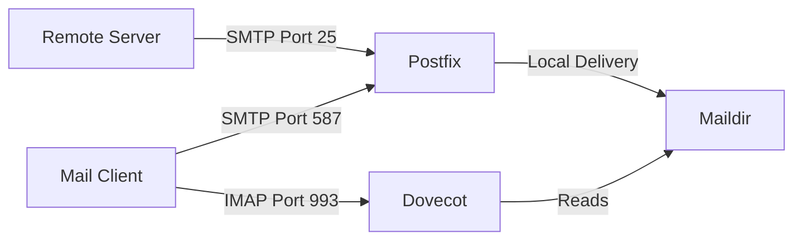

# How to Set Up Dovecot IMAP with Postfix on RHEL

Author: [nawazdhandala](https://www.github.com/nawazdhandala)

Tags: RHEL, Dovecot, IMAP, Postfix, Linux

Description: Install and configure Dovecot as an IMAP server alongside Postfix on RHEL so users can read their email with any mail client.

---

## Why Dovecot?

Postfix handles sending and receiving email, but it does not provide mailbox access. Users need an IMAP (or POP3) server to read their mail with clients like Thunderbird, Outlook, or a mobile app. Dovecot is the standard choice on RHEL - it is fast, well-maintained, and integrates smoothly with Postfix.

## Architecture



## Prerequisites

- RHEL with Postfix installed and configured
- TLS certificate and key for your mail server
- DNS records pointing to your mail server

## Installing Dovecot

```bash
# Install Dovecot
sudo dnf install -y dovecot
```

## Configuring Dovecot

Dovecot's configuration is split across multiple files in `/etc/dovecot/conf.d/`. The main file is `/etc/dovecot/dovecot.conf`.

### Main Configuration

Edit `/etc/dovecot/dovecot.conf`:

```bash
# Enable IMAP protocol (add pop3 if needed)
protocols = imap

# Listen on all interfaces
listen = *, ::
```

### Authentication Settings

Edit `/etc/dovecot/conf.d/10-auth.conf`:

```bash
# Require clients to use encrypted connections for auth
disable_plaintext_auth = yes

# Authentication mechanisms
auth_mechanisms = plain login
```

### Mail Location

Edit `/etc/dovecot/conf.d/10-mail.conf`:

```bash
# Use Maildir format in user home directories
mail_location = maildir:~/Maildir
```

Make sure this matches the `home_mailbox` setting in Postfix. If Postfix uses `home_mailbox = Maildir/`, then Dovecot should use `maildir:~/Maildir`.

### TLS Configuration

Edit `/etc/dovecot/conf.d/10-ssl.conf`:

```bash
# Require SSL/TLS
ssl = required

# Certificate and key paths
ssl_cert = </etc/letsencrypt/live/mail.example.com/fullchain.pem
ssl_key = </etc/letsencrypt/live/mail.example.com/privkey.pem

# Minimum TLS version
ssl_min_protocol = TLSv1.2

# Prefer server cipher order
ssl_prefer_server_ciphers = yes
```

Note the `<` before the file paths. This is Dovecot syntax for reading from a file.

### Mailbox Configuration

Edit `/etc/dovecot/conf.d/15-mailboxes.conf`:

```bash
namespace inbox {
  mailbox Drafts {
    auto = subscribe
    special_use = \Drafts
  }
  mailbox Junk {
    auto = subscribe
    special_use = \Junk
  }
  mailbox Trash {
    auto = subscribe
    special_use = \Trash
  }
  mailbox Sent {
    auto = subscribe
    special_use = \Sent
  }
  mailbox "Sent Messages" {
    special_use = \Sent
  }
  mailbox Archive {
    auto = subscribe
    special_use = \Archive
  }
}
```

### Logging

Edit `/etc/dovecot/conf.d/10-logging.conf`:

```bash
# Log to syslog
log_path = syslog
syslog_facility = mail

# Enable authentication debug logging (disable in production)
auth_verbose = yes
auth_debug = no
```

## Integrating Dovecot Authentication with Postfix

Dovecot can handle SASL authentication for Postfix, so users authenticate through one system.

Edit `/etc/dovecot/conf.d/10-master.conf`:

```bash
service auth {
  # Existing settings...

  # Postfix SMTP authentication socket
  unix_listener /var/spool/postfix/private/auth {
    mode = 0660
    user = postfix
    group = postfix
  }
}
```

Configure Postfix to use Dovecot for SASL. Add to `/etc/postfix/main.cf`:

```bash
# Use Dovecot for SASL authentication
smtpd_sasl_type = dovecot
smtpd_sasl_path = private/auth
smtpd_sasl_auth_enable = yes
smtpd_sasl_security_options = noanonymous
smtpd_sasl_local_domain = $myhostname
```

## Firewall Configuration

Open the IMAP ports:

```bash
# Allow IMAPS (encrypted IMAP on port 993)
sudo firewall-cmd --permanent --add-service=imaps

# If you also need unencrypted IMAP on port 143 (not recommended)
# sudo firewall-cmd --permanent --add-service=imap

sudo firewall-cmd --reload
```

## Starting Dovecot

```bash
# Enable and start Dovecot
sudo systemctl enable --now dovecot

# Check status
sudo systemctl status dovecot
```

## Testing the Setup

### Test IMAP Connection

```bash
# Test IMAP over TLS
openssl s_client -connect mail.example.com:993
```

Once connected, you can issue IMAP commands:

```bash
a1 LOGIN username password
a2 LIST "" "*"
a3 SELECT INBOX
a4 LOGOUT
```

### Test Authentication

```bash
# Check Dovecot authentication
sudo doveadm auth test username password
```

### Send and Retrieve a Test Email

```bash
# Send a test email via Postfix
echo "Test message body" | mail -s "Dovecot Test" username@example.com
```

Then connect with a mail client to see if the message appears in the inbox.

### Check Logs

```bash
# View Dovecot logs
sudo journalctl -u dovecot --since "10 minutes ago"

# Check mail log
sudo tail -20 /var/log/maillog
```

## Performance Tuning

Edit `/etc/dovecot/conf.d/10-master.conf` for high-traffic servers:

```bash
service imap-login {
  # Number of connections before forking a new process
  service_count = 1

  # Pre-fork processes for faster connection handling
  process_min_avail = 3

  # Limit for VSZ (virtual memory size)
  vsz_limit = 256M
}

service imap {
  # Maximum number of IMAP processes
  process_limit = 1024
}
```

## SELinux Considerations

If SELinux is enforcing and you use non-standard mail directories:

```bash
# Set the correct SELinux context for mail directories
sudo semanage fcontext -a -t mail_spool_t "/custom/mail/path(/.*)?"
sudo restorecon -Rv /custom/mail/path
```

## Troubleshooting

**"Authentication failed" errors:**

Check that the user exists and the password is correct:

```bash
sudo doveadm auth test username password
```

**Cannot connect on port 993:**

Verify Dovecot is listening:

```bash
sudo ss -tlnp | grep dovecot
```

**Mailbox is empty after sending a test email:**

Confirm the mail location matches between Postfix and Dovecot:

```bash
sudo postconf home_mailbox
sudo doveconf mail_location
```

## Wrapping Up

With Dovecot and Postfix working together, you have a complete mail server. Postfix handles SMTP traffic, Dovecot provides IMAP access, and Dovecot's auth socket gives you unified authentication. From here, you can add virtual mailboxes, webmail access, or spam filtering depending on your needs.
