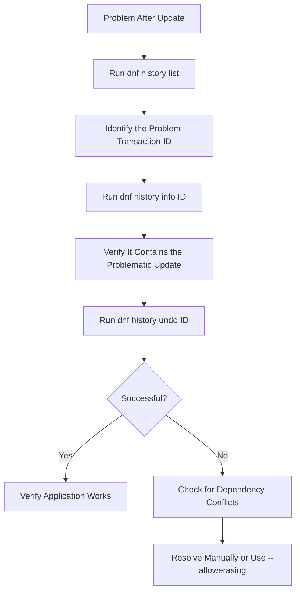

# How to Downgrade a Package to a Previous Version Using DNF on RHEL 9

Author: [nawazdhandala](https://www.github.com/nawazdhandala)

Tags: RHEL, DNF, Package Downgrade, Linux, Troubleshooting

Description: Learn how to safely downgrade packages to previous versions on RHEL 9 using DNF, including finding older versions, using history undo, and caching strategies.

---

Package updates usually make things better. But every now and then, an update breaks something. Maybe a new version of a library causes your application to crash, or a kernel update introduces a regression with your hardware. When that happens, you need to roll back to the version that worked.

I have been in this situation more times than I would like to admit, and RHEL 9 gives you a few solid options for handling it. Let me walk you through each approach.

## The Quick Downgrade with dnf downgrade

The most straightforward method is `dnf downgrade`. It works much like `dnf install` but in reverse.

```bash
# Downgrade a package to the previous available version
sudo dnf downgrade httpd
```

DNF will find the next-oldest version available in your enabled repositories and install it. You will see a transaction summary showing the version change before you confirm.

If you need a specific version:

```bash
# Downgrade to a specific version of a package
sudo dnf downgrade httpd-2.4.53-11.el9_2.5
```

### Finding Available Older Versions

Before you can downgrade, you need to know what older versions are available:

```bash
# List all available versions of a package
dnf --showduplicates list httpd
```

This shows every version of the package across all enabled repositories. The output looks something like:

```
Available Packages
httpd.x86_64    2.4.53-7.el9       rhel-9-for-x86_64-appstream-rpms
httpd.x86_64    2.4.53-11.el9_2.5  rhel-9-for-x86_64-appstream-rpms
httpd.x86_64    2.4.57-5.el9       rhel-9-for-x86_64-appstream-rpms
```

The currently installed version is listed under "Installed Packages." Pick the version you want from "Available Packages."

## Using DNF History to Undo Transactions

This is my preferred method when you want to roll back an entire update transaction, not just a single package. DNF keeps a record of every transaction it performs.

### Viewing Transaction History

```bash
# Show the last 20 DNF transactions
sudo dnf history list
```

You get a numbered list with the date, action, and number of packages affected:

```
ID  | Command line             | Date and time    | Action(s) | Altered
----+--------------------------+------------------+-----------+--------
 15 | update                   | 2026-03-01 09:00 | Upgrade   |   42
 14 | install postgresql-server| 2026-02-28 14:30 | Install   |    8
```

### Getting Transaction Details

```bash
# Show details of a specific transaction
sudo dnf history info 15
```

This shows exactly what packages were upgraded, installed, or removed in that transaction.

### Undoing a Transaction

```bash
# Undo transaction 15 (reverts all changes from that transaction)
sudo dnf history undo 15
```

This is powerful because it handles the whole transaction. If transaction 15 upgraded 42 packages, `history undo 15` will downgrade all 42 back to their previous versions.



### Rollback vs Undo

There is a subtle difference between `undo` and `rollback`:

```bash
# Undo reverses a single transaction
sudo dnf history undo 15

# Rollback reverts ALL transactions after the specified one
sudo dnf history rollback 14
```

With `rollback 14`, DNF will undo transactions 15, 16, 17, and so on, bringing the system back to the state it was in after transaction 14 completed. This is more aggressive but useful if multiple recent transactions caused issues.

## Keeping Old Packages in Cache

By default, DNF cleans up downloaded packages after installation. If you want to keep them around for potential downgrades, enable the cache:

```bash
# Edit DNF configuration to keep downloaded packages
sudo vi /etc/dnf/dnf.conf
```

Add or change this setting:

```ini
[main]
# Keep downloaded packages in the cache after installation
keepcache=1
```

The cached packages live in `/var/cache/dnf/`. With this enabled, old versions remain available locally even if they get removed from the upstream repository.

Check what is in the cache:

```bash
# List cached packages for a specific repo
ls /var/cache/dnf/rhel-9-for-x86_64-appstream-*/packages/
```

## Downgrading Kernel Packages

Kernels are special because RHEL installs new kernels side-by-side rather than replacing the old one. You usually do not need to downgrade. Instead, just boot the older kernel.

```bash
# List installed kernels
rpm -qa kernel-core | sort -V
```

Select the older kernel at the GRUB menu during boot, or set it as the default:

```bash
# List available kernel entries in GRUB
sudo grubby --info=ALL

# Set a specific kernel as the default
sudo grubby --set-default /boot/vmlinuz-5.14.0-284.11.1.el9_2.x86_64

# Verify the default kernel
sudo grubby --default-kernel
```

If you truly need to remove a bad kernel:

```bash
# Remove a specific kernel version
sudo dnf remove kernel-core-5.14.0-362.8.1.el9_3.x86_64
```

## Preventing a Package from Being Updated Again

After downgrading, you probably want to prevent DNF from upgrading that package again until you are ready.

### Using dnf versionlock

```bash
# Install the versionlock plugin
sudo dnf install python3-dnf-plugin-versionlock

# Lock a package at its current version
sudo dnf versionlock add httpd

# List all locked packages
sudo dnf versionlock list

# Remove a lock when you are ready to update again
sudo dnf versionlock delete httpd

# Clear all locks
sudo dnf versionlock clear
```

### Using the exclude Option

A simpler but less precise approach:

```bash
# Temporarily exclude a package from updates
sudo dnf update --exclude=httpd

# Or add it to /etc/dnf/dnf.conf for a persistent exclusion
# excludepkgs=httpd
```

## Handling Dependency Conflicts During Downgrade

Sometimes a downgrade fails because other packages depend on the newer version:

```
Error: Problem: problem with installed package libfoo-2.0-1.el9.x86_64
```

You have a few options:

```bash
# Allow DNF to remove conflicting packages to complete the downgrade
sudo dnf downgrade httpd --allowerasing
```

Be careful with `--allowerasing`. It will remove packages that conflict with the downgrade. Check the transaction summary carefully before confirming.

Alternatively, downgrade the dependent packages together:

```bash
# Downgrade multiple related packages at once
sudo dnf downgrade httpd httpd-core httpd-tools mod_ssl
```

## Downloading an Older Package Without Installing

If you just want to grab an older version for later use:

```bash
# Download a specific version without installing
sudo dnf download httpd-2.4.53-11.el9_2.5 --destdir=/tmp/rpms/
```

You can then install it later with:

```bash
# Install the downloaded RPM
sudo dnf localinstall /tmp/rpms/httpd-2.4.53-11.el9_2.5.x86_64.rpm
```

## A Real-World Downgrade Scenario

Let me walk through a typical scenario. Say you updated everything last night and now your web application is throwing 500 errors.

```bash
# Step 1: Check what was updated recently
sudo dnf history list

# Step 2: Look at the details of the most recent update
sudo dnf history info last

# Step 3: Find the httpd-related changes
sudo dnf history info last | grep httpd

# Step 4: Undo the entire transaction
sudo dnf history undo last

# Step 5: Verify the old version is back
rpm -q httpd

# Step 6: Lock the package to prevent re-upgrade
sudo dnf versionlock add httpd

# Step 7: Restart the service
sudo systemctl restart httpd

# Step 8: Test the application
curl -I http://localhost/
```

## Summary

Downgrading packages on RHEL 9 is well-supported and there are multiple approaches depending on your situation. For a single package, `dnf downgrade` is quick and simple. For rolling back a whole update session, `dnf history undo` is the way to go. Either way, remember to lock the package version afterward so it does not get upgraded again before you are ready. And if you are in an environment where downgrades might be needed, keep `keepcache=1` in your DNF configuration. You will thank yourself later.
