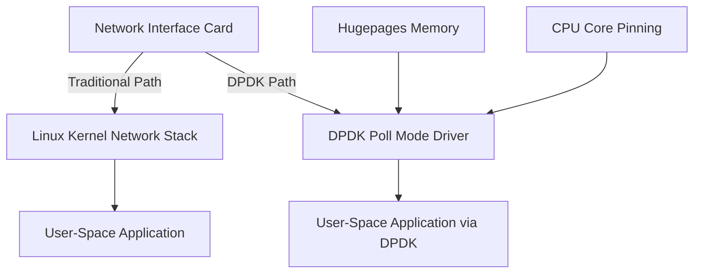

# How to Set Up DPDK for High-Performance Packet Processing on RHEL 9

Author: [nawazdhandala](https://www.github.com/nawazdhandala)

Tags: RHEL, DPDK, Networking, High-Performance, Packet Processing, Linux

Description: Learn how to install and configure the Data Plane Development Kit (DPDK) on RHEL 9 for bypassing the kernel network stack and achieving high-performance packet processing.

---

The Data Plane Development Kit (DPDK) is a set of libraries and drivers that enables fast packet processing by bypassing the kernel network stack entirely. This is critical for telecom, NFV, and high-frequency networking workloads where every microsecond matters.

In this guide, you will install DPDK on RHEL 9, bind network interfaces to DPDK-compatible drivers, configure hugepages for optimal memory performance, and run a basic test application.

## Architecture Overview



## Prerequisites

Before starting, make sure you have:

- A RHEL 9 system with a subscription or access to repositories
- At least two network interfaces (one for management, one for DPDK)
- Root or sudo access
- A CPU that supports SSE4.2 or higher

## Step 1: Install Required Packages

```bash
# Enable the CodeReady Builder repository for development headers
sudo subscription-manager repos --enable codeready-builder-for-rhel-9-x86_64-rpms

# Install DPDK and development packages
sudo dnf install -y dpdk dpdk-devel dpdk-tools

# Install build tools for compiling DPDK applications
sudo dnf install -y gcc make numactl-devel libpcap-devel meson ninja-build
```

## Step 2: Configure Hugepages

DPDK relies on hugepages for efficient memory access. You need to allocate them before binding interfaces.

```bash
# Check current hugepage allocation
grep -i huge /proc/meminfo

# Allocate 1024 hugepages of 2MB each (2GB total)
echo 1024 | sudo tee /sys/kernel/mm/hugepages/hugepages-2048kB/nr_hugepages

# Make hugepage allocation persistent across reboots
echo "vm.nr_hugepages=1024" | sudo tee -a /etc/sysctl.d/dpdk.conf
sudo sysctl --system

# Mount the hugepage filesystem
sudo mkdir -p /dev/hugepages
sudo mount -t hugetlbfs nodev /dev/hugepages

# Make the mount persistent by adding it to /etc/fstab
echo "nodev /dev/hugepages hugetlbfs defaults 0 0" | sudo tee -a /etc/fstab
```

## Step 3: Load the VFIO-PCI Driver

VFIO-PCI is the recommended driver for DPDK on modern systems because it supports IOMMU and is more secure than the older igb_uio driver.

```bash
# Load the vfio-pci kernel module
sudo modprobe vfio-pci

# Make it persistent across reboots
echo "vfio-pci" | sudo tee /etc/modules-load.d/vfio-pci.conf

# If your system does not have an IOMMU, enable unsafe no-IOMMU mode
# (not recommended for production)
echo 1 | sudo tee /sys/module/vfio/parameters/enable_unsafe_noiommu_mode
```

## Step 4: Identify and Bind Network Interfaces

```bash
# List all network interfaces with their PCI addresses and current drivers
dpdk-devbind.py --status

# You should see output like:
# Network devices using kernel driver
# ====================================
# 0000:03:00.0 'Ethernet Controller X710' if=ens3f0 drv=i40e
# 0000:03:00.1 'Ethernet Controller X710' if=ens3f1 drv=i40e

# Bring down the interface you want to use with DPDK
sudo ip link set ens3f1 down

# Bind the interface to vfio-pci using its PCI address
sudo dpdk-devbind.py --bind=vfio-pci 0000:03:00.1

# Verify the binding
dpdk-devbind.py --status
# The interface should now appear under "Network devices using DPDK-compatible driver"
```

## Step 5: Run a DPDK Test Application

DPDK ships with several example applications. The `dpdk-testpmd` tool is useful for verifying your setup.

```bash
# Run testpmd with basic forwarding
# -l specifies which CPU cores to use (cores 0 and 1)
# -n specifies the number of memory channels
# --socket-mem limits memory allocation per NUMA node
sudo dpdk-testpmd -l 0,1 -n 4 --socket-mem 512 -- -i --portmask=0x1

# Inside the testpmd interactive shell:
# Start packet forwarding
testpmd> start

# Show port statistics
testpmd> show port stats all

# Stop forwarding and quit
testpmd> stop
testpmd> quit
```

## Step 6: Write a Simple DPDK Application

Create a minimal DPDK application that initializes the Environment Abstraction Layer (EAL) and lists available ports.

```c
/* simple_dpdk.c - A minimal DPDK application */
#include <stdio.h>
#include <rte_eal.h>
#include <rte_ethdev.h>

int main(int argc, char *argv[]) {
    int ret;
    uint16_t nb_ports;
    uint16_t port_id;

    /* Initialize the Environment Abstraction Layer (EAL) */
    ret = rte_eal_init(argc, argv);
    if (ret < 0) {
        fprintf(stderr, "Error: Failed to initialize EAL\n");
        return -1;
    }

    /* Get the number of available Ethernet ports */
    nb_ports = rte_eth_dev_count_avail();
    printf("Number of available DPDK ports: %u\n", nb_ports);

    /* List information about each port */
    RTE_ETH_FOREACH_DEV(port_id) {
        struct rte_eth_dev_info dev_info;
        rte_eth_dev_info_get(port_id, &dev_info);
        printf("Port %u: driver=%s\n", port_id, dev_info.driver_name);
    }

    /* Clean up EAL resources */
    rte_eal_cleanup();
    return 0;
}
```

Build and run the application:

```bash
# Compile the application using pkg-config to get DPDK flags
gcc -o simple_dpdk simple_dpdk.c $(pkg-config --cflags --libs libdpdk)

# Run the application
sudo ./simple_dpdk -l 0 -n 4
```

## Step 7: Configure CPU Isolation for DPDK Cores

For best performance, isolate the CPU cores dedicated to DPDK from the kernel scheduler.

```bash
# Edit the GRUB configuration to isolate cores 2 and 3
sudo grubby --update-kernel=ALL --args="isolcpus=2,3 nohz_full=2,3 rcu_nocbs=2,3"

# Reboot for changes to take effect
sudo reboot

# After reboot, verify isolated CPUs
cat /sys/devices/system/cpu/isolated
# Expected output: 2-3
```

## Troubleshooting

If DPDK fails to bind an interface, check these common issues:

```bash
# Verify IOMMU is enabled (for VFIO)
dmesg | grep -i iommu

# Check that hugepages are properly allocated
cat /proc/meminfo | grep Huge

# Verify the vfio-pci module is loaded
lsmod | grep vfio

# Check DPDK application logs for errors
# DPDK logs go to stderr by default, so redirect them:
sudo dpdk-testpmd -l 0,1 -n 4 -- -i 2>&1 | tee dpdk_output.log
```

## Summary

You have configured DPDK on RHEL 9 for high-performance packet processing. You set up hugepages for memory efficiency, bound a network interface to the VFIO-PCI driver, ran the testpmd verification tool, and built a simple DPDK application. For production workloads, consider tuning NUMA affinity, using 1GB hugepages, and enabling CPU isolation for the best possible throughput.
