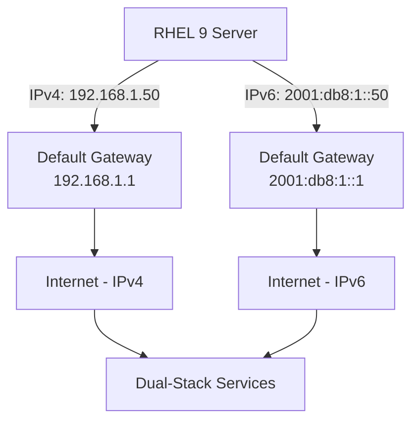

# How to Set Up Dual-Stack IPv4/IPv6 Networking on RHEL 9

Author: [nawazdhandala](https://www.github.com/nawazdhandala)

Tags: RHEL, Dual-Stack, IPv4, IPv6, Linux

Description: Learn how to configure dual-stack networking on RHEL 9 so your system communicates over both IPv4 and IPv6 simultaneously, with practical examples using nmcli and verification steps.

---

Running both IPv4 and IPv6 on the same interfaces is not some future-proofing exercise anymore. It is the standard approach for any production environment that needs to talk to the modern internet. RHEL 9 handles dual-stack networking well out of the box, but getting the configuration right and understanding how the two stacks interact takes a bit of deliberate setup.

## Why Dual-Stack Matters

Most organizations cannot do a hard cutover to IPv6-only. You have legacy services, third-party integrations, and monitoring systems that still rely on IPv4. Dual-stack lets you run both protocols side by side, so you can adopt IPv6 for new services while keeping IPv4 for everything that still needs it.

## Prerequisites

- RHEL 9 system with root or sudo access
- Network infrastructure that supports both IPv4 and IPv6
- Valid IPv4 and IPv6 address allocations
- NetworkManager running (default on RHEL 9)

## Checking Current Network State

Start by understanding what you have.

```bash
# See all connections and their state
nmcli connection show

# Check current IP configuration on an interface
nmcli device show ens192

# See both IPv4 and IPv6 addresses
ip addr show dev ens192
```

## Configuring Dual-Stack with Static Addresses

The most common production setup uses static addresses for both stacks.

```bash
# Set static IPv4
sudo nmcli connection modify "ens192" ipv4.method manual
sudo nmcli connection modify "ens192" ipv4.addresses "192.168.1.50/24"
sudo nmcli connection modify "ens192" ipv4.gateway "192.168.1.1"
sudo nmcli connection modify "ens192" ipv4.dns "192.168.1.1"

# Set static IPv6
sudo nmcli connection modify "ens192" ipv6.method manual
sudo nmcli connection modify "ens192" ipv6.addresses "2001:db8:1::50/64"
sudo nmcli connection modify "ens192" ipv6.gateway "2001:db8:1::1"
sudo nmcli connection modify "ens192" ipv6.dns "2001:4860:4860::8888"

# Apply both at once
sudo nmcli connection up "ens192"
```

## Configuring Dual-Stack with DHCP and SLAAC

If your network provides both DHCPv4 and IPv6 Router Advertisements, you can let the system auto-configure.

```bash
# Use DHCP for IPv4
sudo nmcli connection modify "ens192" ipv4.method auto

# Use SLAAC/DHCPv6 for IPv6
sudo nmcli connection modify "ens192" ipv6.method auto

# Apply
sudo nmcli connection up "ens192"
```

## Mixed Mode: Static IPv4 with SLAAC IPv6

This is pretty common in environments transitioning to IPv6.

```bash
# Static IPv4
sudo nmcli connection modify "ens192" ipv4.method manual
sudo nmcli connection modify "ens192" ipv4.addresses "10.0.1.100/24"
sudo nmcli connection modify "ens192" ipv4.gateway "10.0.1.1"

# Automatic IPv6 via Router Advertisements
sudo nmcli connection modify "ens192" ipv6.method auto

# Apply
sudo nmcli connection up "ens192"
```

## Understanding Address Selection

When your system has both IPv4 and IPv6 addresses, how does it decide which to use for outgoing connections? RHEL 9 follows RFC 6724 for address selection. You can see the current policy table:

```bash
# View the address selection policy
ip -6 addrlabel show
```

By default, IPv6 is preferred over IPv4. If you need to change this behavior, you can adjust the policy:

```bash
# Prefer IPv4 over IPv6 (add to /etc/gai.conf)
echo "precedence ::ffff:0:0/96 100" | sudo tee -a /etc/gai.conf
```

## Verifying Dual-Stack Connectivity

Test both stacks independently to make sure everything works.

```bash
# Test IPv4 connectivity
ping -4 -c 4 8.8.8.8

# Test IPv6 connectivity
ping -6 -c 4 2001:4860:4860::8888

# Test DNS resolution over both protocols
dig A example.com
dig AAAA example.com

# Check which protocol curl prefers
curl -v https://example.com 2>&1 | grep "Connected to"
```

## DNS Configuration for Dual-Stack

Your DNS resolvers should be reachable over both protocols. You can set resolvers for each stack separately.

```bash
# Set IPv4 DNS servers
sudo nmcli connection modify "ens192" ipv4.dns "8.8.8.8,8.8.4.4"

# Set IPv6 DNS servers
sudo nmcli connection modify "ens192" ipv6.dns "2001:4860:4860::8888,2001:4860:4860::8844"

# Apply
sudo nmcli connection up "ens192"

# Verify resolv.conf has both
cat /etc/resolv.conf
```

## Dual-Stack Network Architecture

Here is how a typical dual-stack setup looks in a network:



## Firewall Configuration for Dual-Stack

Remember that firewalld on RHEL 9 handles both IPv4 and IPv6 by default, but you should verify your rules cover both.

```bash
# List all rules (covers both IPv4 and IPv6)
sudo firewall-cmd --list-all

# Add a service that will be accessible over both protocols
sudo firewall-cmd --permanent --add-service=https
sudo firewall-cmd --reload

# Verify rich rules for specific protocol filtering
sudo firewall-cmd --list-rich-rules
```

## Monitoring Dual-Stack Traffic

Keep an eye on both stacks to make sure they are actually being used.

```bash
# Watch IPv4 traffic on an interface
sudo tcpdump -i ens192 ip -c 10

# Watch IPv6 traffic on an interface
sudo tcpdump -i ens192 ip6 -c 10

# Check network statistics by protocol
ss -s
```

## Troubleshooting Dual-Stack Issues

**IPv6 works but IPv4 doesn't (or vice versa):**

```bash
# Check routing tables for both protocols
ip -4 route show
ip -6 route show

# Verify both addresses are assigned
ip -4 addr show dev ens192
ip -6 addr show dev ens192
```

**Applications only using one protocol:**

```bash
# Force curl to use IPv4
curl -4 https://example.com

# Force curl to use IPv6
curl -6 https://example.com

# Check /etc/gai.conf for address selection preferences
cat /etc/gai.conf
```

**Happy Eyeballs (RFC 8305):**

Modern applications use Happy Eyeballs, which tries both IPv6 and IPv4 connections simultaneously and uses whichever responds first. If IPv6 is broken but present, you might see brief delays as applications fall back to IPv4. Fix the IPv6 issue rather than disabling IPv6.

## Wrapping Up

Dual-stack on RHEL 9 is the pragmatic approach to IPv6 adoption. Set both addresses, verify both paths, and make sure your firewall and DNS cover both protocols. The key is testing each stack independently. Don't assume that because IPv4 works, IPv6 is fine too, and don't assume that because you configured it, traffic is actually flowing over both paths.
