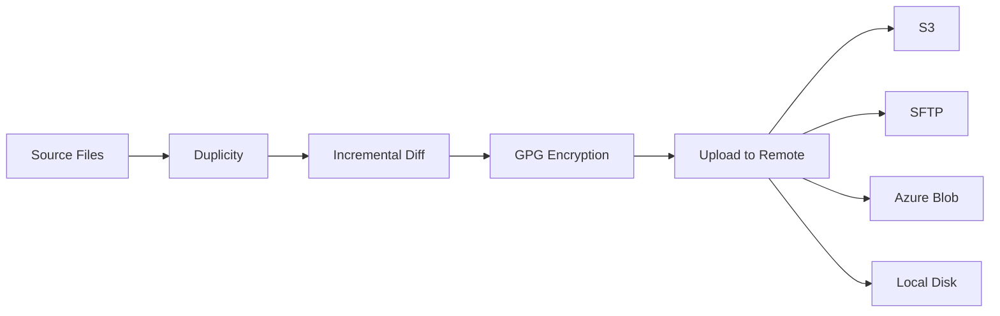

# How to Set Up Duplicity for Encrypted Remote Backups on RHEL

Author: [nawazdhandala](https://www.github.com/nawazdhandala)

Tags: RHEL, Duplicity, Encrypted Backups, GPG, Linux

Description: Configure Duplicity on RHEL for encrypted, bandwidth-efficient incremental backups to remote storage including S3, SFTP, and more.

---

Duplicity combines tar-format backups with GPG encryption and rsync-like bandwidth efficiency. It produces encrypted, signed backup volumes that can be stored on untrusted remote storage. You get the security of encryption with the efficiency of incremental backups.

## How Duplicity Works



## Installation

```bash
# Install Duplicity and dependencies
sudo dnf install duplicity python3-boto3 gnupg2

# Verify installation
duplicity --version
```

## Basic Backup to SFTP

```bash
# Set the encryption passphrase
export PASSPHRASE="YourStrongPassphrase"

# Full backup to remote server via SFTP
duplicity full /home sftp://backupuser@backup.example.com/backup/home

# Incremental backup (Duplicity auto-detects if full exists)
duplicity /home sftp://backupuser@backup.example.com/backup/home

# Unset the passphrase when done
unset PASSPHRASE
```

## Backup to S3-Compatible Storage

```bash
# Set AWS credentials
export AWS_ACCESS_KEY_ID="your-access-key"
export AWS_SECRET_ACCESS_KEY="your-secret-key"
export PASSPHRASE="YourEncryptionPassphrase"

# Backup to S3
duplicity /home s3://s3.amazonaws.com/my-backup-bucket/home

# Backup to MinIO or other S3-compatible storage
duplicity /home s3://minio.example.com/backup-bucket/home

unset AWS_ACCESS_KEY_ID AWS_SECRET_ACCESS_KEY PASSPHRASE
```

## Automated Backup Script

```bash
#!/bin/bash
# /usr/local/bin/duplicity-backup.sh
# Automated encrypted backup with Duplicity

# Configuration
export PASSPHRASE="YourStrongPassphrase"
BACKUP_SOURCE="/home"
BACKUP_DEST="sftp://backupuser@backup.example.com/backup/$(hostname)/home"
LOG="/var/log/duplicity-backup.log"

# Full backup if older than 30 days, otherwise incremental
FULL_IF_OLDER="30D"

echo "$(date): Starting Duplicity backup" >> "$LOG"

duplicity \
    --full-if-older-than "$FULL_IF_OLDER" \
    --exclude '**/.cache' \
    --exclude '**/.tmp' \
    --exclude '**/node_modules' \
    --volsize 250 \
    --asynchronous-upload \
    --verbosity info \
    "$BACKUP_SOURCE" \
    "$BACKUP_DEST" \
    >> "$LOG" 2>&1

# Remove backups older than 90 days
duplicity remove-older-than 90D --force "$BACKUP_DEST" >> "$LOG" 2>&1

# Remove all but the last 3 full backups
duplicity remove-all-but-n-full 3 --force "$BACKUP_DEST" >> "$LOG" 2>&1

# Clean up incomplete backup sessions
duplicity cleanup --force "$BACKUP_DEST" >> "$LOG" 2>&1

unset PASSPHRASE

echo "$(date): Backup complete" >> "$LOG"
```

## Restoring Files

```bash
export PASSPHRASE="YourStrongPassphrase"

# Restore everything to a directory
duplicity restore sftp://backupuser@backup.example.com/backup/home /tmp/restore/

# Restore a specific file
duplicity restore --file-to-restore Documents/report.pdf \
    sftp://backupuser@backup.example.com/backup/home /tmp/restored-report.pdf

# Restore from a specific point in time
duplicity restore --time 3D \
    sftp://backupuser@backup.example.com/backup/home /tmp/restore-3days/

# Restore from a specific date
duplicity restore --time 2026-02-28 \
    sftp://backupuser@backup.example.com/backup/home /tmp/restore-feb/

unset PASSPHRASE
```

## Using GPG Keys Instead of Passphrases

For better security, use GPG keys:

```bash
# Generate a GPG key for backups
gpg --gen-key

# Note the key ID
gpg --list-keys

# Use the GPG key for encryption
duplicity --encrypt-key ABCD1234 --sign-key ABCD1234 \
    /home sftp://backupuser@backup.example.com/backup/home
```

## Listing Backup Contents

```bash
export PASSPHRASE="YourStrongPassphrase"

# List all files in the backup
duplicity list-current-files sftp://backupuser@backup.example.com/backup/home

# List files from 5 days ago
duplicity list-current-files --time 5D sftp://backupuser@backup.example.com/backup/home

# Show backup chain status
duplicity collection-status sftp://backupuser@backup.example.com/backup/home

unset PASSPHRASE
```

## Verifying Backups

```bash
export PASSPHRASE="YourStrongPassphrase"

# Verify the backup matches the source
duplicity verify sftp://backupuser@backup.example.com/backup/home /home

unset PASSPHRASE
```

## Scheduling

```bash
# Add to crontab
sudo crontab -e
```

```
# Run Duplicity backup daily at 2 AM
0 2 * * * /usr/local/bin/duplicity-backup.sh
```

## Wrapping Up

Duplicity fills the gap between simple rsync backups and enterprise backup solutions. You get encryption (so you can use untrusted storage like S3), incremental efficiency (so backups are fast and use minimal bandwidth), and flexible retention policies. The main downside is that restoring individual files requires processing the backup chain, which can be slow for very old files. Keep your GPG keys and passphrases safe since losing them means losing access to your backups permanently.
