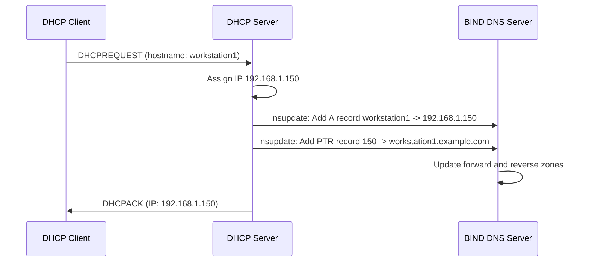

# How to Set Up Dynamic DNS with BIND and DHCP on RHEL 9

Author: [nawazdhandala](https://www.github.com/nawazdhandala)

Tags: RHEL, Dynamic DNS, BIND, DHCP, Linux

Description: Configure BIND and ISC DHCP to work together on RHEL 9 so that DHCP clients automatically get DNS records created and updated when they receive an IP address.

---

In a dynamic network where machines come and go, manually updating DNS records every time a device gets a new IP is not practical. Dynamic DNS (DDNS) solves this by letting the DHCP server automatically update BIND when it hands out a lease. The client gets an IP, and within seconds, it has a DNS name too. This guide sets up the full integration.

## How It Works



## Prerequisites

You need both BIND and ISC DHCP server installed. They can run on the same machine or different machines.

```bash
dnf install bind bind-utils dhcp-server -y
```

## Step 1: Generate a TSIG Key for DDNS Updates

The DHCP server authenticates to BIND using a shared TSIG key. Generate one:

```bash
tsig-keygen -a hmac-sha256 ddns-key > /etc/named/ddns-key.conf
```

View the key:

```bash
cat /etc/named/ddns-key.conf
```

Copy the key file so both BIND and DHCP can access it:

```bash
cp /etc/named/ddns-key.conf /etc/dhcp/ddns-key.conf
chown root:named /etc/named/ddns-key.conf
chmod 640 /etc/named/ddns-key.conf
chown root:dhcpd /etc/dhcp/ddns-key.conf
chmod 640 /etc/dhcp/ddns-key.conf
```

## Step 2: Configure BIND for Dynamic Updates

Update named.conf to allow DDNS updates from the DHCP server:

```bash
cat > /etc/named.conf << 'EOF'
// Include DDNS key
include "/etc/named/ddns-key.conf";

options {
    listen-on port 53 { any; };
    listen-on-v6 port 53 { any; };
    directory "/var/named";
    allow-query { localhost; 192.168.1.0/24; };
    recursion yes;
    allow-recursion { localhost; 192.168.1.0/24; };
    dnssec-validation auto;
    pid-file "/run/named/named.pid";
};

logging {
    channel default_log {
        file "/var/log/named/default.log" versions 3 size 5m;
        severity info;
        print-time yes;
    };
    category default { default_log; };
    category update { default_log; };
};

zone "." IN {
    type hint;
    file "named.ca";
};

// Forward zone - allows dynamic updates with the DDNS key
zone "example.com" IN {
    type primary;
    file "dynamic/example.com.zone";
    allow-update { key ddns-key; };
};

// Reverse zone - allows dynamic updates with the DDNS key
zone "1.168.192.in-addr.arpa" IN {
    type primary;
    file "dynamic/192.168.1.rev";
    allow-update { key ddns-key; };
};
EOF
```

Note that the zone files are in a `dynamic` subdirectory. BIND writes journal files alongside dynamic zones, so keeping them in their own directory is cleaner.

## Step 3: Create the Zone Files

```bash
mkdir -p /var/named/dynamic

cat > /var/named/dynamic/example.com.zone << 'EOF'
$TTL 86400
@   IN  SOA ns1.example.com. admin.example.com. (
            2026030401  ; Serial
            3600        ; Refresh
            1800        ; Retry
            604800      ; Expire
            86400       ; Minimum TTL
)

@       IN  NS  ns1.example.com.
ns1     IN  A   192.168.1.10
gateway IN  A   192.168.1.1
EOF

cat > /var/named/dynamic/192.168.1.rev << 'EOF'
$TTL 86400
@   IN  SOA ns1.example.com. admin.example.com. (
            2026030401 3600 1800 604800 86400 )

@       IN  NS  ns1.example.com.
1       IN  PTR gateway.example.com.
10      IN  PTR ns1.example.com.
EOF

chown -R named:named /var/named/dynamic
mkdir -p /var/log/named
chown named:named /var/log/named
```

## Step 4: Configure the DHCP Server

Set up the DHCP server to send dynamic updates to BIND:

```bash
cat > /etc/dhcp/dhcpd.conf << 'EOF'
# DDNS configuration
ddns-updates on;
ddns-update-style interim;
update-static-leases on;

# Include the TSIG key for BIND authentication
include "/etc/dhcp/ddns-key.conf";

# Define the DNS zones to update
zone example.com. {
    primary 192.168.1.10;
    key ddns-key;
}

zone 1.168.192.in-addr.arpa. {
    primary 192.168.1.10;
    key ddns-key;
}

# Tell clients to send their hostname
option domain-name "example.com";
option domain-name-servers 192.168.1.10;

# Global settings
default-lease-time 600;
max-lease-time 7200;
authoritative;

# Log facility
log-facility local7;

# Subnet declaration
subnet 192.168.1.0 netmask 255.255.255.0 {
    range 192.168.1.100 192.168.1.200;
    option routers 192.168.1.1;
    option subnet-mask 255.255.255.0;
    option domain-name "example.com";
    option domain-name-servers 192.168.1.10;
}
EOF
```

## Step 5: Start the Services

Validate and start BIND:

```bash
named-checkconf /etc/named.conf
named-checkzone example.com /var/named/dynamic/example.com.zone
systemctl enable --now named
```

Start the DHCP server:

```bash
systemctl enable --now dhcpd
```

Open firewall ports:

```bash
firewall-cmd --permanent --add-service=dns
firewall-cmd --permanent --add-service=dhcp
firewall-cmd --reload
```

## Step 6: Testing

Connect a client to the network and let it obtain a DHCP lease. The client should send its hostname in the DHCP request.

On the DNS server, check that records were created:

```bash
dig @localhost workstation1.example.com A
```

Check the reverse record:

```bash
dig @localhost -x 192.168.1.150
```

Watch the BIND logs for update activity:

```bash
tail -f /var/log/named/default.log
```

You should see messages about incoming updates from the DHCP server.

## Manual Testing with nsupdate

You can test DDNS manually using the `nsupdate` command:

```bash
nsupdate -k /etc/named/ddns-key.conf << 'EOF'
server 192.168.1.10
zone example.com
update add testhost.example.com 86400 A 192.168.1.250
send
EOF
```

Verify:

```bash
dig @localhost testhost.example.com A
```

Clean up:

```bash
nsupdate -k /etc/named/ddns-key.conf << 'EOF'
server 192.168.1.10
zone example.com
update delete testhost.example.com A
send
EOF
```

## Handling Journal Files

When BIND receives dynamic updates, it writes them to journal files (`.jnl` files) alongside the zone files. These are binary files.

To view the current zone including dynamic updates:

```bash
rndc sync example.com
cat /var/named/dynamic/example.com.zone
```

The `rndc sync` command writes the journal entries to the zone file. Without it, the zone file on disk may not reflect the latest dynamic updates.

## Troubleshooting

**DHCP server logs show update failures:**

```bash
journalctl -u dhcpd --no-pager -n 30
```

Common issues: wrong key name, BIND not allowing updates, firewall blocking port 53.

**BIND rejects the update:**

Check BIND logs for "update denied" messages. Make sure `allow-update` in named.conf uses the correct key name.

**Zone file permissions:** BIND needs write access to the dynamic zone directory:

```bash
chown -R named:named /var/named/dynamic
```

Dynamic DNS with BIND and DHCP is one of those setups that, once working, saves a huge amount of manual work. Every device that joins your network automatically gets a DNS name, and when it leaves or gets a new IP, the records update automatically.
