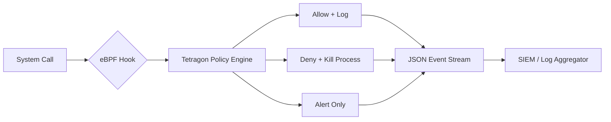

# How to Use eBPF for Security Monitoring with Tetragon on RHEL

Author: [nawazdhandala](https://www.github.com/nawazdhandala)

Tags: RHEL, EBPF, Tetragon, Security, Monitoring, Linux

Description: Learn how to deploy Cilium Tetragon on RHEL to monitor process execution, file access, and network connections using eBPF-based security observability.

---

Tetragon is an eBPF-based security observability tool from the Cilium project. It hooks into the Linux kernel to monitor process execution, file access, network connections, and privilege escalation in real time with minimal overhead. On RHEL, it runs natively and provides the kind of deep visibility that traditional audit tools cannot match.

## Why Tetragon Over Traditional Audit



Traditional auditd captures syscalls but generates massive log volumes and cannot take enforcement actions. Tetragon filters and processes events inside the kernel, only sending relevant events to userspace.

## Installing Tetragon on RHEL

```bash
# Add the Cilium Tetragon repository
cat <<'REPO' | sudo tee /etc/yum.repos.d/cilium-tetragon.repo
[cilium-tetragon]
name=Cilium Tetragon
baseurl=https://download.cilium.io/tetragon/rpm/stable/
enabled=1
gpgcheck=1
gpgkey=https://download.cilium.io/tetragon/rpm/stable/GPG-KEY-cilium
REPO

# Install Tetragon
sudo dnf install -y tetragon

# Enable and start the Tetragon service
sudo systemctl enable --now tetragon

# Verify it is running
sudo systemctl status tetragon

# Install the tetra CLI for interacting with Tetragon
sudo dnf install -y tetragon-cli
```

## Viewing Real-Time Security Events

Once Tetragon is running, it immediately starts capturing process execution and basic security events:

```bash
# Stream all events in real time using the tetra CLI
sudo tetra getevents -o compact

# Example output:
# process myhost /usr/bin/curl https://example.com
# process myhost /usr/bin/bash -c "whoami"
# process myhost /usr/sbin/useradd testuser

# For detailed JSON output (useful for piping to jq)
sudo tetra getevents | jq '.process_exec.process | {binary, arguments, uid}'
```

## Creating Custom Tracing Policies

Tetragon's real power comes from TracingPolicy custom resources. Even outside Kubernetes, you can load policy files:

```yaml
# /etc/tetragon/tetragon.tp.d/file-monitoring.yaml
# Monitor sensitive file access
apiVersion: cilium.io/v1alpha1
kind: TracingPolicy
metadata:
  name: sensitive-file-access
spec:
  kprobes:
    - call: "fd_install"
      syscall: false
      args:
        - index: 0
          type: int
        - index: 1
          type: "file"
      selectors:
        - matchArgs:
            - index: 1
              operator: "Prefix"
              values:
                - "/etc/shadow"
                - "/etc/passwd"
                - "/etc/sudoers"
                - "/root/.ssh/"
          matchActions:
            - action: Post
```

```bash
# Reload Tetragon to pick up the new policy
sudo systemctl restart tetragon

# Now try accessing a sensitive file
cat /etc/shadow

# Check the events - you should see the file access logged
sudo tetra getevents -o compact | grep shadow
```

## Monitoring Network Connections

Track outbound network connections to detect unexpected communication:

```yaml
# /etc/tetragon/tetragon.tp.d/network-monitoring.yaml
# Monitor TCP connect calls
apiVersion: cilium.io/v1alpha1
kind: TracingPolicy
metadata:
  name: network-connections
spec:
  kprobes:
    - call: "tcp_connect"
      syscall: false
      args:
        - index: 0
          type: "sock"
      selectors:
        - matchActions:
            - action: Post
```

```bash
# After loading this policy, all TCP connections are tracked
sudo tetra getevents | jq 'select(.process_kprobe.function_name == "tcp_connect")'
```

## Detecting Privilege Escalation

One of the most valuable security use cases is catching privilege escalation attempts:

```yaml
# /etc/tetragon/tetragon.tp.d/privilege-escalation.yaml
# Detect processes changing credentials
apiVersion: cilium.io/v1alpha1
kind: TracingPolicy
metadata:
  name: privilege-escalation-detect
spec:
  kprobes:
    - call: "commit_creds"
      syscall: false
      args:
        - index: 0
          type: "cred"
      selectors:
        - matchActions:
            - action: Post
    - call: "__x64_sys_setuid"
      syscall: true
      args:
        - index: 0
          type: int
      selectors:
        - matchActions:
            - action: Post
```

## Enforcement: Killing Suspicious Processes

Tetragon can go beyond monitoring and actively kill processes that violate policies:

```yaml
# /etc/tetragon/tetragon.tp.d/block-crypto-miners.yaml
# Kill any process that tries to connect to known mining pools
apiVersion: cilium.io/v1alpha1
kind: TracingPolicy
metadata:
  name: block-crypto-miners
spec:
  kprobes:
    - call: "tcp_connect"
      syscall: false
      args:
        - index: 0
          type: "sock"
      selectors:
        - matchArgs:
            - index: 0
              operator: "DPort"
              values:
                - "3333"    # Common Stratum mining port
                - "4444"
                - "14444"
          matchActions:
            - action: Sigkill  # Kill the process immediately
```

## Forwarding Events to a SIEM

For production use, you want to forward Tetragon events to your logging infrastructure:

```bash
# Tetragon writes JSON events to its export file
# Configure the export path in the Tetragon config
sudo mkdir -p /etc/tetragon/
cat <<'EOF' | sudo tee /etc/tetragon/tetragon.yaml
export-filename: /var/log/tetragon/tetragon.log
export-file-max-size-mb: 100
export-file-rotation-interval: 24h
export-file-max-backups: 5
export-file-compress: true
EOF

# Restart to apply
sudo systemctl restart tetragon

# Use rsyslog or a log shipper to forward /var/log/tetragon/tetragon.log
# Example: forward to a remote syslog server using rsyslog
cat <<'EOF' | sudo tee /etc/rsyslog.d/tetragon.conf
module(load="imfile")
input(type="imfile"
      File="/var/log/tetragon/tetragon.log"
      Tag="tetragon"
      Severity="info"
      Facility="local6")
local6.* @siem-server.example.com:514
EOF

sudo systemctl restart rsyslog
```

## Performance Impact

Tetragon is designed for production use with minimal overhead:

```bash
# Check Tetragon's resource usage
sudo systemctl status tetragon
ps aux | grep tetragon

# Monitor eBPF program performance
sudo bpftool prog list | grep tetragon
# Look at the "run_cnt" and "run_time_ns" fields to see actual overhead
```

Typical overhead is less than 1% CPU on moderately active systems, since eBPF programs run in the kernel and only send matching events to userspace.

## Conclusion

Tetragon gives RHEL administrators a powerful, low-overhead security monitoring tool that goes far beyond what auditd or file integrity monitoring can provide. The combination of deep kernel visibility, flexible policy rules, and enforcement capabilities makes it suitable for production security monitoring. Start with process and file access monitoring, then add network and privilege escalation policies as you become comfortable with the event volume and policy syntax.
