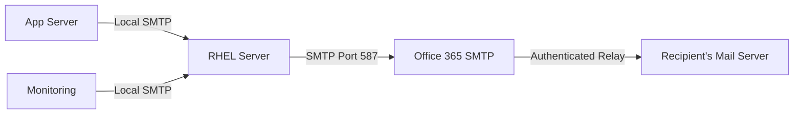

# How to Configure Email Relay Through Office 365 Using Postfix on RHEL

Author: [nawazdhandala](https://www.github.com/nawazdhandala)

Tags: RHEL, Postfix, Office 365, Email Relay, Linux

Description: Configure Postfix on RHEL to relay outgoing email through Microsoft Office 365 (Microsoft 365) SMTP servers for reliable email delivery.

---

## Why Relay Through Office 365?

Many organizations use Microsoft 365 for email but still have Linux servers that need to send notifications, alerts, and reports. Rather than sending mail directly from these servers (which often gets blocked because cloud IP addresses have poor sending reputation), you relay through Office 365's SMTP infrastructure. Microsoft handles deliverability, DKIM signing, and reputation management.

## Architecture



## Prerequisites

- RHEL with Postfix installed
- An Office 365 account with a valid license that can send email
- The account must have SMTP AUTH enabled (it is disabled by default in modern tenants)

## Enabling SMTP AUTH in Office 365

Before configuring Postfix, you need to enable SMTP AUTH for the sending account in the Microsoft 365 admin center:

1. Go to Microsoft 365 Admin Center
2. Navigate to Users, then Active Users
3. Select the user account
4. Click on the Mail tab
5. Under Email apps, enable Authenticated SMTP

If your tenant has security defaults enabled, you may need to create an app password or configure an exception. Check your Azure AD settings.

## Office 365 SMTP Details

| Setting | Value |
|---|---|
| Server | smtp.office365.com |
| Port | 587 |
| Encryption | STARTTLS |
| Authentication | Required (username and password) |

## Configuring Postfix

### Install Required Packages

```bash
# Install Postfix and SASL support
sudo dnf install -y postfix cyrus-sasl cyrus-sasl-plain
```

### Main Configuration

Edit `/etc/postfix/main.cf`:

```bash
# Server identity
myhostname = server.example.com
mydomain = example.com
myorigin = $mydomain

# Listen on localhost only
inet_interfaces = loopback-only
inet_protocols = ipv4

# Do not deliver locally
mydestination =

# Relay all mail through Office 365
relayhost = [smtp.office365.com]:587

# TLS settings for Office 365
smtp_tls_security_level = encrypt
smtp_tls_CAfile = /etc/pki/tls/certs/ca-bundle.crt
smtp_tls_loglevel = 1

# SASL authentication
smtp_sasl_auth_enable = yes
smtp_sasl_password_maps = hash:/etc/postfix/sasl_passwd
smtp_sasl_security_options = noanonymous
smtp_sasl_tls_security_options = noanonymous

# Sender address rewriting (Office 365 requires the sender to match the auth account)
sender_canonical_maps = hash:/etc/postfix/sender_canonical
```

### Create the SASL Password File

```bash
# Create the password file
sudo vi /etc/postfix/sasl_passwd
```

Add the Office 365 credentials:

```bash
[smtp.office365.com]:587 user@example.com:your_password
```

Secure and hash the file:

```bash
# Set restrictive permissions
sudo chmod 600 /etc/postfix/sasl_passwd

# Generate the hash database
sudo postmap /etc/postfix/sasl_passwd
```

### Sender Address Rewriting

Office 365 requires the sender address to match the authenticated account (or an alias of that account). Create a sender canonical map to rewrite local sender addresses:

```bash
sudo vi /etc/postfix/sender_canonical
```

```bash
# Rewrite all local senders to the Office 365 account
root            user@example.com
www-data        user@example.com
nagios          user@example.com
@server.example.com  user@example.com
```

If you want to rewrite ALL senders regardless:

```bash
sudo vi /etc/postfix/sender_canonical_regexp
```

```bash
/.+/ user@example.com
```

And use this in `main.cf` instead:

```bash
sender_canonical_maps = regexp:/etc/postfix/sender_canonical_regexp
```

Hash the map (if using the hash version):

```bash
sudo postmap /etc/postfix/sender_canonical
```

## Starting and Testing

```bash
# Enable and start Postfix
sudo systemctl enable --now postfix

# Check configuration for errors
sudo postfix check
```

Send a test email:

```bash
# Send test email
echo "Test relay through Office 365" | mail -s "O365 Relay Test" recipient@gmail.com
```

Check the logs:

```bash
# Watch for delivery status
sudo tail -f /var/log/maillog
```

A successful delivery looks like:

```bash
postfix/smtp: ABC123: to=<recipient@gmail.com>, relay=smtp.office365.com[52.x.x.x]:587, delay=1.5, status=sent (250 2.0.0 OK)
```

## Handling Multiple Sender Addresses

If you need different applications to send as different addresses, those addresses must be configured as aliases on the Office 365 account. Then use a more specific sender canonical map:

```bash
# Map specific local users to specific Office 365 aliases
nagios    alerts@example.com
www-data  noreply@example.com
root      admin@example.com
```

## Common Errors and Fixes

### Authentication Failed (535 5.7.3)

```bash
SASL authentication failed: UGFzc3dvcmQ6
```

**Causes:**
- SMTP AUTH is not enabled for the account
- Wrong username or password
- Multi-factor authentication is blocking the connection
- Security defaults are enabled in Azure AD

**Fix:** Enable SMTP AUTH in the admin center. If MFA is enabled, create an app password.

### Sender Address Rejected (550 5.7.60)

```bash
550 5.7.60 SMTP; Client does not have permissions to send as this sender
```

**Cause:** The From address does not match the authenticated account or its aliases.

**Fix:** Add the sender address as an alias on the account, or use sender_canonical_maps to rewrite the From address.

### TLS Handshake Failed

```bash
TLS handshake failed
```

**Fix:** Make sure the CA bundle is up to date:

```bash
sudo dnf update -y ca-certificates
```

### Rate Limiting (452 4.5.3)

Office 365 has sending limits. Default limits for Exchange Online:
- 10,000 recipients per day
- 30 messages per minute

If you hit these limits, messages will be deferred and retried later.

## Using a Shared Mailbox

Instead of a licensed user account, you can use a shared mailbox for relaying. Shared mailboxes do not require a license. Assign Send As permissions to the user account authenticating the SMTP connection.

## Security Best Practices

```bash
# Verify the password file has restrictive permissions
ls -la /etc/postfix/sasl_passwd
# Should show: -rw------- root root

# Make sure only root can read the hash file too
sudo chmod 600 /etc/postfix/sasl_passwd.db
```

Consider creating a dedicated service account in Office 365 with minimal permissions rather than using a personal account.

## Monitoring

```bash
# Check queue for stuck messages
sudo postqueue -p

# Check for authentication errors
sudo grep "SASL" /var/log/maillog | tail -10

# Check delivery statistics
sudo grep "status=" /var/log/maillog | tail -20
```

## Wrapping Up

Relaying through Office 365 is the practical choice when your organization already uses Microsoft 365 for email. The setup is straightforward - configure SASL authentication, enforce TLS, and rewrite sender addresses to match your Office 365 account. The main gotchas are SMTP AUTH being disabled by default and sender address mismatches, both of which are easy to fix once you know about them.
