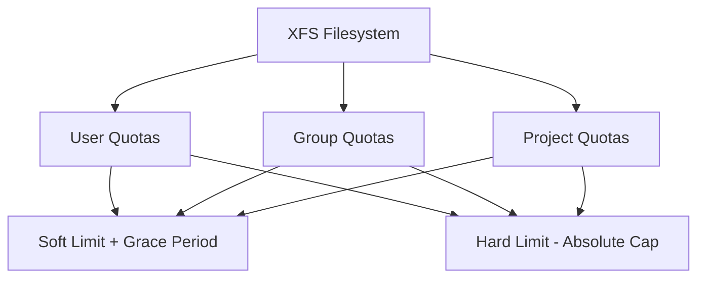

# How to Enable and Configure XFS Disk Quotas on RHEL

Author: [nawazdhandala](https://www.github.com/nawazdhandala)

Tags: RHEL, XFS, Quotas, Storage, Linux

Description: Learn how to enable and configure XFS disk quotas on RHEL to control disk usage per user and group, keeping your storage consumption predictable and fair.

---

If you have been managing Linux servers for any length of time, you know that disk space has a way of disappearing faster than anyone expects. One developer uploads a few database dumps, another leaves log rotation off, and suddenly your 500 GB partition is at 98%. XFS quotas are your first line of defense.

RHEL uses XFS as the default filesystem, and XFS has its own quota implementation that differs from the older ext4/quota tools. This guide walks through enabling and configuring XFS quotas from scratch.

## How XFS Quotas Work

XFS handles quotas at the filesystem level using its own internal accounting. Unlike ext4 quotas (which rely on separate quota files), XFS tracks usage in the filesystem metadata itself. This means quota enforcement is faster and there is no need to run `quotacheck` periodically.

XFS supports three types of quotas:

- **User quotas** - limit per-user consumption
- **Group quotas** - limit per-group consumption
- **Project quotas** - limit usage for specific directory trees



## Prerequisites

Before you begin, make sure you have:

- A RHEL system with root access
- An XFS filesystem on a dedicated partition or logical volume
- The `xfsprogs` package installed (it should be by default)

Check your XFS tools version:

```bash
# Verify xfsprogs is installed
rpm -q xfsprogs
```

## Step 1: Enable Quotas via Mount Options

XFS quotas must be enabled at mount time. You cannot turn them on for a mounted filesystem without remounting it.

Edit your `/etc/fstab` to add quota mount options:

```bash
# Open fstab in your preferred editor
vi /etc/fstab
```

Find the line for your XFS partition and add the appropriate quota options. For user and group quotas:

```bash
/dev/vg_data/lv_data  /data  xfs  defaults,uquota,gquota  0 0
```

The key mount options are:

| Option | Description |
|--------|-------------|
| `uquota` or `usrquota` | Enable user quotas |
| `gquota` or `grpquota` | Enable group quotas |
| `pquota` or `prjquota` | Enable project quotas |

Note that you cannot enable group quotas and project quotas at the same time on XFS. Pick one or the other.

## Step 2: Remount the Filesystem

If the filesystem is already mounted, remount it to apply the new options:

```bash
# Remount with new quota options
umount /data
mount /data
```

If the filesystem is in use and cannot be unmounted, you will need to reboot. For root filesystems, a reboot is always required.

Verify that quotas are active:

```bash
# Check that quota mount options are in effect
mount | grep /data
```

You should see `usrquota` and `grpquota` in the output.

## Step 3: Set User Quotas

Use `xfs_quota` to configure limits. The tool has an interactive mode and a command-line mode.

Set a soft limit of 5 GB and a hard limit of 6 GB for a user:

```bash
# Set quota limits for user 'jsmith'
# bsoft = soft block limit, bhard = hard block limit
xfs_quota -x -c 'limit bsoft=5g bhard=6g jsmith' /data
```

The `-x` flag enables expert mode (required for setting limits), and `-c` passes a command.

You can also set inode limits to restrict the number of files:

```bash
# Set inode limits - max 100,000 files soft, 120,000 hard
xfs_quota -x -c 'limit isoft=100000 ihard=120000 jsmith' /data
```

## Step 4: Set Group Quotas

Group quotas work the same way but target groups instead of users:

```bash
# Set a 50 GB soft limit and 60 GB hard limit for the 'developers' group
xfs_quota -x -c 'limit -g bsoft=50g bhard=60g developers' /data
```

## Step 5: Verify Quota Configuration

Check the current quota report for all users:

```bash
# Show quota report for all users on /data
xfs_quota -x -c 'report -ubih' /data
```

The flags break down as:
- `-u` for user report
- `-b` for block usage
- `-i` for inode usage
- `-h` for human-readable sizes

For group quotas:

```bash
# Show group quota report
xfs_quota -x -c 'report -gbih' /data
```

## Step 6: Check Individual User Quota

To check a specific user's quota:

```bash
# Check quota for a specific user
xfs_quota -x -c 'quota -bih jsmith' /data
```

## Step 7: Configure Grace Periods

When a user exceeds their soft limit, they enter a grace period. Once the grace period expires, no new writes are allowed until usage drops below the soft limit.

Set a 7-day grace period:

```bash
# Set grace period to 7 days for block usage
xfs_quota -x -c 'timer -u -b 7days' /data
```

## Removing Quotas for a User

To remove all quota limits for a user:

```bash
# Remove all limits for user 'jsmith'
xfs_quota -x -c 'limit bsoft=0 bhard=0 isoft=0 ihard=0 jsmith' /data
```

Setting limits to 0 effectively removes the quota.

## Real-World Example: Multi-User File Server

Here is a practical setup for a file server with three tiers of users:

```bash
# Standard users get 10 GB
for user in alice bob carol; do
    xfs_quota -x -c "limit bsoft=10g bhard=12g $user" /data
done

# Power users get 50 GB
for user in dave eve; do
    xfs_quota -x -c "limit bsoft=50g bhard=55g $user" /data
done

# Set a 3-day grace period
xfs_quota -x -c 'timer -u -b 3days' /data

# Verify everything looks right
xfs_quota -x -c 'report -ubh' /data
```

## Monitoring Quotas with a Cron Job

Set up a daily report that gets emailed to you:

```bash
# Create a daily quota report script
cat > /usr/local/bin/quota-report.sh << 'SCRIPT'
#!/bin/bash
REPORT=$(xfs_quota -x -c 'report -ubh' /data)
echo "$REPORT" | mail -s "Daily Quota Report - $(hostname)" admin@example.com
SCRIPT

chmod +x /usr/local/bin/quota-report.sh

# Add to crontab - runs daily at 8 AM
echo "0 8 * * * /usr/local/bin/quota-report.sh" >> /var/spool/cron/root
```

## Troubleshooting

If quotas are not enforcing, check these common issues:

1. **Mount options missing** - Run `mount | grep quota` to confirm quota options are active
2. **Wrong filesystem** - XFS quota tools only work on XFS. Check with `df -T /data`
3. **SELinux denials** - Check `ausearch -m avc -ts recent` for any SELinux blocks

## Summary

XFS quotas on RHEL are straightforward once you understand the workflow: enable at mount time, set limits with `xfs_quota`, and monitor with reports. The built-in accounting in XFS makes this faster and more reliable than the older quota tools used with ext4. Start with soft limits and grace periods so users get warnings before they hit a wall, and automate your monitoring so you are never surprised by a full disk.
