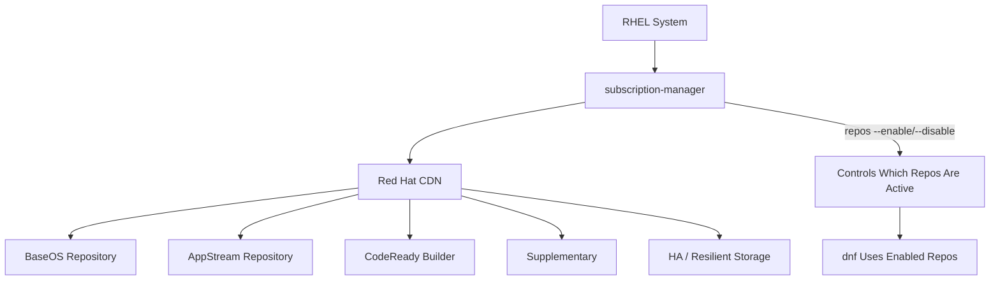

# How to Enable and Disable Software Repositories with subscription-manager on RHEL

Author: [nawazdhandala](https://www.github.com/nawazdhandala)

Tags: RHEL, Repositories, subscription-manager, Red Hat, Linux

Description: Learn how to list, enable, and disable Red Hat software repositories on RHEL using subscription-manager, giving you control over what packages are available on your system.

---

After registering your RHEL system and attaching a subscription, you get access to a set of default repositories. But not every repository is enabled out of the box, and sometimes you need more than the defaults. The `subscription-manager repos` command gives you full control over which Red Hat repositories are active on your system. This guide covers everything from listing repos to enabling specialized channels.

## Default Repositories on RHEL

A freshly registered RHEL system typically has two repositories enabled:

- `rhel-9-for-x86_64-baseos-rpms` - Core OS packages
- `rhel-9-for-x86_64-appstream-rpms` - Application stream packages

These two cover the vast majority of day-to-day needs. But additional repos exist for supplementary tools, high availability, CodeReady Builder, and more.

## Listing All Available Repositories

To see every repository your subscription provides access to:

```bash
# List all repositories (enabled and disabled)
sudo subscription-manager repos --list
```

This can produce a long list. Filter it to find what you need:

```bash
# Search for repositories matching a keyword
sudo subscription-manager repos --list | grep -i codeready
```

## Listing Only Enabled Repositories

To see what is currently active:

```bash
# Show only enabled repositories
sudo subscription-manager repos --list-enabled
```

This is the quick way to verify which repos are feeding packages to `dnf`.

## Enabling a Repository

To enable a repository, use the `--enable` flag with the repo ID:

```bash
# Enable the CodeReady Linux Builder repository
sudo subscription-manager repos --enable=codeready-builder-for-rhel-9-x86_64-rpms
```

After enabling, verify it shows up:

```bash
# Confirm the repo is now enabled
sudo dnf repolist
```

## Enabling Multiple Repositories at Once

You can enable several repositories in a single command:

```bash
# Enable multiple repos in one shot
sudo subscription-manager repos \
    --enable=codeready-builder-for-rhel-9-x86_64-rpms \
    --enable=rhel-9-for-x86_64-supplementary-rpms
```

## Disabling a Repository

Disable a repository when you no longer need it or want to prevent packages from being pulled from it:

```bash
# Disable the supplementary repository
sudo subscription-manager repos --disable=rhel-9-for-x86_64-supplementary-rpms
```

## Combining Enable and Disable

You can enable and disable repos in the same command:

```bash
# Enable one repo and disable another simultaneously
sudo subscription-manager repos \
    --enable=codeready-builder-for-rhel-9-x86_64-rpms \
    --disable=rhel-9-for-x86_64-supplementary-rpms
```

## Repository Architecture

Here is how the repository system fits together:



## Common Repositories You Might Need

Here is a quick reference of commonly used RHEL repositories and when to enable them:

**CodeReady Linux Builder** - Needed for development headers and libraries not in AppStream:

```bash
# Enable CodeReady Builder
sudo subscription-manager repos --enable=codeready-builder-for-rhel-9-x86_64-rpms
```

**High Availability** - Required for cluster software like Pacemaker and Corosync:

```bash
# Enable the HA repository
sudo subscription-manager repos --enable=rhel-9-for-x86_64-highavailability-rpms
```

**Resilient Storage** - For GFS2 and related clustered storage tools:

```bash
# Enable Resilient Storage
sudo subscription-manager repos --enable=rhel-9-for-x86_64-resilientstorage-rpms
```

**Supplementary** - Contains third-party and supplementary packages:

```bash
# Enable Supplementary
sudo subscription-manager repos --enable=rhel-9-for-x86_64-supplementary-rpms
```

## Overriding Repository Settings

If you need to override specific repository attributes (like the base URL or GPG check setting) without disabling the entire repo, use the `--override` feature:

```bash
# Disable GPG checking for a specific repo (not recommended for production)
sudo subscription-manager repo-override --repo=rhel-9-for-x86_64-baseos-rpms \
    --add=gpgcheck:0
```

To remove an override:

```bash
# Remove a specific override
sudo subscription-manager repo-override --repo=rhel-9-for-x86_64-baseos-rpms \
    --remove=gpgcheck
```

To list all active overrides:

```bash
# Show all repository overrides
sudo subscription-manager repo-override --list
```

## Disabling All Repositories

In rare cases, you may want to disable all repos and selectively enable just what you need:

```bash
# Disable every repository, then enable only what you want
sudo subscription-manager repos --disable="*"
sudo subscription-manager repos \
    --enable=rhel-9-for-x86_64-baseos-rpms \
    --enable=rhel-9-for-x86_64-appstream-rpms
```

This is useful when you want strict control over package sources.

## Repositories and dnf

The repositories managed by `subscription-manager` show up as regular dnf repos. You can also see their configuration in `/etc/yum.repos.d/redhat.repo`:

```bash
# View the generated repository configuration file
cat /etc/yum.repos.d/redhat.repo | head -30
```

Do not edit this file directly. Changes will be overwritten by `subscription-manager`. Always use `subscription-manager repos` to manage these repositories.

## Managing Repos with Ansible

For consistent configuration across many systems:

```yaml
# Ansible task to enable specific repositories
- name: Enable required RHEL repositories
  community.general.rhsm_repository:
    name:
      - codeready-builder-for-rhel-9-x86_64-rpms
      - rhel-9-for-x86_64-highavailability-rpms
    state: enabled

# Ansible task to disable a repository
- name: Disable supplementary repository
  community.general.rhsm_repository:
    name: rhel-9-for-x86_64-supplementary-rpms
    state: disabled
```

## Troubleshooting

**Repository not found**: Make sure your subscription covers the repository. Not all subscriptions include every repo. Check with:

```bash
# Verify available repos for your subscription
sudo subscription-manager repos --list | grep -c "Repo ID"
```

**Stale repo metadata**: If dnf complains about metadata, clean and refresh:

```bash
# Clean dnf cache and refresh
sudo dnf clean all
sudo subscription-manager refresh
```

## Summary

Repository management with `subscription-manager` is one of those tasks that seems simple but makes a big difference in how well your RHEL systems are configured. Keep only the repos you need enabled to reduce package conflicts, speed up dnf operations, and maintain a cleaner system. For automation, pair `subscription-manager repos` with Ansible to enforce consistent repo configurations across your fleet.
