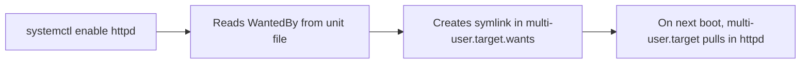
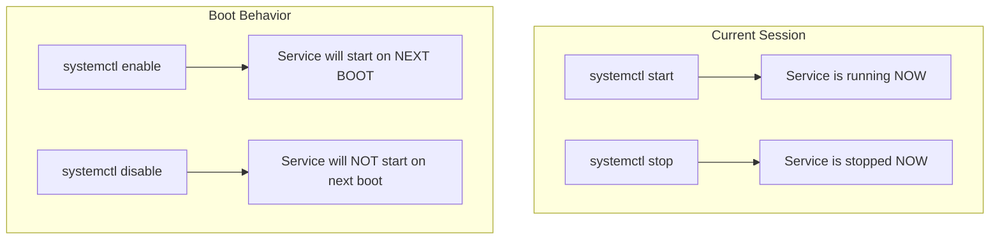

# How to Enable and Disable Services at Boot Time on RHEL

Author: [nawazdhandala](https://www.github.com/nawazdhandala)

Tags: RHEL, Systemd, Boot Services, Systemctl, Linux

Description: Learn how to control which services start automatically at boot on RHEL using systemctl enable and disable, and understand what happens under the hood.

---

There is a difference between starting a service and enabling it. Starting a service brings it up right now. Enabling a service tells systemd to start it automatically every time the machine boots. If you have ever rebooted a server and found that the service you started manually yesterday is gone, you forgot to enable it.

This guide covers everything you need to know about controlling boot-time service behavior on RHEL.

---

## Enabling a Service

When you enable a service, systemd creates a symbolic link in the appropriate target's wants directory. That link is what tells systemd to start the service during boot.

```bash
# Enable httpd to start at boot
sudo systemctl enable httpd
```

The output tells you exactly what it did:

```bash
Created symlink /etc/systemd/system/multi-user.target.wants/httpd.service -> /usr/lib/systemd/system/httpd.service.
```

This means "when the system reaches the multi-user target (normal operation), start httpd."

If you want to enable a service and start it immediately in one shot:

```bash
# Enable at boot AND start right now
sudo systemctl enable --now httpd
```

The `--now` flag is a time-saver you will use constantly.

---

## Disabling a Service

Disabling a service removes the symlink, so the service will not start automatically at boot:

```bash
# Disable httpd from starting at boot
sudo systemctl disable httpd
```

Output:

```bash
Removed /etc/systemd/system/multi-user.target.wants/httpd.service.
```

Important: disabling a service does NOT stop it if it is currently running. It only affects boot behavior. If you want to disable and stop:

```bash
# Disable at boot AND stop right now
sudo systemctl disable --now httpd
```

---

## Checking if a Service is Enabled

Before making changes, you often want to check the current state:

```bash
# Check if httpd is enabled
systemctl is-enabled httpd
```

This returns one of several possible states:

| State | Meaning |
|-------|---------|
| `enabled` | Starts at boot (symlink exists) |
| `disabled` | Does not start at boot |
| `static` | Cannot be enabled directly, only started as a dependency |
| `masked` | Completely blocked from starting |
| `alias` | The name is an alias for another unit |
| `indirect` | Enabled indirectly through another unit |

The exit code is also useful for scripting - 0 means enabled, non-zero means not enabled:

```bash
# Use in a script
if systemctl is-enabled --quiet httpd; then
    echo "httpd starts at boot"
else
    echo "httpd does NOT start at boot"
fi
```

---

## Understanding WantedBy and the Symlink Mechanism

The magic behind enable/disable is the `[Install]` section in the unit file. Let's look at it:

```bash
# Show the Install section of the httpd unit file
systemctl cat httpd | grep -A 5 "\[Install\]"
```

You will see something like:

```ini
[Install]
WantedBy=multi-user.target
```

`WantedBy=multi-user.target` means "when someone enables this service, create a symlink in `/etc/systemd/system/multi-user.target.wants/`." The multi-user target is the standard target for a running system with networking but no graphical interface.

Here is the flow:



Some services use `WantedBy=graphical.target` instead, meaning they only start when the system boots into a graphical environment. Others might use `WantedBy=timers.target` or custom targets.

---

## Listing All Enabled Services

To see every service that is configured to start at boot:

```bash
# List all enabled services
systemctl list-unit-files --type=service --state=enabled
```

This gives you a clean list of service names and their states. To get just the names:

```bash
# List only the names of enabled services
systemctl list-unit-files --type=service --state=enabled --no-legend | awk '{print $1}'
```

To see disabled services:

```bash
# List all disabled services
systemctl list-unit-files --type=service --state=disabled
```

And to see everything at once:

```bash
# List all service unit files with their states
systemctl list-unit-files --type=service
```

---

## Enabling vs. Starting: The Common Mistake

I see this mistake constantly, especially from people coming from SysVinit where `chkconfig` and `service` were separate tools. Here is the distinction laid out clearly:



The operations are independent. You can have a service that is:
- **Running but disabled** - It's running now, but won't start after a reboot
- **Stopped but enabled** - It's not running now, but will start after a reboot
- **Running and enabled** - This is what you usually want for production services
- **Stopped and disabled** - This is what you usually want for services you don't need

---

## Preset Services: RHEL Defaults

RHEL uses presets to define which services should be enabled by default after package installation. You can see these presets:

```bash
# Show service presets
systemctl list-unit-files --type=service | head -20
```

The preset column shows what Red Hat considers the default state. To reset a service to its preset value:

```bash
# Reset a service to its RHEL default state
sudo systemctl preset httpd
```

To reset ALL services to their default states (be careful with this one):

```bash
# Reset all services to preset defaults
sudo systemctl preset-all
```

I would not run `preset-all` on a production system without understanding what it does first. It could disable services you have intentionally enabled.

---

## Enabling Services That Have No Install Section

Sometimes you try to enable a service and get this error:

```bash
The unit files have no installation config (WantedBy=, RequiredBy=, etc.)
```

This means the unit file has no `[Install]` section. These are "static" services that are only meant to be started as dependencies of other services. You cannot enable them directly, and you should not need to. They will start automatically when whatever depends on them starts.

Check for this:

```bash
# See if a service is static
systemctl is-enabled systemd-journald
```

If it returns `static`, that is by design.

---

## Practical Example: Setting Up a LAMP Stack

Here is a real-world example of enabling the services for a LAMP stack:

```bash
# Install the packages
sudo dnf install httpd mariadb-server php-fpm -y

# Enable and start all three services
sudo systemctl enable --now httpd
sudo systemctl enable --now mariadb
sudo systemctl enable --now php-fpm

# Verify they are all enabled
systemctl is-enabled httpd mariadb php-fpm
```

The output should show `enabled` three times. Now after any reboot, all three services will come up automatically.

---

## Wrapping Up

The enable/disable mechanism is straightforward once you understand the symlink system underneath it. The key habits to build are: always use `--now` when you want both immediate and boot-time changes, always verify with `is-enabled` after making changes, and periodically review your enabled services list to make sure nothing unexpected has crept in. A clean boot configuration is part of a well-maintained system.
