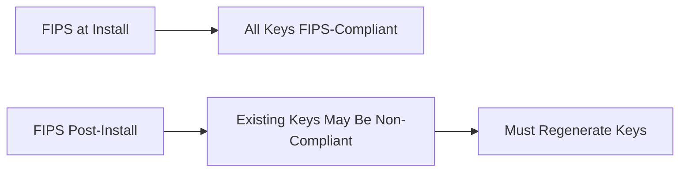

# How to Enable FIPS Mode on RHEL 9 During Installation

Author: [nawazdhandala](https://www.github.com/nawazdhandala)

Tags: RHEL, FIPS, Installation, Security, Linux

Description: Enable FIPS 140-3 compliant cryptography on RHEL 9 during the installation process, ensuring the system uses validated cryptographic modules from the very first boot.

---

FIPS (Federal Information Processing Standards) mode ensures that your RHEL 9 system only uses NIST-validated cryptographic algorithms. Enabling it during installation is the cleanest approach because it configures the kernel, libraries, and all cryptographic subsystems before any data hits the disk. Enabling FIPS post-installation works too, but during installation is the recommended path per Red Hat documentation.

## Why Enable FIPS During Installation

When you enable FIPS during installation, the installer generates all cryptographic keys using FIPS-approved algorithms from the start. If you enable it after installation, existing keys may have been generated with non-FIPS algorithms and would need to be regenerated. This matters for SSH host keys, LUKS encryption keys, and SSL/TLS certificates.



## Method 1: Kernel Boot Parameter

The simplest way to enable FIPS during installation is to add a kernel parameter at the boot menu:

```bash
# At the RHEL 9 installation boot menu:
# 1. Highlight the installation option
# 2. Press Tab to edit boot parameters
# 3. Append: fips=1
# The full line should look something like:
# vmlinuz ... inst.stage2=... fips=1
```

## Method 2: Kickstart File

For automated installations, add the fips directive to your Kickstart file:

```bash
# Add this line to your Kickstart configuration
fips --enable

# Full Kickstart example with FIPS
text
lang en_US.UTF-8
keyboard us
timezone America/New_York --utc
rootpw --iscrypted $6$salt$hash

# Enable FIPS mode
fips --enable

# Partitioning (FIPS requires /boot on a separate partition)
clearpart --all --initlabel
part /boot --fstype=xfs --size=1024
part /boot/efi --fstype=efi --size=600
part pv.01 --size=1 --grow
volgroup rhel pv.01
logvol / --vgname=rhel --fstype=xfs --size=20480 --name=root
logvol swap --vgname=rhel --fstype=swap --size=4096 --name=swap

%packages
@^minimal-environment
%end

reboot
```

Important: When using FIPS mode, `/boot` must be on a separate partition. The FIPS integrity check needs to verify the kernel and initramfs, and this requires `/boot` to be on its own partition rather than within an encrypted volume.

## Method 3: Anaconda GUI

During the graphical installation:

1. In the Installation Summary screen, click "Security Policy"
2. Select the FIPS profile or a profile that includes FIPS (like STIG)
3. The installer will configure FIPS mode as part of the profile application

## Verify FIPS Is Active After Installation

After the system boots for the first time:

```bash
# Check FIPS mode status
fips-mode-setup --check
# Expected output: FIPS mode is enabled.

# Verify the kernel has FIPS enabled
cat /proc/sys/crypto/fips_enabled
# Expected output: 1

# Check the crypto policy
update-crypto-policies --show
# Expected output: FIPS
```

## Verify Cryptographic Module Integrity

```bash
# Check that FIPS self-tests passed
journalctl -b | grep -i fips

# Verify OpenSSL is running in FIPS mode
openssl list -providers | grep fips

# Test that a non-FIPS algorithm is rejected
openssl md5 /dev/null 2>&1
# Should show an error because MD5 is not FIPS-approved
```

## What Changes in FIPS Mode

When FIPS mode is active, the following changes take effect:

- **Disabled algorithms**: MD5, SHA-1 (for signatures), DES, RC4, and other non-approved algorithms
- **SSH**: Only FIPS-approved ciphers and MACs are available
- **TLS**: Only TLS 1.2 and 1.3 with FIPS-approved cipher suites
- **Kernel**: The kernel performs self-tests on cryptographic modules at boot
- **OpenSSL**: Only the FIPS provider is active

```bash
# See which SSH ciphers are available in FIPS mode
ssh -Q cipher

# See which TLS cipher suites are available
openssl ciphers -v | head -20
```

## Troubleshooting Installation Issues

### Boot fails after FIPS installation

```bash
# If the system fails to boot, check that /boot is a separate partition
# FIPS requires /boot to be accessible without decryption

# Boot from rescue media and verify
mount /dev/sda1 /mnt
ls /mnt/vmlinuz* /mnt/initramfs*
```

### LUKS encryption with FIPS

If you are using LUKS disk encryption with FIPS, make sure to use a FIPS-approved cipher:

```bash
# During Kickstart, specify FIPS-compliant encryption
# The default aes-xts-plain64 is FIPS-approved
logvol / --vgname=rhel --fstype=xfs --size=20480 --name=root \
  --encrypted --passphrase=YourPassphrase
```

## Network Considerations

Some network services may behave differently after FIPS is enabled:

```bash
# If using LDAP/AD authentication, ensure the server supports FIPS ciphers
# Test LDAP connectivity
ldapsearch -x -H ldaps://ldap.example.com -b "dc=example,dc=com" 2>&1

# If using Kerberos, verify it works with FIPS
klist -e
```

Enabling FIPS during installation is a simple one-line addition to your boot parameters or Kickstart file, but it has far-reaching effects on how the entire system handles cryptography. Get it right during installation and you avoid the hassle of retrofitting it later.
