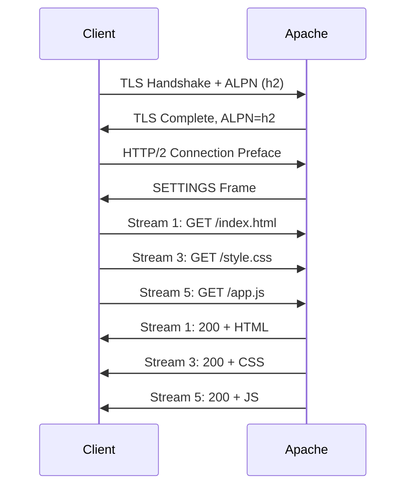

# How to Enable HTTP/2 on Apache httpd in RHEL

Author: [nawazdhandala](https://www.github.com/nawazdhandala)

Tags: RHEL, Apache, HTTP/2, Performance, Linux

Description: Step-by-step instructions for enabling HTTP/2 on Apache httpd in RHEL to improve page load times and connection efficiency.

---

## What HTTP/2 Brings to the Table

HTTP/1.1 has served us well, but it has a fundamental limitation: one request per connection at a time. Browsers work around this by opening multiple connections, which wastes resources. HTTP/2 fixes this with multiplexing, letting many requests share a single connection. It also adds header compression and server push.

On RHEL, enabling HTTP/2 in Apache is surprisingly simple.

## Prerequisites

- RHEL with Apache httpd installed
- TLS configured (HTTP/2 in browsers requires HTTPS)
- The event or worker MPM (not prefork)
- Root or sudo access

## Step 1 - Verify the MPM

HTTP/2 does not work with the prefork MPM. Check your current MPM:

```bash
# Check which MPM is active
httpd -V | grep MPM
```

If you see `prefork`, you need to switch. This is common if you installed mod_php. Consider moving to PHP-FPM first.

Switch to the event MPM:

```bash
# Edit the MPM configuration
sudo vi /etc/httpd/conf.modules.d/00-mpm.conf
```

Ensure only the event module is loaded:

```apache
LoadModule mpm_event_module modules/mod_mpm_event.so
#LoadModule mpm_prefork_module modules/mod_mpm_prefork.so
#LoadModule mpm_worker_module modules/mod_mpm_worker.so
```

## Step 2 - Verify mod_http2 Is Available

```bash
# Check if the HTTP/2 module is loaded
httpd -M | grep http2
```

If it is not listed, check the module config files:

```bash
# Look for the HTTP/2 module configuration
cat /etc/httpd/conf.modules.d/10-h2.conf
```

The module should be loaded with:

```apache
LoadModule http2_module modules/mod_http2.so
```

## Step 3 - Enable the Protocols Directive

Add the `Protocols` directive to your SSL virtual host:

```apache
<VirtualHost *:443>
    ServerName www.example.com
    DocumentRoot /var/www/html

    # Enable HTTP/2 with HTTPS fallback
    Protocols h2 http/1.1

    SSLEngine on
    SSLCertificateFile /etc/pki/tls/certs/server.crt
    SSLCertificateKeyFile /etc/pki/tls/private/server.key

    <Directory /var/www/html>
        Require all granted
    </Directory>
</VirtualHost>
```

The `Protocols h2 http/1.1` line tells Apache to prefer HTTP/2 but fall back to HTTP/1.1 for clients that do not support it.

## Step 4 - Enable HTTP/2 Globally

If you want HTTP/2 on all virtual hosts, add the directive to the main config:

```bash
# Add HTTP/2 protocol support globally
sudo tee /etc/httpd/conf.d/http2.conf > /dev/null <<'EOF'
# Enable HTTP/2 for all HTTPS virtual hosts
Protocols h2 http/1.1

# Optional: enable h2c (HTTP/2 over cleartext) for port 80
# Protocols h2c http/1.1
EOF
```

Most browsers only support HTTP/2 over TLS, so `h2c` is mainly useful for internal services or reverse proxy communication.

## Step 5 - Restart Apache

Since we might have changed the MPM, do a full restart:

```bash
# Validate configuration
sudo apachectl configtest

# Restart Apache
sudo systemctl restart httpd
```

## Step 6 - Verify HTTP/2 Is Working

Use curl to check:

```bash
# Test HTTP/2 support (curl needs to be built with nghttp2)
curl -kI --http2 https://www.example.com
```

Look for `HTTP/2 200` in the response. If you see `HTTP/1.1 200`, something is not right.

You can also check with openssl:

```bash
# Check ALPN negotiation
openssl s_client -connect www.example.com:443 -alpn h2 </dev/null 2>/dev/null | grep ALPN
```

You should see `ALPN protocol: h2`.

## Step 7 - Tune HTTP/2 Settings

Apache has some HTTP/2-specific directives you can tune:

```apache
# HTTP/2 tuning parameters
H2MaxSessionStreams 100
H2WindowSize 65535
H2MinWorkers 1
H2MaxWorkers 25
```

- **H2MaxSessionStreams** - Maximum concurrent streams per connection (default 100)
- **H2WindowSize** - Flow control window size for streams
- **H2MaxWorkers** - Worker threads for HTTP/2 processing

For most setups, the defaults work fine. Only tune these if you have specific performance requirements.

## HTTP/2 Connection Flow



Notice how multiple requests are sent without waiting for responses. That is multiplexing in action.

## Common Issues

### Prefork MPM Still Active

If you see this error in the log:

```bash
AH10034: The mpm module (prefork.c) is not supported by mod_http2
```

You need to switch to the event or worker MPM. See Step 1.

### Old TLS Configuration

HTTP/2 requires TLS 1.2 or higher with specific cipher suites. RHEL defaults are fine, but if you have customized your TLS settings, make sure you have not accidentally excluded ECDHE ciphers.

### Client Does Not Support HTTP/2

Older browsers or curl builds without nghttp2 will fall back to HTTP/1.1 automatically. This is expected behavior and not a problem.

## Wrap-Up

Enabling HTTP/2 on Apache in RHEL is a straightforward performance win. The main prerequisite is running the event MPM instead of prefork, which means moving away from mod_php to PHP-FPM if you are running PHP. Once that is done, adding `Protocols h2 http/1.1` to your virtual host is all it takes. The multiplexing alone makes a noticeable difference for page load times on asset-heavy sites.
