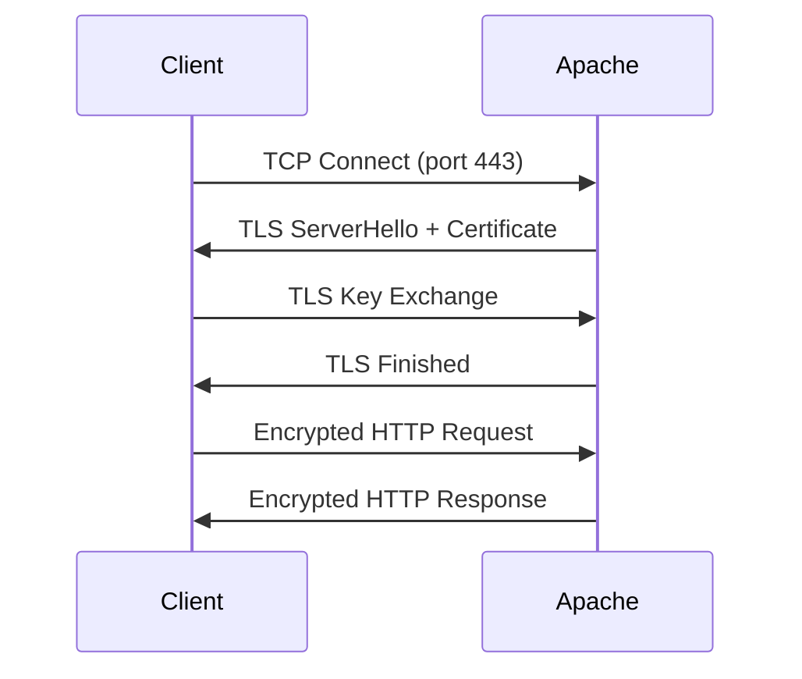

# How to Enable HTTPS with TLS on Apache httpd in RHEL

Author: [nawazdhandala](https://www.github.com/nawazdhandala)

Tags: RHEL, Apache, HTTPS, TLS, Linux

Description: Step-by-step guide to enabling HTTPS on Apache httpd using mod_ssl and TLS certificates on RHEL.

---

## Why HTTPS Matters

Running a website over plain HTTP means every request and response travels in clear text. Anyone sitting on the network can read it. HTTPS fixes that by encrypting the connection with TLS. On RHEL, enabling HTTPS on Apache is quick - install mod_ssl, drop in your certificates, and reload.

## Prerequisites

- RHEL with Apache httpd installed and running
- A domain name pointing to your server (for Let's Encrypt) or a self-signed certificate for testing
- Root or sudo access
- Firewall port 443 open

## Step 1 - Install mod_ssl

The SSL module is packaged separately:

```bash
# Install the Apache SSL module
sudo dnf install -y mod_ssl
```

This creates a default config at `/etc/httpd/conf.d/ssl.conf` and generates a self-signed certificate for immediate testing.

## Step 2 - Open the Firewall for HTTPS

```bash
# Allow HTTPS traffic through the firewall
sudo firewall-cmd --permanent --add-service=https
sudo firewall-cmd --reload
```

## Step 3 - Generate a Self-Signed Certificate (For Testing)

If you just want to test TLS quickly, generate a self-signed cert:

```bash
# Generate a self-signed certificate valid for one year
sudo openssl req -x509 -nodes -days 365 \
  -newkey rsa:2048 \
  -keyout /etc/pki/tls/private/selfsigned.key \
  -out /etc/pki/tls/certs/selfsigned.crt \
  -subj "/CN=www.example.com"
```

## Step 4 - Use Let's Encrypt for Production

For production, use certbot to get a free trusted certificate:

```bash
# Install certbot and the Apache plugin
sudo dnf install -y certbot python3-certbot-apache

# Request a certificate and auto-configure Apache
sudo certbot --apache -d www.example.com -d example.com
```

Certbot will modify your Apache config to point to the new certificates and set up auto-renewal.

Verify the renewal timer is active:

```bash
# Check that the certbot renewal timer is running
sudo systemctl status certbot-renew.timer
```

## Step 5 - Manual TLS Configuration

If you prefer to configure TLS manually (or you have certificates from another CA), edit the SSL virtual host:

```bash
# Create an HTTPS virtual host configuration
sudo tee /etc/httpd/conf.d/mysite-ssl.conf > /dev/null <<'EOF'
<VirtualHost *:443>
    ServerName www.example.com
    DocumentRoot /var/www/html

    SSLEngine on
    SSLCertificateFile /etc/pki/tls/certs/selfsigned.crt
    SSLCertificateKeyFile /etc/pki/tls/private/selfsigned.key

    # If you have a CA chain file, uncomment the next line
    # SSLCertificateChainFile /etc/pki/tls/certs/chain.crt

    <Directory /var/www/html>
        Require all granted
    </Directory>
</VirtualHost>
EOF
```

## Step 6 - Redirect HTTP to HTTPS

Force all traffic to the encrypted connection:

```bash
# Create an HTTP to HTTPS redirect
sudo tee /etc/httpd/conf.d/redirect-https.conf > /dev/null <<'EOF'
<VirtualHost *:80>
    ServerName www.example.com
    Redirect permanent / https://www.example.com/
</VirtualHost>
EOF
```

## Step 7 - Harden TLS Settings

The defaults in RHEL are already reasonable, but you can tighten them further:

```apache
# Strong TLS settings - add these inside your VirtualHost or ssl.conf
SSLProtocol all -SSLv3 -TLSv1 -TLSv1.1
SSLHonorCipherOrder on
SSLCipherSuite ECDHE-ECDSA-AES128-GCM-SHA256:ECDHE-RSA-AES128-GCM-SHA256:ECDHE-ECDSA-AES256-GCM-SHA384:ECDHE-RSA-AES256-GCM-SHA384
Header always set Strict-Transport-Security "max-age=63072000; includeSubDomains"
```

Make sure mod_headers is loaded for the HSTS header:

```bash
# Verify mod_headers is available
httpd -M | grep headers
```

## Step 8 - Validate and Reload

```bash
# Test the configuration
sudo apachectl configtest

# Reload Apache
sudo systemctl reload httpd
```

## Step 9 - Test the Connection

```bash
# Test HTTPS connectivity (skip cert verify for self-signed)
curl -kI https://www.example.com

# Check TLS details with openssl
openssl s_client -connect www.example.com:443 -servername www.example.com </dev/null 2>/dev/null | head -20
```

## TLS Request Flow



## Wrap-Up

Enabling HTTPS on Apache in RHEL boils down to installing mod_ssl, placing your certificates, and configuring the virtual host. For production, Let's Encrypt with certbot is the easiest path. Always disable old TLS versions and set up an HTTP-to-HTTPS redirect so visitors never hit the unencrypted site.
