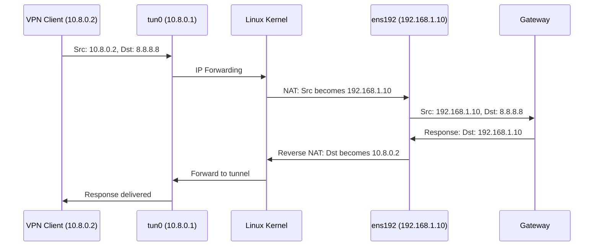

# How to Enable IP Forwarding and NAT for OpenVPN on RHEL

Author: [nawazdhandala](https://www.github.com/nawazdhandala)

Tags: RHEL, OpenVPN, IP Forwarding, NAT, Linux

Description: Learn how to configure IP forwarding and NAT masquerading on RHEL so that OpenVPN clients can access the internet and internal networks through the VPN server.

---

Setting up OpenVPN is only half the battle. Without IP forwarding and NAT, your clients can connect to the VPN server but can't reach anything beyond it. The server needs to act as a router, forwarding packets between the VPN tunnel and the rest of the network. Here's how to set that up properly on RHEL.

## Why You Need Both Forwarding and NAT


**IP Forwarding** tells the kernel to route packets between interfaces (from tun0 to ens192). Without it, packets that arrive on the tunnel die at the server.

**NAT (Network Address Translation)** rewrites the source address of packets from VPN clients so they appear to come from the server's own IP. Without NAT, responses from the internet wouldn't know how to get back to 10.8.0.2 since that address only exists on the VPN tunnel.

## Step 1: Enable IP Forwarding

Check the current state first.

```bash
# Check if forwarding is already enabled
sysctl net.ipv4.ip_forward

# 0 means disabled, 1 means enabled
```

Enable it immediately and persistently:

```bash
# Enable now
sudo sysctl -w net.ipv4.ip_forward=1

# Make it permanent
sudo tee /etc/sysctl.d/99-openvpn-forward.conf > /dev/null << 'EOF'
# Enable IPv4 forwarding for OpenVPN
net.ipv4.ip_forward = 1
EOF

# Reload sysctl
sudo sysctl -p /etc/sysctl.d/99-openvpn-forward.conf
```

For IPv6 forwarding (if you're running dual-stack):

```bash
# Enable IPv6 forwarding
sudo sysctl -w net.ipv6.conf.all.forwarding=1

# Make persistent
echo "net.ipv6.conf.all.forwarding = 1" | sudo tee -a /etc/sysctl.d/99-openvpn-forward.conf
```

## Step 2: Configure NAT with firewalld

RHEL uses firewalld by default. Enable masquerading to handle NAT.

```bash
# Enable masquerading on the default zone
sudo firewall-cmd --permanent --add-masquerade

# Reload
sudo firewall-cmd --reload

# Verify
sudo firewall-cmd --query-masquerade
```

This enables masquerading for all outgoing traffic, which means VPN client traffic leaving through ens192 gets the server's IP as source.

## Step 3: Assign the VPN Interface to a Zone

For better control, put the tun0 interface in a specific zone.

```bash
# Add tun0 to the trusted zone (all traffic allowed from VPN)
sudo firewall-cmd --permanent --zone=trusted --add-interface=tun0

# Or use a more restrictive approach with the internal zone
sudo firewall-cmd --permanent --zone=internal --add-interface=tun0
sudo firewall-cmd --permanent --zone=internal --add-service=ssh
sudo firewall-cmd --permanent --zone=internal --add-service=http
sudo firewall-cmd --permanent --zone=internal --add-service=https

# Reload
sudo firewall-cmd --reload
```

## Understanding the Packet Flow

When a VPN client sends a packet to the internet:



## Step 4: Allowing VPN Clients to Access Internal Networks

If VPN clients need to reach servers on the internal LAN (192.168.1.0/24), forwarding handles that. But the internal servers need a route back to the VPN subnet.

**Option A: NAT everything (simpler)**

Masquerading handles this automatically. Internal servers see traffic coming from the VPN server's IP.

**Option B: Route without NAT (better for visibility)**

Add a static route on the internal network's gateway:

```bash
# On the internal gateway or each internal server
sudo ip route add 10.8.0.0/24 via 192.168.1.10
```

Then you can disable masquerading for internal traffic and only masquerade internet-bound traffic:

```bash
# Remove the global masquerade
sudo firewall-cmd --permanent --remove-masquerade

# Add a specific masquerade policy for internet traffic only
sudo firewall-cmd --permanent --new-policy=vpn-internet
sudo firewall-cmd --permanent --policy=vpn-internet --add-ingress-zone=trusted
sudo firewall-cmd --permanent --policy=vpn-internet --add-egress-zone=public
sudo firewall-cmd --permanent --policy=vpn-internet --set-target=ACCEPT
sudo firewall-cmd --permanent --policy=vpn-internet --add-masquerade

sudo firewall-cmd --reload
```

## Step 5: OpenVPN Server Push Directives

Make sure your OpenVPN server config pushes the right routes to clients.

```bash
# In /etc/openvpn/server/server.conf

# Push the default route (full tunnel)
push "redirect-gateway def1 bypass-dhcp"

# Or push only specific routes (split tunnel)
# push "route 192.168.1.0 255.255.255.0"
# push "route 172.16.0.0 255.240.0.0"

# Push DNS servers
push "dhcp-option DNS 1.1.1.1"
push "dhcp-option DNS 1.0.0.1"
```

## Step 6: Using PostUp/PostDown in OpenVPN

Alternatively, you can manage forwarding and NAT directly in the OpenVPN config:

```bash
# Alternative approach using OpenVPN hooks
# In /etc/openvpn/server/server.conf

# Scripts to run when tunnel comes up/down
script-security 2
up /etc/openvpn/server/up.sh
down /etc/openvpn/server/down.sh
```

Create the scripts:

```bash
# Create the up script
sudo tee /etc/openvpn/server/up.sh > /dev/null << 'EOF'
#!/bin/bash
# Enable forwarding
sysctl -w net.ipv4.ip_forward=1
# Add masquerade
firewall-cmd --add-masquerade
EOF

# Create the down script
sudo tee /etc/openvpn/server/down.sh > /dev/null << 'EOF'
#!/bin/bash
# Remove masquerade
firewall-cmd --remove-masquerade
EOF

# Make executable
sudo chmod +x /etc/openvpn/server/up.sh /etc/openvpn/server/down.sh
```

## Verifying Everything Works

```bash
# Check forwarding is enabled
sysctl net.ipv4.ip_forward

# Check masquerading
sudo firewall-cmd --query-masquerade

# Check active zones
sudo firewall-cmd --get-active-zones

# After a client connects, check the connection tracking table
sudo conntrack -L | grep 10.8.0

# Check NAT rules
sudo nft list table ip firewalld | grep masquerade
```

From a connected VPN client:

```bash
# Ping the VPN server tunnel IP
ping -c 4 10.8.0.1

# Ping an internal server
ping -c 4 192.168.1.100

# Ping the internet
ping -c 4 8.8.8.8

# Check your public IP (should be the VPN server's IP)
curl ifconfig.me
```

## Troubleshooting

**Client can ping server but nothing else:**

```bash
# IP forwarding is probably off
sysctl net.ipv4.ip_forward

# Or masquerade is not enabled
sudo firewall-cmd --query-masquerade
```

**Client can reach internal network but not the internet:**

```bash
# Check the push directive in server.conf
grep "redirect-gateway" /etc/openvpn/server/server.conf

# Check the server's own internet connectivity
ping -c 4 8.8.8.8
```

**Slow performance:**

```bash
# Check conntrack table size
sysctl net.netfilter.nf_conntrack_count
sysctl net.netfilter.nf_conntrack_max

# If count is near max, increase it
sudo sysctl -w net.netfilter.nf_conntrack_max=131072
```

## Wrapping Up

IP forwarding and NAT are what turn your OpenVPN server from a dead-end tunnel into an actual gateway. Enable forwarding in sysctl, add masquerading in firewalld, push the right routes to clients, and verify from the client side. The permanent firewalld rules and sysctl config files ensure everything survives reboots.
