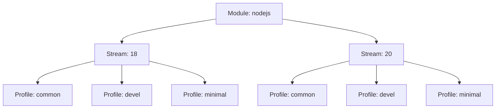
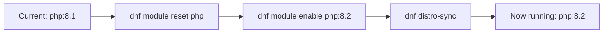

# How to Enable and Manage Module Streams in AppStream on RHEL

Author: [nawazdhandala](https://www.github.com/nawazdhandala)

Tags: RHEL, Module Streams, AppStream, DNF, Linux

Description: A hands-on guide to working with module streams in RHEL AppStream, covering how to list, enable, disable, reset, and install modules with different stream versions and profiles.

---

Module streams are one of the more powerful features in RHEL, but they can be confusing if you have not worked with them before. They let you install different versions of the same software side by side across your fleet, without fighting dependency conflicts. This guide covers everything you need to manage modules day to day.

## What Are Module Streams?

A module is a collection of RPM packages that form a logical unit, like "nodejs" or "php." A stream is a specific version of that module. So `nodejs:18` and `nodejs:20` are two streams of the same module, each providing a different major version of Node.js.

Each stream can also have profiles, which are curated package lists for different use cases (common, devel, minimal, etc.).

Here is how the hierarchy works:



## Listing Available Modules

Start by seeing what modules are available on your system:

```bash
# List all available modules and their streams
dnf module list
```

The output uses markers to indicate status:

- `[d]` - default stream or profile
- `[e]` - enabled stream
- `[i]` - installed profile
- `[x]` - disabled stream

To filter the list for a specific module:

```bash
# Show streams for the php module
dnf module list php
```

Example output:

```bash
Name   Stream   Profiles               Summary
php    8.1      common [d], devel, minimal   PHP scripting language
php    8.2      common [d], devel, minimal   PHP scripting language
```

### Listing Enabled and Disabled Modules

```bash
# Show only modules with enabled streams
dnf module list --enabled

# Show only disabled modules
dnf module list --disabled

# Show installed modules
dnf module list --installed
```

## Getting Module Information

Before enabling a stream, check what you are getting:

```bash
# Show detailed info about a module stream
dnf module info php:8.2
```

This displays the summary, description, list of included packages, default profile, and other metadata.

To see which specific RPM packages a profile includes:

```bash
# List packages in the common profile of php 8.2
dnf module info --profile php:8.2
```

## Enabling a Module Stream

Enabling a stream makes its packages visible to DNF without actually installing anything:

```bash
# Enable the PHP 8.2 stream
sudo dnf module enable php:8.2
```

After enabling, you can install individual packages from that stream using regular `dnf install`:

```bash
# Install php from the enabled 8.2 stream
sudo dnf install php
```

### Why Enable Before Install?

Enabling a stream locks DNF to that version. Without it, you get the default stream. If you explicitly enable a stream first, you have a clear record of which version you chose, and DNF will not accidentally pull in packages from a different stream.

## Installing a Module with a Profile

The fastest way to get a module running is to install it with a profile:

```bash
# Install the common profile of the nodejs 20 stream
sudo dnf module install nodejs:20/common
```

This does three things in one step:
1. Enables the `nodejs:20` stream
2. Marks the `common` profile as installed
3. Installs all packages listed in that profile

If you do not specify a profile, the default profile (marked with `[d]`) is used:

```bash
# Install nodejs 20 with the default profile
sudo dnf module install nodejs:20
```

### Installing the Development Profile

If you need headers and development libraries for building native extensions:

```bash
# Install with the devel profile for build dependencies
sudo dnf module install php:8.2/devel
```

## Switching Between Streams

This is one of the trickier operations. You cannot just enable a new stream while another is active. You need to reset the module first.

### Step-by-Step Stream Switch

Let's say you are running PHP 8.1 and want to move to 8.2:

```bash
# Step 1: Reset the module to clear the current stream
sudo dnf module reset php

# Step 2: Enable the new stream
sudo dnf module enable php:8.2

# Step 3: Synchronize installed packages to the new stream versions
sudo dnf distro-sync
```

The `distro-sync` step is critical. It updates (or downgrades) installed packages to match the versions available in the newly enabled stream.

### Process Flow for Stream Switching



## Disabling a Module Stream

Disabling a module makes all of its packages invisible to DNF. This is useful if you want to prevent accidental installation of a module:

```bash
# Disable the nodejs module entirely
sudo dnf module disable nodejs
```

When a module is disabled:
- Its packages will not show up in `dnf search` or `dnf list`
- Attempting to install packages from it will fail
- Already installed packages are not removed

To re-enable a disabled module:

```bash
# Reset the module first, then enable the desired stream
sudo dnf module reset nodejs
sudo dnf module enable nodejs:20
```

## Resetting a Module

Resetting a module returns it to its initial state. The stream is no longer enabled or disabled, and the module goes back to using defaults:

```bash
# Reset the php module to its initial state
sudo dnf module reset php
```

This does not uninstall packages. It just clears the stream selection. You will need to remove packages separately if you want them gone.

## Removing Installed Module Packages

To remove the packages installed by a module profile:

```bash
# Remove packages installed by the nodejs:20/common profile
sudo dnf module remove nodejs:20
```

After removing, you should also reset or disable the module to clean up:

```bash
# Remove and reset in sequence
sudo dnf module remove nodejs:20
sudo dnf module reset nodejs
```

## Dealing with Module Dependencies

Modules can depend on other modules. When you enable or install a module, DNF handles these dependencies automatically. But it is good to know about them for troubleshooting:

```bash
# Check module dependencies
dnf module info --profile php:8.2
```

If you run into dependency conflicts during a stream switch, the most common fix is:

```bash
# Force a full sync to resolve version mismatches
sudo dnf distro-sync --allowerasing
```

The `--allowerasing` flag lets DNF remove conflicting packages to resolve the dependency tree. Use it carefully and review the transaction summary before confirming.

## Practical Example: Setting Up a PHP 8.2 Development Environment

Here is a complete workflow from start to finish:

```bash
# Check what PHP streams are available
dnf module list php

# Enable PHP 8.2
sudo dnf module enable php:8.2 -y

# Install the common profile
sudo dnf module install php:8.2/common -y

# Install additional PHP extensions
sudo dnf install php-mysqlnd php-mbstring php-xml php-json -y

# Verify the installed version
php --version
```

## Tips for Working with Modules

1. **Document your stream choices.** When you deviate from defaults, write it down. Future you (or your replacement) will thank you.

2. **Test stream switches in staging first.** Switching from one stream to another can update dozens of packages. Do not try it for the first time in production.

3. **Check module lifecycle dates.** Not all streams are supported for the full RHEL lifecycle. Some are shorter-lived and require you to switch streams before they hit EOL.

4. **Use `dnf module list --installed` regularly.** It gives you a quick snapshot of what module streams are active on a system, which is invaluable for inventory and compliance.

5. **Do not mix module and non-module packages.** If a module provides `php`, do not also install PHP from a third-party repo. That path leads to dependency nightmares.

Module streams take a bit of getting used to, but they solve a real problem. Being able to run PHP 8.2 on one server and PHP 8.1 on another, both on RHEL with full support, is genuinely useful. Once the concepts click, the commands are straightforward.
