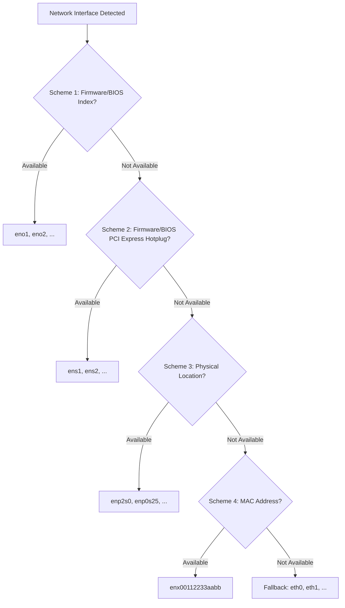

# How to Enable Predictable Network Interface Names on RHEL

Author: [nawazdhandala](https://www.github.com/nawazdhandala)

Tags: RHEL, Network Interfaces, Naming, Linux, Networking

Description: A guide to understanding and configuring predictable network interface naming on RHEL, including naming schemes, biosdevname, udev rules, and troubleshooting.

---

Remember the days of `eth0`, `eth1`, `eth2`? Simple, easy to remember, and completely unreliable. Reboot a server with multiple NICs, and suddenly `eth0` and `eth1` might swap. Add a new card, and all your interface assignments shuffle around. That was a real problem, especially on servers with bonded interfaces or complex network configurations.

Predictable network interface naming was introduced to fix this. RHEL enables it by default, and the interfaces you see now have names like `ens3`, `enp0s25`, or `eno1`. These names are based on the physical location or firmware assignment of the network card, so they stay consistent across reboots. Here is how it all works and how to manage it.

## How Predictable Naming Works

The naming scheme uses information from the system firmware (BIOS/UEFI), PCI bus topology, and MAC addresses to generate stable names. systemd's udev rules handle the assignment.

There are five naming schemes, applied in priority order:



### Naming Scheme Breakdown

| Prefix | Based On | Example | Description |
|---|---|---|---|
| eno | Firmware/BIOS onboard index | eno1 | Built-in NICs with firmware-provided index |
| ens | Firmware/BIOS PCI Express hotplug slot | ens3 | Slot number from firmware |
| enp | PCI bus/slot/function | enp0s25 | Physical PCI topology location |
| enx | MAC address | enx00112233aabb | Based on hardware MAC (rarely used) |

For wireless interfaces, the `en` prefix is replaced with `wl` (e.g., `wlp3s0`).

## Checking Your Current Interface Names

```bash
# List all network interfaces with their names
ip link show

# Get more details including PCI location
udevadm info /sys/class/net/enp0s25

# See the naming scheme that was applied
udevadm info --query=property /sys/class/net/enp0s25 | grep ID_NET_NAME
```

The output from `udevadm info` shows all the name candidates:

```bash
ID_NET_NAME_ONBOARD=eno1
ID_NET_NAME_SLOT=ens3
ID_NET_NAME_PATH=enp0s25
ID_NET_NAME_MAC=enx001122334455
```

The first one that matches is used.

## Understanding biosdevname

On some Dell and other enterprise servers, the `biosdevname` package provides an alternative naming scheme that uses BIOS information. It produces names like `em1` (for embedded NICs) and `p1p1` (for add-in cards).

```bash
# Check if biosdevname is installed
rpm -q biosdevname

# Check if biosdevname is active
biosdevname -d
```

On RHEL, systemd's built-in naming takes precedence over biosdevname in most cases. The two systems can coexist, but if you want consistent behavior, it is best to stick with one approach.

## The net.ifnames and biosdevname Kernel Parameters

Two kernel parameters control the naming behavior:

- `net.ifnames=1` - Enable systemd predictable naming (default on RHEL)
- `net.ifnames=0` - Disable systemd predictable naming
- `biosdevname=1` - Enable biosdevname naming
- `biosdevname=0` - Disable biosdevname naming

```bash
# Check current kernel parameters
cat /proc/cmdline
```

The behavior matrix:

| net.ifnames | biosdevname | Result |
|---|---|---|
| 1 (default) | 0 (default) | systemd predictable names (enp0s25) |
| 1 | 1 | biosdevname takes priority (em1, p1p1) |
| 0 | 0 | Traditional names (eth0, eth1) |
| 0 | 1 | biosdevname names (em1, p1p1) |

## Reverting to Traditional eth0 Naming

Some people prefer the old naming scheme, or have legacy scripts that depend on `eth0`. Here is how to go back, though I do not recommend it in production.

```bash
# Edit the GRUB configuration to disable predictable naming
sudo grubby --update-kernel=ALL --args="net.ifnames=0 biosdevname=0"

# Verify the change
sudo grubby --info=ALL | grep args
```

After a reboot, your interfaces will be named `eth0`, `eth1`, etc. again.

Remember to update your NetworkManager connection profiles to match the new names:

```bash
# Check current connection profiles
nmcli con show

# Rename a connection to match the new interface name
sudo nmcli con mod "Wired connection 1" connection.interface-name eth0
```

## Creating Custom Naming Rules with udev

If you want full control over interface names, create custom udev rules.

### Naming by MAC Address

```bash
# Create a custom udev rule file
sudo vi /etc/udev/rules.d/70-custom-net-names.rules
```

```bash
# Assign a custom name based on MAC address
SUBSYSTEM=="net", ACTION=="add", ATTR{address}=="00:11:22:33:44:55", NAME="mgmt0"
SUBSYSTEM=="net", ACTION=="add", ATTR{address}=="00:11:22:33:44:66", NAME="data0"
```

### Naming by PCI Slot

```bash
# Find the PCI slot of your interface
udevadm info /sys/class/net/enp0s25 | grep PCI_SLOT_NAME
```

```bash
# Assign name based on PCI slot
SUBSYSTEM=="net", ACTION=="add", KERNELS=="0000:02:00.0", NAME="lan0"
```

After creating udev rules:

```bash
# Reload udev rules
sudo udevadm control --reload-rules

# Trigger the rules (or reboot for a clean start)
sudo udevadm trigger --action=add --subsystem-match=net
```

Custom udev rules in `/etc/udev/rules.d/` take priority over the default rules in `/usr/lib/udev/rules.d/`.

## NetworkManager and Interface Names

When interface names change, NetworkManager connection profiles need to be updated to match.

```bash
# List connections and their associated interfaces
nmcli con show

# If a connection is tied to an old interface name, update it
sudo nmcli con mod "my-connection" connection.interface-name enp0s25

# Reload NetworkManager to pick up changes
sudo nmcli con reload
```

If you use connection profiles in `/etc/NetworkManager/system-connections/`, the `interface-name` field in the keyfile needs to match:

```bash
# Check the keyfile for an interface name reference
cat /etc/NetworkManager/system-connections/my-connection.nmconnection
```

```ini
[connection]
id=my-connection
type=ethernet
interface-name=enp0s25
```

## Troubleshooting Interface Naming Issues

### Interface Not Getting Expected Name

Check the udev rules processing:

```bash
# Trace udev processing for a specific device
udevadm test /sys/class/net/enp0s25 2>&1 | grep -i name
```

### Interface Named "Renamed" or "renamedX"

This happens when there is a naming conflict. Two rules are trying to assign different names.

```bash
# Check for conflicting udev rules
ls /etc/udev/rules.d/*net* /usr/lib/udev/rules.d/*net* 2>/dev/null

# Check the journal for naming issues
journalctl -b | grep -i "renamed"
```

### Finding the Physical Location of an Interface

On servers with many NICs, figuring out which port is which can be tricky:

```bash
# Blink the LED on a specific interface (if supported by the driver)
sudo ethtool --identify enp0s25 5

# Show the driver and bus info for each interface
for iface in $(ls /sys/class/net/ | grep -v lo); do
    echo "$iface: $(ethtool -i $iface 2>/dev/null | grep -E 'driver|bus-info')"
done
```

### Verifying Naming Consistency After Hardware Changes

When you add or remove network cards, check that existing interface names did not change:

```bash
# Before hardware change, save interface-to-MAC mapping
ip -o link show | awk '{print $2, $(NF-2)}' > /tmp/nic-mapping-before.txt

# After hardware change, compare
ip -o link show | awk '{print $2, $(NF-2)}' > /tmp/nic-mapping-after.txt
diff /tmp/nic-mapping-before.txt /tmp/nic-mapping-after.txt
```

## Virtual Machine Considerations

In virtual machines, the interface naming depends on the virtual hardware model:

- **VirtIO** - Typically produces names like `enp1s0`
- **e1000** - Produces names like `ens3` or `enp0s3`
- **VMware vmxnet3** - Produces names like `ens192`

If you are building VM templates, the predictable names are based on virtual PCI topology, which is consistent as long as the VM configuration does not change.

```bash
# Check the virtual NIC type
ethtool -i enp1s0 | grep driver
```

## Summary

Predictable network interface naming eliminates the old problem of interface names shuffling across reboots. On RHEL, it is enabled by default and works well out of the box. The names encode information about where the NIC sits in the system, which makes it easier to manage servers with multiple interfaces. If you need custom names, udev rules give you full control. And if you absolutely must go back to `eth0` naming, the kernel parameters let you do that, though I would recommend against it unless you have a very specific reason.
