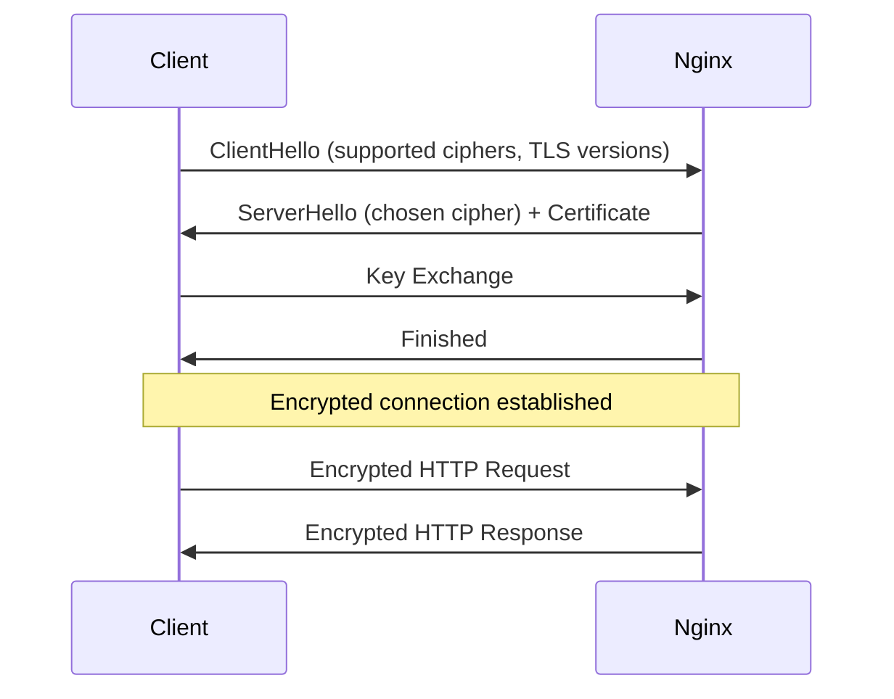

# How to Enable TLS/SSL on Nginx in RHEL

Author: [nawazdhandala](https://www.github.com/nawazdhandala)

Tags: RHEL, NGINX, TLS, SSL, Linux

Description: How to configure TLS certificates on Nginx in RHEL, including Let's Encrypt automation and manual certificate setup.

---

## Why TLS?

Serving your site over plain HTTP means everything travels unencrypted. Passwords, session cookies, personal data, all of it is visible to anyone on the network. TLS encrypts the connection between the client and Nginx. Modern browsers also flag HTTP-only sites as "Not Secure", which hurts trust.

## Prerequisites

- RHEL with Nginx installed and running
- A domain name pointing to your server (for Let's Encrypt)
- Port 443 open in the firewall
- Root or sudo access

## Step 1 - Open the Firewall for HTTPS

```bash
# Allow HTTPS traffic
sudo firewall-cmd --permanent --add-service=https
sudo firewall-cmd --reload
```

## Step 2 - Self-Signed Certificate (For Testing)

Generate a quick self-signed cert for testing:

```bash
# Generate a self-signed certificate
sudo openssl req -x509 -nodes -days 365 \
  -newkey rsa:2048 \
  -keyout /etc/pki/tls/private/nginx-selfsigned.key \
  -out /etc/pki/tls/certs/nginx-selfsigned.crt \
  -subj "/CN=www.example.com"
```

Generate Diffie-Hellman parameters for stronger key exchange:

```bash
# Generate DH parameters (this takes a minute or two)
sudo openssl dhparam -out /etc/pki/tls/certs/dhparam.pem 2048
```

## Step 3 - Configure Nginx for TLS

Create an HTTPS server block:

```bash
# Create the TLS server block
sudo tee /etc/nginx/conf.d/mysite-ssl.conf > /dev/null <<'EOF'
server {
    listen 443 ssl;
    server_name www.example.com;
    root /var/www/mysite;

    # Certificate and key paths
    ssl_certificate /etc/pki/tls/certs/nginx-selfsigned.crt;
    ssl_certificate_key /etc/pki/tls/private/nginx-selfsigned.key;

    # DH parameters
    ssl_dhparam /etc/pki/tls/certs/dhparam.pem;

    # TLS settings
    ssl_protocols TLSv1.2 TLSv1.3;
    ssl_ciphers ECDHE-ECDSA-AES128-GCM-SHA256:ECDHE-RSA-AES128-GCM-SHA256:ECDHE-ECDSA-AES256-GCM-SHA384:ECDHE-RSA-AES256-GCM-SHA384;
    ssl_prefer_server_ciphers off;

    # HSTS - tell browsers to always use HTTPS
    add_header Strict-Transport-Security "max-age=31536000; includeSubDomains" always;

    location / {
        try_files $uri $uri/ =404;
    }
}
EOF
```

## Step 4 - Redirect HTTP to HTTPS

```bash
# Create an HTTP to HTTPS redirect
sudo tee /etc/nginx/conf.d/redirect-https.conf > /dev/null <<'EOF'
server {
    listen 80;
    server_name www.example.com example.com;
    return 301 https://www.example.com$request_uri;
}
EOF
```

## Step 5 - Test and Reload

```bash
# Test config
sudo nginx -t

# Reload
sudo systemctl reload nginx
```

## Step 6 - Using Let's Encrypt for Production

For production, use certbot to get a trusted certificate:

```bash
# Install certbot and the Nginx plugin
sudo dnf install -y certbot python3-certbot-nginx

# Request a certificate
sudo certbot --nginx -d www.example.com -d example.com
```

Certbot will:
- Obtain the certificate
- Modify your Nginx config to use it
- Set up the HTTP-to-HTTPS redirect

Verify auto-renewal works:

```bash
# Test the renewal process
sudo certbot renew --dry-run
```

Check the renewal timer:

```bash
# Verify the systemd timer is active
sudo systemctl status certbot-renew.timer
```

## Step 7 - Verify the TLS Configuration

```bash
# Check TLS details with curl
curl -kI https://www.example.com

# Check TLS negotiation with openssl
echo | openssl s_client -connect www.example.com:443 -servername www.example.com 2>/dev/null | grep -E "Protocol|Cipher"
```

## TLS Handshake Flow



## Step 8 - Session Caching

TLS session caching reduces the overhead of repeated handshakes:

```nginx
# Add to the http block or server block
ssl_session_cache shared:SSL:10m;
ssl_session_timeout 10m;
ssl_session_tickets off;
```

This creates a 10 MB shared cache that can hold around 40,000 sessions.

## Step 9 - OCSP Stapling

OCSP stapling lets Nginx fetch the certificate revocation status and include it in the TLS handshake, so the client does not have to check separately:

```nginx
# Enable OCSP stapling
ssl_stapling on;
ssl_stapling_verify on;
resolver 8.8.8.8 8.8.4.4 valid=300s;
resolver_timeout 5s;
```

This does not work with self-signed certificates. It requires a certificate from a real CA.

## Wrap-Up

Enabling TLS on Nginx in RHEL is essential for any production site. Use Let's Encrypt and certbot for the easiest setup with automatic renewal. For the TLS configuration itself, stick with TLS 1.2 and 1.3, enable HSTS, and set up session caching. Always redirect HTTP to HTTPS so no traffic is served unencrypted.
