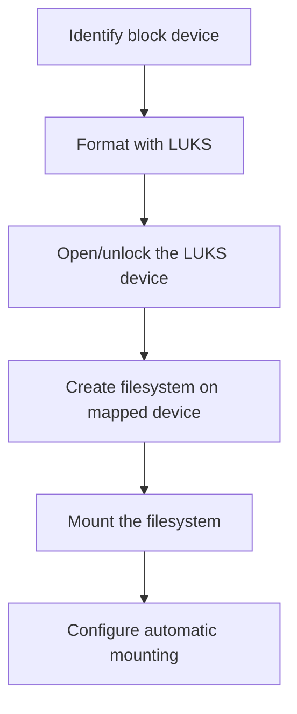

# How to Encrypt Individual Block Devices with LUKS on RHEL

Author: [nawazdhandala](https://www.github.com/nawazdhandala)

Tags: RHEL, LUKS, Block Device Encryption, dm-crypt, Security, Linux

Description: Encrypt individual block devices like data disks and partitions with LUKS on RHEL to protect sensitive data stored on specific volumes.

---

While full disk encryption protects the entire system, sometimes you only need to encrypt specific data volumes. LUKS (Linux Unified Key Setup) on RHEL lets you encrypt individual block devices like additional hard drives, partitions, or logical volumes. This guide covers the complete process from setup to mounting.

## Overview of the Process



## Step 1: Identify the Block Device

```bash
# List all block devices
lsblk

# Show detailed information
lsblk -f

# Identify the device you want to encrypt
# For example: /dev/sdb or /dev/sdb1
```

**Warning:** Encrypting a device destroys all existing data on it. Make sure you have backed up any important data before proceeding.

## Step 2: Format the Device with LUKS2

```bash
# Initialize LUKS2 encryption on the device
sudo cryptsetup luksFormat --type luks2 /dev/sdb

# You will be prompted to confirm (type uppercase YES) and enter a passphrase
```

For more control over encryption parameters:

```bash
# Specify cipher, key size, and hash algorithm
sudo cryptsetup luksFormat --type luks2 \
    --cipher aes-xts-plain64 \
    --key-size 512 \
    --hash sha256 \
    --iter-time 5000 \
    /dev/sdb
```

Parameter explanations:
- `--cipher aes-xts-plain64` - the encryption algorithm (AES in XTS mode)
- `--key-size 512` - key size in bits (512 for AES-256 in XTS mode, since XTS splits the key)
- `--hash sha256` - hash algorithm for the passphrase derivation
- `--iter-time 5000` - time in milliseconds for the passphrase derivation function (higher is more secure but slower to unlock)

## Step 3: Open the LUKS Device

```bash
# Open (unlock) the encrypted device
# This creates a mapped device at /dev/mapper/data_encrypted
sudo cryptsetup luksOpen /dev/sdb data_encrypted

# Enter the passphrase when prompted

# Verify the device is open
ls -la /dev/mapper/data_encrypted
```

## Step 4: Create a Filesystem

```bash
# Create an XFS filesystem on the encrypted device
sudo mkfs.xfs /dev/mapper/data_encrypted

# Or create ext4
sudo mkfs.ext4 /dev/mapper/data_encrypted
```

## Step 5: Mount the Filesystem

```bash
# Create a mount point
sudo mkdir -p /mnt/encrypted-data

# Mount the filesystem
sudo mount /dev/mapper/data_encrypted /mnt/encrypted-data

# Verify the mount
df -h /mnt/encrypted-data

# Set appropriate ownership
sudo chown user:group /mnt/encrypted-data
```

## Step 6: Configure Automatic Mounting

### Add to /etc/crypttab

The `/etc/crypttab` file tells the system which LUKS devices to unlock at boot:

```bash
# Get the UUID of the LUKS device
sudo cryptsetup luksDump /dev/sdb | grep UUID

# Or use blkid
sudo blkid /dev/sdb
```

Add an entry to `/etc/crypttab`:

```bash
# Format: name UUID=<uuid> none|keyfile options
echo "data_encrypted UUID=YOUR-UUID-HERE none luks" | sudo tee -a /etc/crypttab
```

This will prompt for the passphrase during boot.

### Add to /etc/fstab

```bash
# Add the mount entry to fstab
echo "/dev/mapper/data_encrypted /mnt/encrypted-data xfs defaults 0 2" | sudo tee -a /etc/fstab

# Test the fstab entry
sudo mount -a
```

## Working with Encrypted Partitions

If you want to encrypt a partition rather than a whole disk:

```bash
# Create a partition first
sudo fdisk /dev/sdb
# Create partition /dev/sdb1

# Then encrypt the partition
sudo cryptsetup luksFormat --type luks2 /dev/sdb1

# The rest of the process is the same
sudo cryptsetup luksOpen /dev/sdb1 partition_encrypted
sudo mkfs.xfs /dev/mapper/partition_encrypted
sudo mkdir -p /mnt/encrypted-partition
sudo mount /dev/mapper/partition_encrypted /mnt/encrypted-partition
```

## Working with LVM on LUKS

A common setup is to use LVM on top of LUKS for flexible volume management:

```bash
# Format the device with LUKS
sudo cryptsetup luksFormat --type luks2 /dev/sdb
sudo cryptsetup luksOpen /dev/sdb encrypted_pv

# Create a physical volume on the encrypted device
sudo pvcreate /dev/mapper/encrypted_pv

# Create a volume group
sudo vgcreate encrypted_vg /dev/mapper/encrypted_pv

# Create logical volumes
sudo lvcreate -L 50G -n data encrypted_vg
sudo lvcreate -L 20G -n logs encrypted_vg

# Create filesystems
sudo mkfs.xfs /dev/encrypted_vg/data
sudo mkfs.xfs /dev/encrypted_vg/logs

# Mount
sudo mkdir -p /mnt/data /mnt/logs
sudo mount /dev/encrypted_vg/data /mnt/data
sudo mount /dev/encrypted_vg/logs /mnt/logs
```

## Closing (Locking) an Encrypted Device

When you are done using the encrypted volume:

```bash
# Unmount the filesystem first
sudo umount /mnt/encrypted-data

# Close the LUKS device
sudo cryptsetup luksClose data_encrypted

# Verify it is closed
ls /dev/mapper/data_encrypted 2>&1
# Should show "No such file or directory"
```

## Checking LUKS Device Status

```bash
# View LUKS header information
sudo cryptsetup luksDump /dev/sdb

# Check if a device is a LUKS device
sudo cryptsetup isLuks /dev/sdb && echo "Is LUKS" || echo "Not LUKS"

# Check the status of an open device
sudo cryptsetup status data_encrypted
```

## Performance Testing

```bash
# Benchmark encryption performance
sudo cryptsetup benchmark

# Test read/write speed on the encrypted device
sudo dd if=/dev/zero of=/mnt/encrypted-data/testfile bs=1M count=1024 oflag=direct
sudo dd if=/mnt/encrypted-data/testfile of=/dev/null bs=1M iflag=direct
sudo rm /mnt/encrypted-data/testfile
```

## Summary

Encrypting individual block devices with LUKS on RHEL involves formatting the device with `cryptsetup luksFormat`, opening it with `cryptsetup luksOpen`, creating a filesystem, and mounting it. For automatic mounting at boot, add entries to `/etc/crypttab` and `/etc/fstab`. You can also combine LUKS with LVM for flexible volume management on top of encryption.
