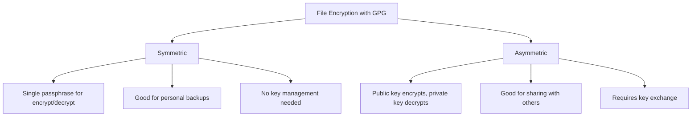

# How to Encrypt and Decrypt Files with GPG on RHEL

Author: [nawazdhandala](https://www.github.com/nawazdhandala)

Tags: RHEL, GPG, Encryption, Decryption, File Security, Linux

Description: Encrypt and decrypt files on RHEL using GPG for secure file storage, transfer, and sharing with both symmetric and asymmetric encryption.

---

GPG provides two primary methods for encrypting files: symmetric encryption (using a passphrase) and asymmetric encryption (using public/private key pairs). Both methods are useful in different scenarios. This guide covers practical file encryption and decryption operations on RHEL.

## Symmetric vs. Asymmetric Encryption



## Symmetric Encryption

Symmetric encryption uses a single passphrase. Anyone who knows the passphrase can decrypt the file.

### Encrypt a File

```bash
# Encrypt a file with a passphrase (interactive prompt)
gpg --symmetric --cipher-algo AES256 myfile.txt

# This creates myfile.txt.gpg

# Encrypt with ASCII armor (text-safe output)
gpg --symmetric --armor --cipher-algo AES256 myfile.txt

# This creates myfile.txt.asc
```

### Decrypt a Symmetrically Encrypted File

```bash
# Decrypt and write to the original filename
gpg --decrypt myfile.txt.gpg > myfile.txt

# Or let GPG figure out the output filename
gpg --output myfile.txt --decrypt myfile.txt.gpg
```

### Encrypt from a Pipeline

```bash
# Encrypt data from stdin
echo "secret data" | gpg --symmetric --armor --cipher-algo AES256 > secret.asc

# Encrypt a tar archive on the fly
tar czf - /important/data | gpg --symmetric --cipher-algo AES256 -o backup.tar.gz.gpg
```

## Asymmetric Encryption (Public Key)

Asymmetric encryption uses someone's public key to encrypt and their private key to decrypt. This is the preferred method when sharing encrypted files with others.

### Import the Recipient's Public Key

Before you can encrypt for someone, you need their public key:

```bash
# Import a public key from a file
gpg --import recipient-public-key.asc

# Import from a keyserver
gpg --keyserver hkps://keys.openpgp.org --recv-keys KEY_ID

# Verify the imported key
gpg --list-keys recipient@example.com
```

### Encrypt a File for a Recipient

```bash
# Encrypt for a specific recipient
gpg --encrypt --recipient recipient@example.com myfile.txt

# This creates myfile.txt.gpg

# Encrypt with ASCII armor
gpg --encrypt --armor --recipient recipient@example.com myfile.txt

# Encrypt for multiple recipients
gpg --encrypt \
    --recipient alice@example.com \
    --recipient bob@example.com \
    myfile.txt

# Encrypt for a recipient and yourself (so you can also decrypt it)
gpg --encrypt \
    --recipient recipient@example.com \
    --recipient your-email@example.com \
    myfile.txt
```

### Decrypt an Asymmetrically Encrypted File

```bash
# Decrypt (GPG automatically finds the right private key)
gpg --decrypt myfile.txt.gpg > myfile.txt

# Or specify the output file
gpg --output myfile.txt --decrypt myfile.txt.gpg
```

You will be prompted for your private key passphrase.

## Sign and Encrypt

You can both sign and encrypt a file, so the recipient can verify it came from you:

```bash
# Sign and encrypt
gpg --sign --encrypt --recipient recipient@example.com myfile.txt

# Sign, encrypt, and ASCII-armor
gpg --sign --encrypt --armor --recipient recipient@example.com myfile.txt
```

The recipient decrypts and verifies in one step:

```bash
gpg --decrypt myfile.txt.gpg
# Shows both the decrypted content and signature verification
```

## Encrypting Directories

GPG encrypts files, not directories. To encrypt a directory, first create a tar archive:

```bash
# Compress and encrypt a directory
tar czf - /path/to/directory | gpg --symmetric --cipher-algo AES256 -o directory-backup.tar.gz.gpg

# Decrypt and extract
gpg --decrypt directory-backup.tar.gz.gpg | tar xzf -

# Asymmetric version
tar czf - /path/to/directory | gpg --encrypt --recipient user@example.com -o directory-backup.tar.gz.gpg
```

## Batch Encryption of Multiple Files

```bash
#!/bin/bash
# Encrypt all .txt files in a directory

RECIPIENT="user@example.com"
SOURCE_DIR="/path/to/files"

for file in "$SOURCE_DIR"/*.txt; do
    if [ -f "$file" ]; then
        echo "Encrypting: $file"
        gpg --encrypt --recipient "$RECIPIENT" "$file"
        echo "Created: ${file}.gpg"
    fi
done
```

## Encrypting Backups

A common use case is encrypting database or system backups:

```bash
# Encrypt a database dump
pg_dump mydb | gpg --symmetric --cipher-algo AES256 --batch --passphrase-fd 3 \
    3< <(cat /root/.backup-passphrase) > mydb-backup.sql.gpg

# Encrypt with a recipient's public key (no passphrase needed at encrypt time)
pg_dump mydb | gpg --encrypt --recipient backup-admin@example.com > mydb-backup.sql.gpg

# Decrypt and restore
gpg --decrypt mydb-backup.sql.gpg | psql mydb
```

## Verifying Encrypted Files

```bash
# List packets in an encrypted file (shows encryption info without decrypting)
gpg --list-packets myfile.txt.gpg

# Show information about who can decrypt the file
gpg --list-packets --verbose myfile.txt.gpg
```

## GPG Agent and Passphrase Caching

The GPG agent caches your passphrase so you do not have to enter it repeatedly:

```bash
# Check if the agent is running
gpg-connect-agent /bye

# Configure cache timeout (in ~/.gnupg/gpg-agent.conf)
# Cache passphrase for 1 hour (3600 seconds)
echo "default-cache-ttl 3600" >> ~/.gnupg/gpg-agent.conf
echo "max-cache-ttl 7200" >> ~/.gnupg/gpg-agent.conf

# Reload the agent
gpg-connect-agent reloadagent /bye
```

## Securely Deleting the Original File

After encrypting a file, you may want to securely delete the original:

```bash
# Encrypt the file
gpg --encrypt --recipient user@example.com sensitive-data.txt

# Securely delete the original
shred -vfz -n 3 sensitive-data.txt
rm sensitive-data.txt
```

## Quick Reference

| Operation | Command |
|-----------|---------|
| Symmetric encrypt | `gpg --symmetric file` |
| Asymmetric encrypt | `gpg --encrypt --recipient email file` |
| Decrypt | `gpg --decrypt file.gpg > file` |
| Sign and encrypt | `gpg --sign --encrypt --recipient email file` |
| Encrypt directory | `tar czf - dir \| gpg --symmetric -o dir.tar.gz.gpg` |
| ASCII armor output | Add `--armor` flag |
| Specify cipher | Add `--cipher-algo AES256` |

## Summary

GPG on RHEL provides robust file encryption for both personal use (symmetric) and secure sharing (asymmetric). Use symmetric encryption with a passphrase for quick personal file protection, and asymmetric encryption with public keys when sharing files with others. Combine signing with encryption when both confidentiality and authenticity are needed.
