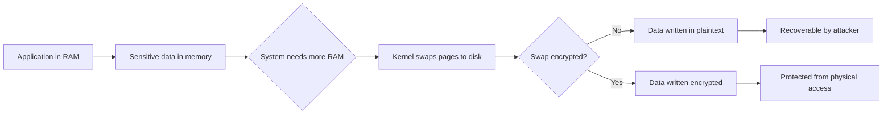

# How to Encrypt Swap Partitions on RHEL

Author: [nawazdhandala](https://www.github.com/nawazdhandala)

Tags: RHEL, LUKS, Swap Encryption, Security, Memory Protection, Linux

Description: Encrypt swap partitions on RHEL to prevent sensitive data in memory from being exposed through swap space on disk.

---

When your RHEL system runs low on physical memory, the kernel moves pages from RAM to the swap partition. This means that sensitive data like passwords, encryption keys, and application secrets that were in memory can end up written to disk in plaintext. Encrypting the swap partition prevents this data from being recovered by someone with physical access to the disk.

## Why Encrypt Swap?



## Method 1: Random Key Encryption (Ephemeral)

This method generates a new random encryption key at every boot. The swap data from previous boots is lost, which is fine because swap data should not persist across reboots anyway.

### Step 1: Identify the Swap Partition

```bash
# Check current swap usage
swapon --show

# Identify the swap device
lsblk -f | grep swap
```

### Step 2: Disable Current Swap

```bash
# Turn off swap
sudo swapoff -a

# Verify swap is off
free -h | grep Swap
```

### Step 3: Configure Encrypted Swap in crypttab

```bash
# Get the device path or UUID of the swap partition
sudo blkid | grep swap

# Add entry to /etc/crypttab for random-key encrypted swap
# The "swap" option tells the system to format as swap after decryption
# The "/dev/urandom" key source means a new random key each boot
echo "swap_encrypted /dev/sda4 /dev/urandom swap,cipher=aes-xts-plain64,size=512" | \
    sudo tee -a /etc/crypttab
```

The options mean:
- `swap_encrypted` - name of the mapped device
- `/dev/sda4` - the underlying partition
- `/dev/urandom` - generate a random key at each boot
- `swap` - format the decrypted device as swap
- `cipher=aes-xts-plain64` - encryption algorithm
- `size=512` - key size in bits

### Step 4: Update /etc/fstab

Replace the existing swap entry with the encrypted device:

```bash
# Comment out the old swap entry and add the encrypted one
sudo vi /etc/fstab

# Old entry (comment it out):
# /dev/sda4 none swap defaults 0 0

# New encrypted swap entry:
# /dev/mapper/swap_encrypted none swap defaults 0 0
```

### Step 5: Reboot and Verify

```bash
sudo systemctl reboot

# After reboot, verify encrypted swap is active
swapon --show
sudo cryptsetup status swap_encrypted
```

## Method 2: LUKS-Encrypted Swap (Persistent)

If you need swap that supports hibernation (suspend-to-disk), you need a persistent LUKS-encrypted swap partition because the system must be able to read the swap data on resume.

### Step 1: Create LUKS Swap Partition

```bash
# Disable current swap
sudo swapoff -a

# Format the partition with LUKS
sudo cryptsetup luksFormat --type luks2 /dev/sda4

# Open the LUKS device
sudo cryptsetup luksOpen /dev/sda4 swap_encrypted

# Create swap on the encrypted device
sudo mkswap /dev/mapper/swap_encrypted
```

### Step 2: Configure crypttab with a Keyfile

Since you do not want to enter a passphrase for swap, use a keyfile stored on the encrypted root filesystem:

```bash
# Generate a keyfile
sudo dd if=/dev/urandom of=/root/swap.keyfile bs=4096 count=1
sudo chmod 400 /root/swap.keyfile

# Add the keyfile to the LUKS device
sudo cryptsetup luksAddKey /dev/sda4 /root/swap.keyfile
```

### Step 3: Configure crypttab and fstab

```bash
# Get the UUID
sudo blkid /dev/sda4

# Add to /etc/crypttab
echo "swap_encrypted UUID=YOUR-UUID-HERE /root/swap.keyfile luks" | \
    sudo tee -a /etc/crypttab

# Add to /etc/fstab
echo "/dev/mapper/swap_encrypted none swap defaults 0 0" | \
    sudo tee -a /etc/fstab
```

### Step 4: Rebuild initramfs and Reboot

```bash
sudo dracut --force
sudo systemctl reboot
```

## Method 3: Encrypted Swap with LVM

If your system uses LVM, you can encrypt the entire volume group and swap is automatically protected:

```bash
# If root is already on LUKS+LVM, just create a swap LV
sudo lvcreate -L 4G -n swap encrypted_vg
sudo mkswap /dev/encrypted_vg/swap

# Add to fstab
echo "/dev/encrypted_vg/swap none swap defaults 0 0" | sudo tee -a /etc/fstab

# Enable
sudo swapon /dev/encrypted_vg/swap
```

## Verifying Swap Encryption

```bash
# Check that encrypted swap is active
swapon --show
# Should show /dev/mapper/swap_encrypted or similar

# Verify the dm-crypt mapping
sudo cryptsetup status swap_encrypted

# Check that the original device is not used directly
cat /proc/swaps
# Should show the /dev/mapper/ device, not the raw partition
```

## Disabling Swap Entirely

As an alternative to encrypting swap, you can disable it entirely if your system has enough RAM:

```bash
# Disable swap permanently
sudo swapoff -a

# Remove swap entries from /etc/fstab
sudo vi /etc/fstab
# Comment out or remove all swap lines

# Remove swap from crypttab if present
sudo vi /etc/crypttab
```

Consider using zram instead of traditional swap for systems that need memory overcommit:

```bash
# Install and enable zram (compressed in-memory swap)
sudo dnf install zram-generator

# Configure zram
sudo tee /etc/systemd/zram-generator.conf << 'EOF'
[zram0]
zram-size = min(ram / 2, 4096)
compression-algorithm = zstd
EOF

# Reboot or restart the service
sudo systemctl daemon-reload
sudo systemctl restart systemd-zram-setup@zram0.service
```

zram keeps swap data in compressed RAM, so it never touches disk and does not need disk encryption.

## Summary

Encrypting swap partitions on RHEL prevents sensitive data from being exposed on disk. Use random-key encryption for the simplest setup where swap data does not need to persist across reboots. Use LUKS-encrypted swap with a keyfile if you need hibernation support. For systems with ample RAM, consider disabling traditional swap entirely and using zram as a compressed in-memory alternative.
