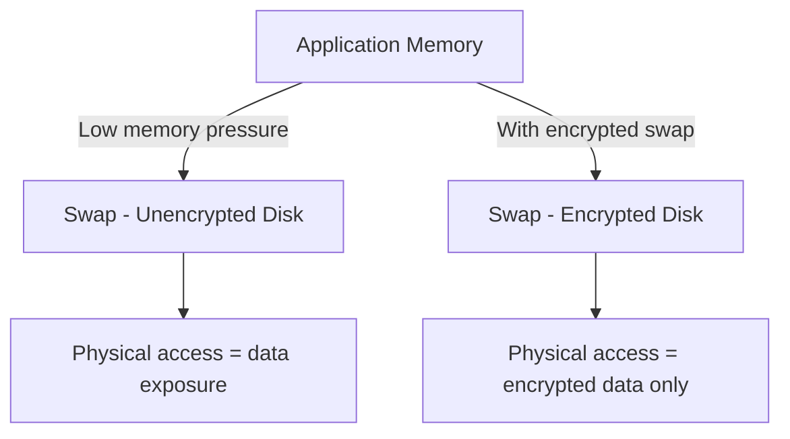

# How to Encrypt Swap Space on RHEL

Author: [nawazdhandala](https://www.github.com/nawazdhandala)

Tags: RHEL, Swap, Encryption, Security, Linux

Description: Learn how to encrypt swap space on RHEL to protect sensitive data that gets paged out of RAM, using LUKS and random-key encryption.

---

When an application writes sensitive data to memory - passwords, encryption keys, personal information - that data can end up in swap. Anyone with physical access to the disk can read swap contents with simple forensic tools. Encrypting swap eliminates this risk.

## Why Encrypt Swap

Data in swap is written to disk in plaintext by default. This means:

- Passwords and encryption keys from running applications can be recovered
- Sensitive documents open in memory get paged to disk
- Even after the system shuts down, swap data persists on disk
- Compliance frameworks (PCI-DSS, HIPAA) often require encryption at rest for all storage



## Method 1: Random Key Encryption (Recommended for Non-Hibernate Systems)

This method generates a new random encryption key at every boot. The swap contents are irrecoverable after reboot, which is actually a feature for security.

### Step 1: Identify Your Swap Device

```bash
# Find the current swap device
swapon --show
blkid | grep swap
```

### Step 2: Disable Current Swap

```bash
# Turn off swap
swapoff -a
```

### Step 3: Configure Encrypted Swap in crypttab

Edit `/etc/crypttab`:

```bash
vi /etc/crypttab
```

Add an entry for encrypted swap:

```bash
swap    /dev/rhel/swap    /dev/urandom    swap,cipher=aes-xts-plain64,size=512
```

This tells the system to:
- Create a mapped device called `swap`
- Use `/dev/rhel/swap` as the underlying device
- Generate a random key from `/dev/urandom` at each boot
- Use AES-XTS encryption with a 512-bit key

### Step 4: Update fstab

Change the swap entry in `/etc/fstab` to use the encrypted device:

```bash
vi /etc/fstab
```

Replace the existing swap line with:

```bash
/dev/mapper/swap    none    swap    defaults    0 0
```

### Step 5: Test the Configuration

```bash
# Initialize the encrypted swap manually for testing
cryptsetup open --type plain --cipher aes-xts-plain64 --key-size 512 --key-file /dev/urandom /dev/rhel/swap swap

# Format and enable
mkswap /dev/mapper/swap
swapon /dev/mapper/swap

# Verify
swapon --show
```

After rebooting, the system should automatically set up encrypted swap.

## Method 2: LUKS Encryption (Required for Hibernation)

If you need hibernation support, you need a persistent encryption key (so the system can read swap after resume). LUKS provides this.

### Step 1: Create a LUKS Encrypted Swap Volume

```bash
# Disable existing swap
swapoff -a

# Encrypt the swap partition with LUKS
cryptsetup luksFormat /dev/rhel/swap
```

You will be asked to confirm and set a passphrase.

### Step 2: Open the Encrypted Volume

```bash
# Open the LUKS volume
cryptsetup luksOpen /dev/rhel/swap swap_crypt
```

### Step 3: Format and Enable Swap

```bash
# Format the encrypted volume as swap
mkswap /dev/mapper/swap_crypt

# Enable it
swapon /dev/mapper/swap_crypt
```

### Step 4: Configure for Boot

Add to `/etc/crypttab`:

```bash
swap_crypt    /dev/rhel/swap    none    luks
```

Update `/etc/fstab`:

```bash
/dev/mapper/swap_crypt    none    swap    defaults    0 0
```

With LUKS, you will be prompted for the passphrase at boot (or you can use a keyfile).

### Using a Keyfile Instead of a Passphrase

To avoid typing a passphrase at boot:

```bash
# Generate a keyfile
dd if=/dev/urandom of=/root/.swap-keyfile bs=4096 count=1
chmod 600 /root/.swap-keyfile

# Add the keyfile to the LUKS volume
cryptsetup luksAddKey /dev/rhel/swap /root/.swap-keyfile
```

Update crypttab to use the keyfile:

```bash
swap_crypt    /dev/rhel/swap    /root/.swap-keyfile    luks
```

Make sure the root filesystem (where the keyfile lives) is on an encrypted volume too, otherwise the keyfile is exposed.

## Verifying Encryption Is Working

Check that the swap device is using dm-crypt:

```bash
# Show device mapper status
dmsetup info swap

# Check if swap is on an encrypted device
lsblk -f | grep -A1 crypt

# Verify swap is active
swapon --show
```

For the random-key method, verify the cipher:

```bash
# Show encryption details
cryptsetup status swap
```

You should see the cipher, key size, and device details.

## Performance Impact

Encrypted swap has a performance cost, but on modern CPUs with AES-NI hardware acceleration, it is minimal:

```bash
# Check if your CPU supports AES-NI
grep aes /proc/cpuinfo | head -1
```

If you see `aes` in the flags, hardware acceleration is available and the performance impact is typically under 5%.

## Troubleshooting

### Swap Not Available After Reboot

Check if cryptsetup is running early enough in the boot process:

```bash
# Check systemd cryptsetup service
systemctl status systemd-cryptsetup@swap
journalctl -u systemd-cryptsetup@swap
```

### "Device already exists" Error

The mapped device name conflicts with something else:

```bash
# Check existing device mapper entries
dmsetup ls
```

Choose a different name in crypttab if there is a conflict.

### System Hangs at Boot Waiting for Passphrase

For the random-key method, make sure crypttab specifies `/dev/urandom` as the key source, not `none`. If it says `none`, it waits for interactive input.

## Summary

Encrypting swap on RHEL protects sensitive data that gets paged out of memory. Use random-key encryption (via `/dev/urandom` in crypttab) for systems that do not hibernate - it is simpler and more secure since keys are never stored. Use LUKS encryption if you need hibernation support. The performance impact is negligible on modern hardware with AES-NI. Always verify with `swapon --show` and `cryptsetup status` after setup.
