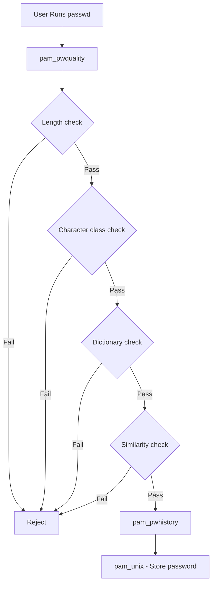

# How to Enforce Password Complexity with pam_pwquality on RHEL

Author: [nawazdhandala](https://www.github.com/nawazdhandala)

Tags: RHEL, Pam_pwquality, Passwords, Security, Linux

Description: Configure pam_pwquality on RHEL to enforce strong password complexity requirements including length, character classes, and dictionary checks.

---

Weak passwords are still one of the top reasons systems get compromised. On RHEL, the `pam_pwquality` module checks new passwords against a set of configurable rules before allowing the change. It replaces the older pam_cracklib and adds dictionary-based checks through cracklib.

## How pam_pwquality Works

When a user changes their password, pam_pwquality runs a series of quality checks on the new password before it reaches pam_unix for storage.



## Configuring pam_pwquality

There are two ways to configure it: in the PAM stack directly, or in the central configuration file.

### Method 1: Central configuration file (recommended)

```bash
sudo vi /etc/security/pwquality.conf
```

```bash
# Minimum password length
minlen = 14

# Minimum number of character classes (lowercase, uppercase, digit, special)
minclass = 3

# Credits for different character types (negative values mean required)
# Require at least 1 digit
dcredit = -1
# Require at least 1 uppercase letter
ucredit = -1
# Require at least 1 lowercase letter
lcredit = -1
# Require at least 1 special character
ocredit = -1

# Maximum number of consecutive identical characters
maxrepeat = 3

# Maximum number of consecutive characters from the same class
maxclassrepeat = 4

# Check for dictionary words
dictcheck = 1

# Check if password contains the username
usercheck = 1

# Number of characters that must differ from the old password
difok = 5

# Reject passwords that are palindromes
palindrome = 1

# Enforce complexity for root as well
enforce_for_root

# Number of retries before returning an error
retry = 3
```

### Method 2: Inline PAM configuration

If you prefer to set options directly in the PAM stack:

```bash
# Check the current password line in system-auth
grep pam_pwquality /etc/pam.d/system-auth
```

The line typically looks like:

```bash
password    requisite     pam_pwquality.so retry=3
```

Options set in `/etc/security/pwquality.conf` apply automatically without changing the PAM line.

## Understanding the Credit System

The credit system in pam_pwquality can be confusing. Here is how it works:

- **Positive values** (e.g., `dcredit = 2`): Each digit in the password adds 1 to the effective length, up to 2. No digits are required.
- **Negative values** (e.g., `dcredit = -1`): At least 1 digit is required, and digits do not add to the effective length.

For straightforward enforcement, use negative values to require specific character types.

### Example: Require all four character classes

```bash
dcredit = -1
ucredit = -1
lcredit = -1
ocredit = -1
```

This means every password must contain at least one digit, one uppercase letter, one lowercase letter, and one special character.

### Example: Require any 3 of 4 character classes

```bash
minclass = 3
dcredit = 0
ucredit = 0
lcredit = 0
ocredit = 0
```

With `minclass = 3`, the password needs characters from at least 3 of the 4 classes, but no specific class is mandatory.

## Testing Password Quality

You can test passwords without changing any user's actual password:

```bash
# Test a specific password against the current policy
echo "weakpass" | pwscore
```

The output is a score from 0 to 100. If the password fails the policy, you will see an error message explaining why.

```bash
# Check the quality of a more complex password
echo "Str0ng!P@ssw0rd2026" | pwscore
```

### Test what a user would experience

```bash
# Use pwmake to generate a password that meets the policy
pwmake 128
```

The number is the desired entropy in bits. `pwmake 128` generates a password with about 128 bits of entropy.

## Common Compliance Configurations

### CIS Benchmark Level 1

```bash
minlen = 14
dcredit = -1
ucredit = -1
lcredit = -1
ocredit = -1
maxrepeat = 3
maxclassrepeat = 0
dictcheck = 1
```

### PCI DSS

```bash
minlen = 7
dcredit = -1
ucredit = -1
lcredit = -1
ocredit = 0
```

### NIST 800-53

NIST guidelines have shifted toward longer passwords with less complexity:

```bash
minlen = 15
minclass = 0
dcredit = 0
ucredit = 0
lcredit = 0
ocredit = 0
dictcheck = 1
usercheck = 1
```

## Customizing the Dictionary Check

pam_pwquality uses cracklib's dictionary to check for common words. You can add custom dictionaries:

```bash
# See where cracklib dictionaries are stored
ls /usr/share/cracklib/

# Add custom words to the dictionary
sudo vi /usr/share/cracklib/pw_dict.custom
```

Add one word per line, then rebuild the dictionary:

```bash
# Rebuild cracklib dictionaries
sudo create-cracklib-dict /usr/share/cracklib/pw_dict.custom /usr/share/dict/*
```

## Excluding Root from Complexity Rules

By default, root can set any password. To enforce the same rules for root:

```bash
# In /etc/security/pwquality.conf
enforce_for_root
```

To explicitly exclude root (the default behavior), remove the `enforce_for_root` line.

## Troubleshooting

### Password change fails with no clear error

```bash
# Check the PAM stack order
grep -n "password" /etc/pam.d/system-auth
```

Make sure `pam_pwquality.so` comes before `pam_unix.so` in the password stack.

### Users report "password is too similar"

The `difok` setting controls how many characters must differ from the old password:

```bash
# Require at least 5 different characters
difok = 5
```

Lower this value if users are having trouble finding acceptable passwords.

### Quality check seems to accept weak passwords

Check that the configuration file is being read:

```bash
# Verify the config file has correct permissions
ls -la /etc/security/pwquality.conf

# Make sure there is no conflicting configuration in the PAM line
grep pam_pwquality /etc/pam.d/system-auth
```

Options specified on the PAM line override the config file.

## Wrapping Up

pam_pwquality on RHEL gives you solid control over password quality without needing third-party tools. Use the central configuration file at `/etc/security/pwquality.conf` for clarity, set negative credit values when you need to require specific character types, and use `pwscore` to verify your policy works as expected. The goal is to find the right balance between security and usability, because an overly strict policy just leads to passwords written on sticky notes.
