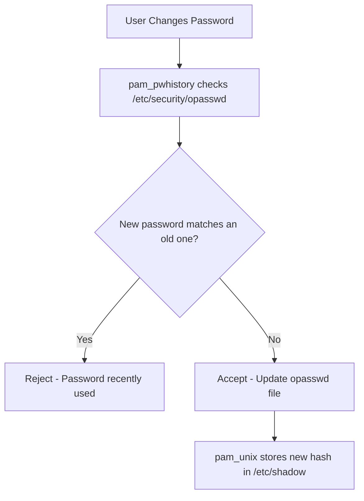

# How to Enforce Password History with pam_pwhistory on RHEL

Author: [nawazdhandala](https://www.github.com/nawazdhandala)

Tags: RHEL, Pam_pwhistory, Password Policy, Linux

Description: Configure pam_pwhistory on RHEL to prevent users from reusing old passwords, meeting compliance requirements and improving overall security posture.

---

We have all seen it, the user who alternates between two passwords forever because the system only remembers the last one. The pam_pwhistory module on RHEL solves this by keeping a record of previous password hashes and rejecting any attempt to reuse them.

## How pam_pwhistory Works

When a user changes their password, pam_pwhistory stores a hash of the old password in `/etc/security/opasswd`. The next time they try to set a password, the module checks the new password against all stored hashes.


```mermaid
graph TD
    A[User Changes Password] --> B[pam_pwhistory checks /etc/security/opasswd]
    B --> C{New password matches an old one?}
    C -->|Yes| D[Reject - Password recently used]
    C -->|No| E[Accept - Update opasswd file]
    E --> F[pam_unix stores new hash in /etc/shadow]
```

## Enabling pam_pwhistory

On RHEL, the cleanest way to add pam_pwhistory is through authselect. Newer RHEL 9 systems can enable the module with the built-in authselect feature; otherwise, create a custom profile rather than editing the generated files in `/etc/pam.d` directly.

### Check the current password stack

```bash
# Look at the password sections managed by authselect

grep "^password" /etc/pam.d/system-auth
grep "^password" /etc/pam.d/password-auth
```

### Configure pam_pwhistory via authselect custom profile

If your authselect version supports the feature, enable it directly:

```bash
sudo authselect enable-feature with-pwhistory
sudo authselect apply-changes
```

Then set the policy in `/etc/security/pwhistory.conf`:

```bash
remember = 12
enforce_for_root
retry = 3
```

If the feature is not available, use a custom profile:

```bash
# Create a custom profile if you do not have one
sudo authselect create-profile myorg -b sssd

# Edit the system-auth and password-auth templates
sudo vi /etc/authselect/custom/myorg/system-auth
sudo vi /etc/authselect/custom/myorg/password-auth
```

Add the pam_pwhistory line in the password section, before pam_unix in both templates:

```bash
password    requisite     pam_pwquality.so retry=3
password    required      pam_pwhistory.so remember=12 use_authtok enforce_for_root retry=3
password    sufficient    pam_unix.so sha512 shadow nullok use_authtok
password    required      pam_deny.so
```

Apply the custom profile:

```bash
sudo authselect select custom/myorg with-faillock --force
```

### Key options explained

| Option | Description |
|---|---|
| remember=12 | Remember the last 12 passwords |
| use_authtok | Use the password already collected by a previous module |
| enforce_for_root | Apply the policy to root as well |
| retry=3 | Allow 3 attempts to pick a non-reused password |

## Setting the Remember Value

The `remember` value determines how many old passwords are stored. Common compliance requirements:

- **CIS Benchmark for RHEL 9 profiles**: remember=5 or greater
- **PCI DSS**: remember=4
- **STIG**: remember=5

```bash
# For CIS or STIG compliance on RHEL 9
password    required    pam_pwhistory.so remember=5 use_authtok enforce_for_root
```

## Understanding the opasswd File

The password history is stored in `/etc/security/opasswd`:

```bash
# Check the file exists and has correct permissions
ls -la /etc/security/opasswd
```

The file should be owned by root with permissions 600:

```bash
# Set correct permissions if needed
sudo chmod 600 /etc/security/opasswd
sudo chown root:root /etc/security/opasswd
```

If the file does not exist, create it:

```bash
sudo touch /etc/security/opasswd
sudo chmod 600 /etc/security/opasswd
sudo chown root:root /etc/security/opasswd
```

### What the file looks like

Each line contains a username followed by password hashes separated by commas:

```bash
jsmith:1000:3:$6$abc..hash1,$6$def..hash2,$6$ghi..hash3
```

The fields are: username, UID, count, and comma-separated password hashes.

## Testing Password History

### Test with a regular user

```bash
# Change the password to something new
sudo passwd testuser

# Try to change it back to the same password
sudo passwd testuser
# This should fail with "Password has been already used"
```

### Verify the opasswd file was updated

```bash
# Check that the user has an entry
sudo grep testuser /etc/security/opasswd
```

## Combining with pam_pwquality

Password history works best alongside password complexity rules. The typical stacking order is:

1. **pam_pwquality** - Check the new password meets complexity requirements
2. **pam_pwhistory** - Check it has not been used before
3. **pam_unix** - Actually store the new password

```bash
password    requisite     pam_pwquality.so retry=3 minlen=12 dcredit=-1 ucredit=-1 lcredit=-1 ocredit=-1
password    required      pam_pwhistory.so remember=12 use_authtok enforce_for_root
password    sufficient    pam_unix.so sha512 shadow nullok use_authtok
password    required      pam_deny.so
```

## Clearing Password History

If you need to clear the password history for a specific user (for example, after a password reset by an admin):

```bash
# Edit the opasswd file and remove the user's line
sudo vi /etc/security/opasswd
# Find and delete the line for the user

# Or clear the entire history
sudo truncate -s 0 /etc/security/opasswd
```

## Handling the enforce_for_root Option

By default, pam_pwhistory does not apply to root. Adding `enforce_for_root` changes this:

```bash
password    required    pam_pwhistory.so remember=12 use_authtok enforce_for_root
```

Without this option, root can set any password regardless of history. Enable it when your baseline requires root password changes to follow the same history rule.

## Troubleshooting

### Password change succeeds even though it should be rejected

Check the module order. pam_pwhistory must come before pam_unix in the password stack, and it must use `required` (not `optional`).

```bash
grep "^password" /etc/pam.d/system-auth
grep "^password" /etc/pam.d/password-auth
```

### "Password has been already used" even for a new password

Check the user's entry in the configured history file. pam_pwhistory compares the proposed password against hashes already stored in `/etc/security/opasswd`, so a stale or unexpected history entry can still trigger the rejection:

```bash
sudo grep '^testuser:' /etc/security/opasswd
```

### opasswd file is empty

The file only gets populated after a user changes their password with pam_pwhistory active. Existing passwords before you enabled the module are not retroactively stored.

## Wrapping Up

Password history enforcement with pam_pwhistory is a simple but effective security measure. Set the `remember` value according to your compliance requirements, make sure the module is in the right position in the PAM stack, and verify that `/etc/security/opasswd` has correct permissions. Combined with password complexity rules and regular expiration, it prevents the lazy password cycling that plagues so many organizations.
