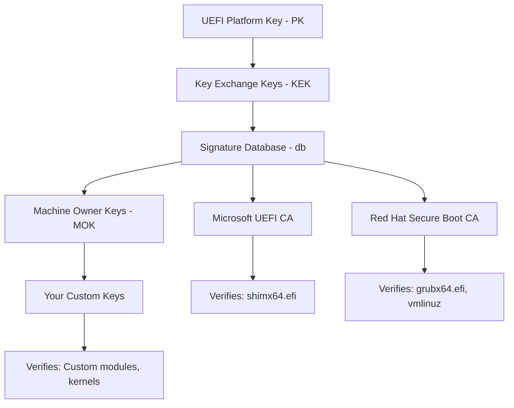

# How to Enroll Custom Secure Boot Keys on RHEL 9

Author: [nawazdhandala](https://www.github.com/nawazdhandala)

Tags: RHEL, Secure Boot, Custom Keys, Linux

Description: Enroll custom Secure Boot keys on RHEL 9 using the Machine Owner Key (MOK) system to trust your own signing certificates for bootloaders and kernel modules.

---

The default Secure Boot trust chain on RHEL 9 uses Microsoft's UEFI CA to verify the shim bootloader, and Red Hat's key to verify GRUB and the kernel. If you need to boot custom kernels, load third-party modules, or run your own signed bootloader, you need to enroll custom keys. The MOK (Machine Owner Key) system makes this possible without modifying the UEFI firmware key database directly.

## Understanding the Key Hierarchy



The MOK list sits alongside the UEFI db keys and is managed through the `mokutil` tool and the MokManager at boot time. This is the safest way to add custom trust without touching the firmware key database.

## Generating Custom Keys

Create a key pair for signing:

```bash
# Create a directory for Secure Boot keys
sudo mkdir -p /root/secureboot-keys
cd /root/secureboot-keys

# Generate a self-signed certificate and private key
sudo openssl req -new -x509 -newkey rsa:2048 \
    -keyout sb-key.priv \
    -outform DER \
    -out sb-key.der \
    -nodes \
    -days 3650 \
    -subj "/CN=My Organization Secure Boot Key/"

# Also create a PEM version for tools that need it
sudo openssl x509 -in sb-key.der -inform DER -out sb-key.pem -outform PEM
```

Protect the private key:

```bash
sudo chmod 400 /root/secureboot-keys/sb-key.priv
```

## Enrolling a MOK Key

Use `mokutil` to request enrollment:

```bash
# Import the certificate into MOK
sudo mokutil --import /root/secureboot-keys/sb-key.der
```

You will be prompted to create a one-time password. Remember this - you need it during the next reboot.

Check the pending enrollment:

```bash
# Verify the enrollment request is pending
sudo mokutil --list-new
```

## Completing Enrollment at Boot

Reboot the system:

```bash
sudo reboot
```

During boot, the MokManager screen appears (blue screen). Follow these steps:

1. Select "Enroll MOK"
2. Select "Continue"
3. Select "Yes" to confirm
4. Enter the one-time password you set
5. Select "Reboot"

If you miss the MokManager screen, the enrollment request remains pending and you can try again on the next reboot.

## Verifying Enrollment

After reboot, confirm the key is enrolled:

```bash
# List all enrolled MOK keys
mokutil --list-enrolled

# Search for your key
mokutil --list-enrolled | grep "My Organization"
```

## Enrolling Keys from a Hash

If you have a key hash instead of a certificate file:

```bash
# Enroll by hash
sudo mokutil --import-hash <sha256-hash>
```

## Managing Multiple Keys

You can enroll multiple MOK keys:

```bash
# Import a second key
sudo mokutil --import /root/secureboot-keys/another-key.der

# List all enrolled keys
mokutil --list-enrolled
```

## Revoking a Key

To remove an enrolled MOK key:

```bash
# Delete a specific MOK key
sudo mokutil --delete /root/secureboot-keys/sb-key.der
```

This also requires a one-time password and a reboot to complete through MokManager.

## Resetting All MOK Keys

To start fresh:

```bash
# Reset all MOK keys (removes all custom enrollments)
sudo mokutil --reset
```

This requires a reboot and MokManager confirmation.

## Using Custom Keys for Module Signing

Once your key is enrolled, use it to sign kernel modules:

```bash
# Sign a kernel module
sudo /usr/src/kernels/$(uname -r)/scripts/sign-file sha256 \
    /root/secureboot-keys/sb-key.priv \
    /root/secureboot-keys/sb-key.der \
    /path/to/module.ko

# Verify the module signature
modinfo /path/to/module.ko | grep sig
```

## Enrolling Keys in the UEFI Firmware db (Advanced)

For more permanent key enrollment that does not depend on shim/MokManager, you can add keys directly to the UEFI firmware. This is hardware-specific and carries more risk:

```bash
# Export current Secure Boot variables
sudo efi-readvar -v db -o db.esl

# This approach varies significantly by hardware vendor
# and is typically done through UEFI firmware setup menus
```

Most administrators should stick with MOK enrollment unless they have a specific reason to modify the firmware key database.

## Automating Key Enrollment for Fleet Deployment

For deploying custom keys across many systems, include the enrollment in your provisioning process:

```bash
# In a Kickstart post-install section
%post
# Copy the MOK certificate
cp /path/to/sb-key.der /root/secureboot-keys/sb-key.der

# Queue the enrollment (requires reboot and console interaction)
mokutil --import /root/secureboot-keys/sb-key.der --root-pw
%end
```

The `--root-pw` option uses the root password for the enrollment instead of a one-time password, which can simplify automated deployments.

## Checking Key Expiration

Monitor your signing certificate expiration:

```bash
# Check certificate dates
openssl x509 -in /root/secureboot-keys/sb-key.der -inform DER -noout -dates

# Check validity
openssl x509 -in /root/secureboot-keys/sb-key.der -inform DER -noout -text | grep -A2 "Validity"
```

Plan to rotate keys before expiration to avoid disruption.

## Security Best Practices

- Store private keys on encrypted storage with restricted access
- Use separate keys for different purposes (module signing vs. bootloader signing)
- Document which keys are enrolled on which systems
- Set up monitoring for certificate expiration
- Keep the key generation and enrollment process documented in your runbook
- Never share private keys between organizations or environments
- Audit enrolled MOK keys periodically across your fleet

Custom Secure Boot keys give you the flexibility to run your own signed code while maintaining the security guarantees of the Secure Boot chain of trust.
