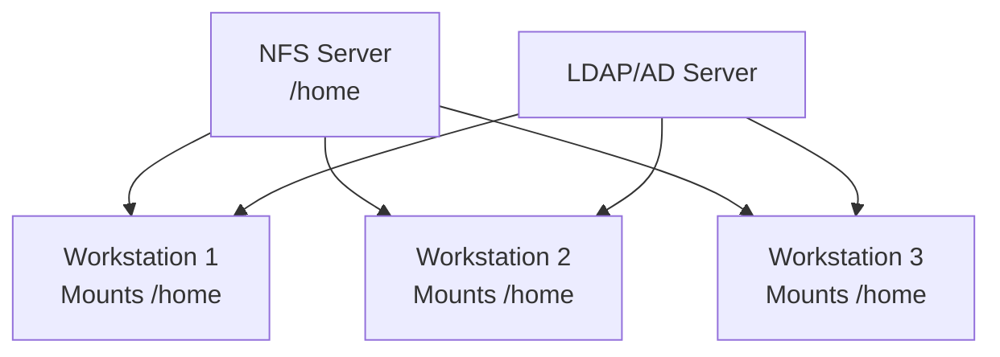

# How to Export Home Directories Over NFS on RHEL

Author: [nawazdhandala](https://www.github.com/nawazdhandala)

Tags: RHEL, NFS, Home Directories, Linux

Description: Set up centralized home directories over NFS on RHEL, letting users access their files from any machine on the network.

---

## Centralized Home Directories

Sharing home directories over NFS is a classic setup for environments where users log into multiple machines. Instead of having separate home directories on each workstation, a central NFS server hosts all home directories. Users get the same files, settings, and environment regardless of which machine they are on.

## Architecture



For this to work well, you also need centralized user authentication (LDAP, FreeIPA, or Active Directory) so UIDs and GIDs are consistent across all machines.

## Server Configuration

### Step 1 - Install and Enable NFS

```bash
# Install NFS server
sudo dnf install -y nfs-utils

# Enable and start NFS
sudo systemctl enable --now nfs-server
```

### Step 2 - Prepare the Home Directory Export

If user home directories already exist under /home, you can export /home directly. For a cleaner setup, use a dedicated directory:

```bash
# Option 1: Export /home directly
# Option 2: Use a dedicated directory and bind-mount /home
sudo mkdir -p /export/home

# If using Option 2, bind-mount /home to /export/home
echo "/home /export/home none bind 0 0" | sudo tee -a /etc/fstab
sudo mount -a
```

### Step 3 - Configure the Export

```bash
# Add to /etc/exports
echo "/export/home 192.168.1.0/24(rw,sync,no_subtree_check,root_squash)" | sudo tee -a /etc/exports

# Apply
sudo exportfs -arv
```

Using `root_squash` (the default) is important for home directories. It prevents root on client machines from having root access to the server's files.

### Step 4 - Set SELinux Booleans

```bash
# Allow NFS to export home directories
sudo setsebool -P nfs_export_all_rw on
sudo setsebool -P use_nfs_home_dirs on
```

### Step 5 - Open the Firewall

```bash
sudo firewall-cmd --permanent --add-service=nfs
sudo firewall-cmd --permanent --add-service=mountd
sudo firewall-cmd --permanent --add-service=rpc-bind
sudo firewall-cmd --reload
```

## Client Configuration

### Step 1 - Install NFS Utilities

```bash
sudo dnf install -y nfs-utils
```

### Step 2 - Configure the Home Directory Mount

On each client machine, the local /home must not contain any local user directories that would conflict.

```bash
# Back up any local home directories first
sudo cp -a /home /home.local.bak

# Add NFS mount to fstab
echo "192.168.1.10:/export/home  /home  nfs  rw,hard,intr,_netdev,nofail  0 0" | sudo tee -a /etc/fstab

# Mount
sudo mount -a

# Verify
df -h /home
ls -la /home
```

### Step 3 - Set SELinux on the Client

```bash
# Allow using NFS home directories
sudo setsebool -P use_nfs_home_dirs on
```

## Creating New Users

When creating users on this setup, create them on the NFS server:

```bash
# On the NFS server, create a user with a home directory
sudo useradd -m -d /home/jdoe jdoe
sudo passwd jdoe

# Verify the home directory was created
ls -la /home/jdoe
```

The home directory is immediately available on all client machines since they mount /home from the server.

## UID/GID Consistency

UIDs and GIDs must match across all machines. With centralized authentication (LDAP, FreeIPA), this is handled automatically. Without it, you must manually ensure consistency:

```bash
# Create user with specific UID/GID on each machine
sudo useradd -u 1500 -g 1500 jdoe
```

For any serious deployment, use FreeIPA or LDAP for centralized identity management.

## Performance Considerations

Home directories typically have lots of small files (dotfiles, configs, caches). This is a challenging workload for NFS. Some tips:

```bash
# Use noatime to reduce metadata operations
192.168.1.10:/export/home  /home  nfs  rw,hard,intr,noatime,_netdev,nofail  0 0
```

For better performance with small files, consider:
- Using NFSv4 (fewer round trips than v3)
- Increasing NFS server threads
- Using SSD storage on the NFS server

## Handling Offline Scenarios

If the NFS server goes down, users cannot access their home directories. Use `nofail` in fstab to prevent boot failures:

```bash
# nofail prevents the client from hanging during boot
192.168.1.10:/export/home  /home  nfs  rw,hard,_netdev,nofail  0 0
```

## Quotas

Set disk quotas on the server to prevent any single user from filling the storage:

```bash
# Enable quotas on the /home filesystem (server side)
# For XFS:
sudo xfs_quota -x -c 'limit bsoft=5g bhard=6g jdoe' /home

# Check quotas
sudo xfs_quota -x -c 'report -h' /home
```

## Wrap-Up

Exporting home directories over NFS on RHEL provides a seamless experience for users who work across multiple machines. The setup is straightforward: export the home directory, mount it on all clients, and ensure UID/GID consistency through centralized authentication. Use `nofail` in fstab to handle server outages gracefully, and consider quotas to keep storage manageable.
