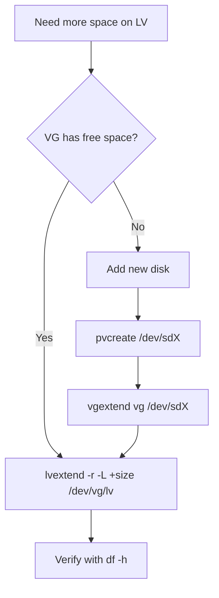

# How to Extend a Logical Volume and Filesystem on RHEL Without Downtime

Author: [nawazdhandala](https://www.github.com/nawazdhandala)

Tags: RHEL, LVM, Extend, Filesystem, Linux

Description: Extend logical volumes and grow XFS or ext4 filesystems on RHEL online without unmounting or rebooting, using lvextend and filesystem resize tools.

---

One of LVM's greatest features is the ability to grow volumes and filesystems while they are mounted and in use. No downtime, no unmounting, no maintenance window. This is one of those tasks every sysadmin needs to know cold because you will do it often.

## Checking Available Space

Before extending, check how much free space the volume group has:

```bash
# Check VG free space
sudo vgs
```

Look at the VFree column. If it shows zero, you need to add a new disk to the VG first.

## Extending a Logical Volume

### Add a Specific Amount of Space

```bash
# Add 20GB to an existing logical volume
sudo lvextend -L +20G /dev/datavg/datalv
```

### Extend to a Specific Total Size

```bash
# Grow the LV to exactly 100GB total
sudo lvextend -L 100G /dev/datavg/datalv
```

### Use All Remaining VG Space

```bash
# Use all free space in the volume group
sudo lvextend -l +100%FREE /dev/datavg/datalv
```

## Growing the Filesystem

After extending the LV, the filesystem still uses the original size. You need to grow it.

### For XFS Filesystems

```bash
# Grow XFS to fill the entire LV (must be mounted)
sudo xfs_growfs /data
```

XFS can only be grown while mounted. You cannot grow an unmounted XFS filesystem.

### For ext4 Filesystems

```bash
# Grow ext4 to fill the entire LV (can be done while mounted)
sudo resize2fs /dev/datavg/datalv
```

ext4 supports online resizing.

## One-Step Extend and Resize

The `lvextend` command can grow the filesystem at the same time with the `-r` flag:

```bash
# Extend LV and resize filesystem in one step
sudo lvextend -r -L +20G /dev/datavg/datalv
```

The `-r` flag detects the filesystem type and calls the appropriate resize tool automatically. This is the recommended approach because it is simpler and you cannot forget the resize step.

## Complete Example: Adding Space to /var

```bash
# Check current usage
df -h /var
sudo lvs /dev/rhel/var

# Check available VG space
sudo vgs rhel

# Extend by 10GB and resize filesystem in one step
sudo lvextend -r -L +10G /dev/rhel/var

# Verify the new size
df -h /var
```

## When the VG Has No Free Space

If the VG is full, add a new disk:

```bash
# Initialize the new disk as a PV
sudo pvcreate /dev/sdd

# Add it to the existing VG
sudo vgextend datavg /dev/sdd

# Now extend the LV
sudo lvextend -r -L +50G /dev/datavg/datalv
```

## Workflow



## Verifying the Extension

Always verify after extending:

```bash
# Check LV size
sudo lvs /dev/datavg/datalv

# Check filesystem size
df -h /data

# Both should show the new size
```

## Tips

- Always use `-r` with `lvextend` to avoid forgetting the filesystem resize
- You can extend volumes while applications are running and writing data
- XFS can only grow, never shrink
- ext4 can both grow and shrink (but shrinking requires unmounting)
- Keep some free space in the VG for emergencies and snapshots
