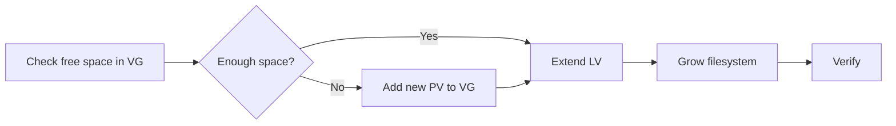

# How to Extend LVM Logical Volumes on RHEL

Author: [nawazdhandala](https://www.github.com/nawazdhandala)

Tags: RHEL, LVM, Storage, Filesystems, Linux

Description: Learn how to grow LVM logical volumes and their filesystems on RHEL without downtime.

---

One of the biggest advantages of LVM is the ability to extend volumes without unmounting them. Running low on space in `/var`? Add more storage to the volume group and grow the logical volume while applications keep running.

## Extending a Logical Volume - The Process



## Check Available Space

Before extending, see how much free space exists in the volume group:

```bash
# Check volume group free space
sudo vgs

# More detailed view
sudo vgdisplay datavg | grep -i free
```

## Extending When Space is Available in the VG

If the volume group has free space, extending is straightforward:

```bash
# Extend by a specific size (add 10GB)
sudo lvextend -L +10G /dev/datavg/datalv

# Extend to a specific total size (set to 50GB)
sudo lvextend -L 50G /dev/datavg/datalv

# Extend using a percentage of free VG space
sudo lvextend -l +50%FREE /dev/datavg/datalv

# Use all remaining free space
sudo lvextend -l +100%FREE /dev/datavg/datalv
```

## Growing the Filesystem

After extending the LV, grow the filesystem to use the new space:

```bash
# For XFS filesystems (must be mounted)
sudo xfs_growfs /data

# For ext4 filesystems (can be mounted or unmounted)
sudo resize2fs /dev/datavg/applv
```

You can combine both steps with the `-r` flag:

```bash
# Extend LV and resize filesystem in one command
sudo lvextend -L +10G -r /dev/datavg/datalv
```

The `-r` flag automatically detects the filesystem type and runs the appropriate resize command.

## Adding a New Disk to the Volume Group

When the volume group is full, add a new physical volume:

```bash
# Initialize the new disk as a PV
sudo pvcreate /dev/sdd

# Add it to the existing volume group
sudo vgextend datavg /dev/sdd

# Verify the new capacity
sudo vgs datavg

# Now extend the logical volume
sudo lvextend -L +50G -r /dev/datavg/datalv
```

## Verifying the Extension

```bash
# Check the logical volume size
sudo lvs /dev/datavg/datalv

# Verify the filesystem sees the new space
df -h /data

# For XFS, check filesystem details
sudo xfs_info /data

# For ext4, check filesystem details
sudo tune2fs -l /dev/datavg/applv | grep "Block count"
```

## Extending the Root Volume

Extending the root volume follows the same process:

```bash
# Check the root LV name
df -h /

# Extend the root LV (typical name on RHEL)
sudo lvextend -L +10G -r /dev/rhel/root

# Verify
df -h /
```

## Summary

Extending LVM volumes on RHEL is an online operation that does not require downtime. The key steps are verifying free space in the volume group, extending the logical volume, and then growing the filesystem. Use the `-r` flag with `lvextend` to handle both steps at once.

