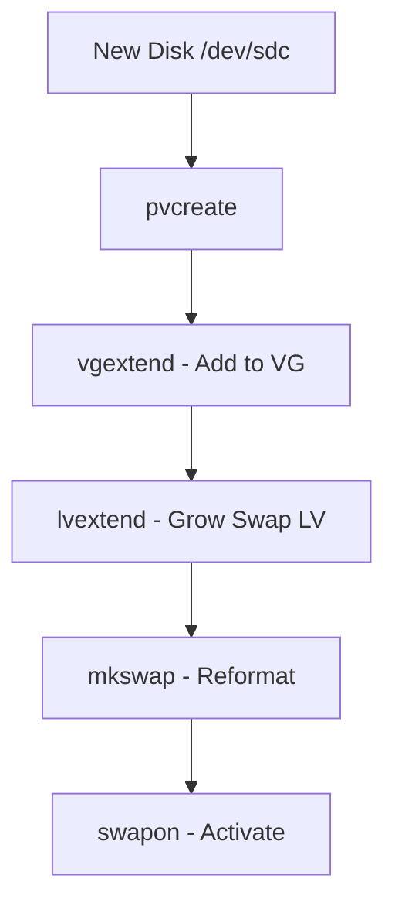

# How to Extend Swap Space Using LVM on RHEL

Author: [nawazdhandala](https://www.github.com/nawazdhandala)

Tags: RHEL, Swap, LVM, Linux

Description: Learn how to extend swap space using LVM on RHEL, whether by growing an existing swap volume or adding a new one.

---

Running low on swap in production is stressful. The OOM killer starts picking off processes, applications slow to a crawl, and everyone is unhappy. If your swap lives on LVM (and on RHEL, it usually does), extending it is a clean, well-supported operation.

## Check Current Swap Layout

Before making changes, understand what you have:

```bash
# Show active swap devices
swapon --show

# Check memory and swap totals
free -h

# See the LVM layout
lvs
```

Identify your swap logical volume:

```bash
# Find the swap LV specifically
lvs -o lv_name,vg_name,lv_size --select 'lv_name=~swap'
```

## Method 1: Extend the Existing Swap LV

This is the cleanest approach when you have free space in the volume group.

### Step 1: Check Available Space

```bash
# Show free space in the volume group
vgs
```

Look at the `VFree` column to see how much space is available.

### Step 2: Disable Swap on the LV

```bash
# Turn off swap on the logical volume
swapoff /dev/rhel/swap
```

Verify swap is disabled:

```bash
# Confirm swap is off
swapon --show
```

### Step 3: Extend the Logical Volume

```bash
# Add 4 GB to the existing swap LV
lvextend -L +4G /dev/rhel/swap
```

Or set an absolute size:

```bash
# Set the swap LV to exactly 8 GB
lvextend -L 8G /dev/rhel/swap
```

### Step 4: Reformat as Swap

After resizing, you must reformat the volume:

```bash
# Reformat the extended volume as swap
mkswap /dev/rhel/swap
```

### Step 5: Re-enable Swap

```bash
# Turn swap back on
swapon /dev/rhel/swap
```

Verify the new size:

```bash
# Confirm the new swap size
swapon --show
free -h
```

## Method 2: Add a New Swap LV

If you want to keep the existing swap and add more, create a second swap volume:

```bash
# Create a new 4 GB logical volume for swap
lvcreate -L 4G -n swap2 rhel
```

Format and enable:

```bash
# Format and enable the new swap volume
mkswap /dev/rhel/swap2
swapon /dev/rhel/swap2
```

Add to fstab for persistence:

```bash
# Add new swap to fstab
echo "/dev/rhel/swap2  none  swap  defaults  0 0" >> /etc/fstab
```

## Method 3: Add a New Physical Volume First

If the volume group is full, add a new disk first:

```bash
# Initialize the new disk as a physical volume
pvcreate /dev/sdc

# Extend the volume group
vgextend rhel /dev/sdc

# Now extend the swap LV
swapoff /dev/rhel/swap
lvextend -L +4G /dev/rhel/swap
mkswap /dev/rhel/swap
swapon /dev/rhel/swap
```



## Handling the fstab Entry

If you extended the existing swap LV, the fstab entry should already be correct. But verify:

```bash
# Check fstab swap entries
grep swap /etc/fstab
```

If the fstab uses a UUID and you reformatted with `mkswap`, the UUID changed. Update it:

```bash
# Get the new UUID
blkid /dev/rhel/swap
```

Update the fstab entry with the new UUID, or switch to using the device path which does not change with reformatting:

```bash
/dev/rhel/swap  none  swap  defaults  0 0
```

## Verify After Reboot

The real test is whether swap comes back after a reboot. If you cannot reboot, at least test the fstab:

```bash
# Turn off all swap
swapoff -a

# Activate swap from fstab
swapon -a

# Verify
swapon --show
free -h
```

## Quick Cheat Sheet

Here is the entire extend process in one block:

```bash
# Extend existing swap LV by 4 GB
swapoff /dev/rhel/swap
lvextend -L +4G /dev/rhel/swap
mkswap /dev/rhel/swap
swapon /dev/rhel/swap

# Update fstab UUID if needed
NEW_UUID=$(blkid -s UUID -o value /dev/rhel/swap)
sed -i "s|UUID=.*swap|UUID=$NEW_UUID  none  swap|" /etc/fstab

# Verify
free -h
swapon --show
```

## Things to Watch Out For

1. **Do not skip mkswap** - After lvextend, the swap signature needs to be recreated for the full size. If you skip this, only the original size is used.

2. **Processes using swap** - If active processes have pages in swap, `swapoff` can take a long time or fail if there is not enough RAM to hold everything. Check first:

```bash
# Check how much swap is actually in use
free -h | grep Swap
```

If swap usage is high, you might need to extend using a new LV instead of disabling the existing one.

3. **SELinux contexts** - New swap LVs should get the correct SELinux context automatically. If not:

```bash
# Restore SELinux context on the swap device
restorecon -v /dev/rhel/swap2
```

## Summary

Extending swap with LVM on RHEL is one of the easier storage tasks. If you have VG free space, it is a five-command operation: swapoff, lvextend, mkswap, swapon, update fstab. If you need more VG space, add a disk with pvcreate and vgextend first. Always verify with `swapon --show` and test your fstab entries before walking away.
