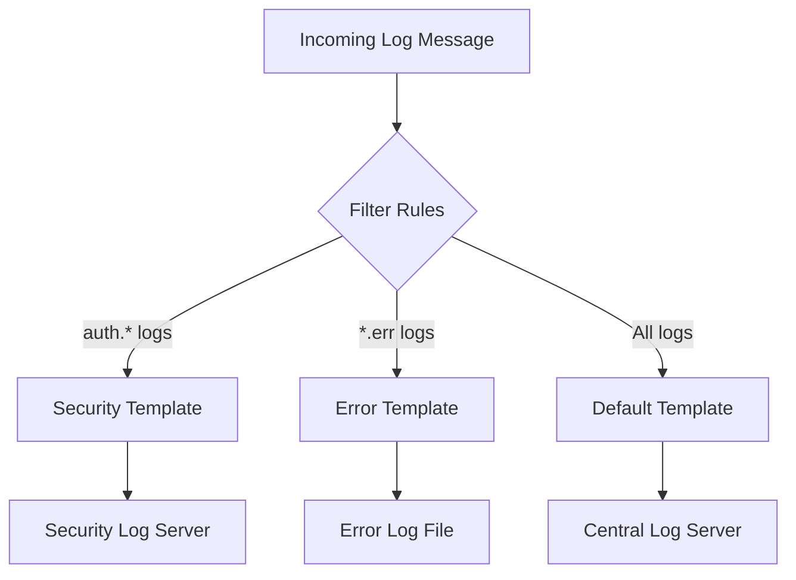

# How to Filter and Forward Logs with rsyslog Templates on RHEL

Author: [nawazdhandala](https://www.github.com/nawazdhandala)

Tags: RHEL, rsyslog, Logging, Templates, Linux

Description: Learn how to use rsyslog templates and filter conditions to selectively forward and format log messages on RHEL for targeted log management.

---

rsyslog on RHEL is far more than a simple log forwarder. Its template and filtering system lets you control exactly which messages go where, in what format, and under what conditions. This is essential when you want to send security logs to one server, application logs to another, and format everything differently for each destination.

## Understanding rsyslog Templates

Templates define how log messages are formatted before they are written to files or forwarded. rsyslog supports several template types.



## Template Types

### String Templates

The simplest type. You insert rsyslog properties using `%property%` syntax:

```bash
# String template - formats log output as a custom string
template(name="CustomFormat" type="string"
    string="%timestamp% %hostname% %syslogtag%%msg%\n"
)
```

### List Templates

More structured and readable for complex formats:

```bash
# List template - each element is specified separately
template(name="DetailedFormat" type="list") {
    property(name="timestamp" dateFormat="rfc3339")
    constant(value=" ")
    property(name="hostname")
    constant(value=" ")
    property(name="syslogtag")
    property(name="msg" spifno1teleading="on")
    constant(value="\n")
}
```

### Plugin Templates

Used for structured output like JSON:

```bash
# JSON output template
template(name="JSONFormat" type="list") {
    constant(value="{")
    constant(value="\"timestamp\":\"")
    property(name="timestamp" dateFormat="rfc3339")
    constant(value="\",\"host\":\"")
    property(name="hostname")
    constant(value="\",\"severity\":\"")
    property(name="syslogseverity-text")
    constant(value="\",\"facility\":\"")
    property(name="syslogfacility-text")
    constant(value="\",\"tag\":\"")
    property(name="syslogtag" format="json")
    constant(value="\",\"message\":\"")
    property(name="msg" format="json")
    constant(value="\"}\n")
}
```

## Setting Up Filter Rules

### Facility and Severity Filters

The traditional way to filter syslog messages:

```bash
# Create a configuration file for filtered logging
sudo vi /etc/rsyslog.d/filters.conf
```

```bash
# Forward only authentication logs to a security server
auth,authpriv.* @@security-server.example.com:514

# Write all error-level and above messages to a dedicated file
*.err action(type="omfile" file="/var/log/all-errors.log")

# Write kernel messages to a separate file
kern.* action(type="omfile" file="/var/log/kernel.log")

# Forward mail logs to the mail server
mail.* @@mail-logs.example.com:514
```

### Property-Based Filters

Filter based on any message property:

```bash
# Filter by hostname - only process logs from web servers
:hostname, startswith, "web" action(type="omfile" file="/var/log/webservers.log")

# Filter by program name - capture all nginx logs
:programname, isequal, "nginx" action(type="omfile" file="/var/log/nginx-syslog.log")

# Filter by message content - find all SSH-related messages
:msg, contains, "sshd" action(type="omfile" file="/var/log/ssh-activity.log")

# Filter by message content using regex
:msg, regex, "error|fail|critical" action(type="omfile" file="/var/log/problems.log")
```

### RainerScript Filters (Advanced)

The modern and most powerful filtering approach:

```bash
# RainerScript conditional filtering
if $syslogfacility-text == 'auth' and $syslogseverity <= 4 then {
    # Forward auth warnings and above to the security SIEM
    action(type="omfwd"
        target="siem.example.com"
        port="514"
        protocol="tcp"
        template="JSONFormat"
    )
}

# Filter based on multiple conditions
if ($programname == 'sshd') and ($msg contains 'Failed password') then {
    action(type="omfile"
        file="/var/log/ssh-failed-auth.log"
        template="DetailedFormat"
    )
}

# Complex filter with negation
if not ($hostname == 'localhost' or $fromhost-ip == '127.0.0.1') then {
    action(type="omfile"
        dynaFile="RemoteHostLogs"
    )
}
```

## Practical Examples

### Example 1: Route Logs by Application

```bash
# /etc/rsyslog.d/app-routing.conf

# Template for per-application log files
template(name="PerAppLog" type="string"
    string="/var/log/apps/%programname%.log"
)

# Template for formatted output
template(name="AppLogFormat" type="list") {
    property(name="timestamp" dateFormat="rfc3339")
    constant(value=" [")
    property(name="syslogseverity-text")
    constant(value="] ")
    property(name="hostname")
    constant(value=" ")
    property(name="programname")
    constant(value=": ")
    property(name="msg" spifno1stleading="on")
    constant(value="\n")
}

# Route application logs to per-app files with custom format
if $programname == ['nginx', 'httpd', 'php-fpm', 'mysql', 'postgresql'] then {
    action(type="omfile"
        dynaFile="PerAppLog"
        template="AppLogFormat"
    )
}
```

### Example 2: Forward Specific Logs to Different Servers

```bash
# /etc/rsyslog.d/multi-forward.conf

# Security logs go to the SIEM
if $syslogfacility-text == 'auth' or $syslogfacility-text == 'authpriv' then {
    action(type="omfwd"
        target="siem.example.com"
        port="514"
        protocol="tcp"
        template="JSONFormat"
        queue.type="LinkedList"
        queue.filename="siem_queue"
        queue.maxdiskspace="500m"
        queue.saveonshutdown="on"
    )
}

# Application errors go to the ops monitoring system
if $syslogseverity <= 3 then {
    action(type="omfwd"
        target="ops-monitor.example.com"
        port="514"
        protocol="tcp"
        template="DetailedFormat"
        queue.type="LinkedList"
        queue.filename="ops_queue"
        queue.maxdiskspace="500m"
        queue.saveonshutdown="on"
    )
}

# Everything else goes to the general log server
*.* action(type="omfwd"
    target="logs.example.com"
    port="514"
    protocol="tcp"
)
```

### Example 3: Dynamic File Naming

```bash
# /etc/rsyslog.d/dynamic-files.conf

# Create log files based on hostname and date
template(name="DailyPerHost" type="string"
    string="/var/log/remote/%HOSTNAME%/%$year%-%$month%-%$day%.log"
)

# Create log files based on facility
template(name="PerFacility" type="string"
    string="/var/log/facility/%syslogfacility-text%.log"
)

# Apply the daily per-host template to remote logs
if $fromhost-ip != '127.0.0.1' then {
    action(type="omfile" dynaFile="DailyPerHost")
    stop
}
```

## Useful rsyslog Properties

Here are the most commonly used properties in templates and filters:

| Property | Description |
|----------|-------------|
| %msg% | The log message content |
| %hostname% | Hostname of the originating machine |
| %fromhost-ip% | IP address of the sending machine |
| %syslogtag% | Program name and PID |
| %programname% | Just the program name |
| %syslogfacility-text% | Facility name (auth, kern, mail, etc.) |
| %syslogseverity-text% | Severity name (emerg, alert, crit, err, etc.) |
| %timestamp% | Message timestamp |
| %timegenerated% | Time when rsyslog received the message |

## Testing and Debugging

```bash
# Validate rsyslog configuration
rsyslogd -N1

# Test with debug output (run in foreground)
sudo rsyslogd -dn

# Send test messages to verify filters
logger -p auth.err "Test auth error message"
logger -p kern.warning "Test kernel warning"
logger -t myapp "Test application message"

# Check filter results
sudo tail -f /var/log/ssh-activity.log
sudo tail -f /var/log/all-errors.log
```

## Summary

rsyslog templates and filters on RHEL give you precise control over log routing and formatting. String templates work for simple formatting, list templates for structured output, and RainerScript conditions for complex filtering logic. By combining these features, you can route security logs to your SIEM, application logs to dedicated files, and format everything in JSON for downstream processing.
