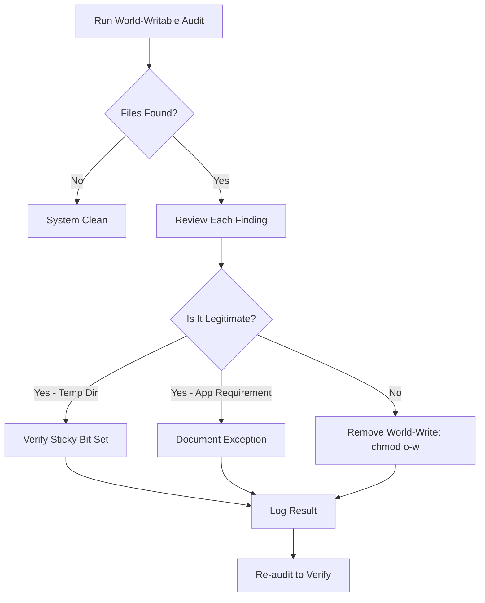

# How to Find and Remediate World-Writable Files on RHEL

Author: [nawazdhandala](https://www.github.com/nawazdhandala)

Tags: RHEL, World-Writable, File Permissions, Security, Linux

Description: Find and fix world-writable files and directories on RHEL to close a common security gap that allows any user to modify critical files.

---

World-writable files are files that any user on the system can modify. In most cases, this is a security problem. An attacker or a malicious local user can modify scripts, configurations, or shared libraries to escalate privileges or disrupt services. Finding and fixing these is a standard part of RHEL hardening.

## What Makes a File World-Writable

A file is world-writable when the "other" write bit is set in its permissions. In numeric notation, that is when the last digit includes 2 (e.g., 777, 666, 722):

```bash
# A world-writable file looks like this in ls -l
-rwxrwxrwx  1 root root  1024 Mar  4 10:00 dangerous-file.sh
#       ^ the w here means world-writable
```

## Finding World-Writable Files

```bash
# Find all world-writable files on local filesystems
sudo find / -xdev -type f -perm -0002 2>/dev/null

# Exclude known-safe locations
sudo find / -xdev -type f -perm -0002 \
    -not -path "/proc/*" \
    -not -path "/sys/*" \
    -not -path "/dev/*" \
    2>/dev/null
```

The `-xdev` flag prevents crossing filesystem boundaries, and `-perm -0002` matches files where the world-write bit is set.

## Finding World-Writable Directories

World-writable directories without the sticky bit are even more dangerous because anyone can rename or delete files in them:

```bash
# Find world-writable directories without sticky bit
sudo find / -xdev -type d \( -perm -0002 -a ! -perm -1000 \) 2>/dev/null
```

The sticky bit (`-perm -1000`) makes it safe for directories like `/tmp` - users can create files but only delete their own.

## Expected World-Writable Locations

Some directories are legitimately world-writable:

- `/tmp` - temporary files (should have sticky bit)
- `/var/tmp` - persistent temporary files (should have sticky bit)
- `/dev/shm` - shared memory (should have sticky bit)

Verify these have the sticky bit set:

```bash
# Check standard temp directories
ls -ld /tmp /var/tmp /dev/shm
# Should show 't' at the end: drwxrwxrwt
```

## Remediating World-Writable Files

For files that should not be world-writable:

```bash
# Remove the world-write bit
sudo chmod o-w /path/to/file

# Or set specific permissions
sudo chmod 644 /path/to/file
```

For bulk remediation:

```bash
# Remove world-write from all files found (be careful with this)
sudo find / -xdev -type f -perm -0002 \
    -not -path "/proc/*" \
    -not -path "/sys/*" \
    -not -path "/dev/*" \
    -exec chmod o-w {} \;
```

## Remediating World-Writable Directories

For directories, either remove the world-write bit or add the sticky bit:

```bash
# Add sticky bit to a world-writable directory
sudo chmod +t /path/to/directory

# Or remove world-write entirely
sudo chmod o-w /path/to/directory

# Fix all world-writable directories without sticky bit
sudo find / -xdev -type d \( -perm -0002 -a ! -perm -1000 \) \
    -exec chmod o-w {} \;
```

## Automated Audit Script

```bash
# Create an audit script for world-writable files
sudo tee /usr/local/sbin/audit-world-writable.sh << 'SCRIPT'
#!/bin/bash
# Audit world-writable files and directories

REPORT="/var/log/world-writable-audit-$(date +%Y%m%d).txt"

echo "World-Writable File Audit - $(date)" > "${REPORT}"
echo "=================================" >> "${REPORT}"

echo "" >> "${REPORT}"
echo "World-Writable Files:" >> "${REPORT}"
find / -xdev -type f -perm -0002 \
    -not -path "/proc/*" \
    -not -path "/sys/*" \
    -not -path "/dev/*" \
    2>/dev/null >> "${REPORT}"

echo "" >> "${REPORT}"
echo "World-Writable Directories Without Sticky Bit:" >> "${REPORT}"
find / -xdev -type d \( -perm -0002 -a ! -perm -1000 \) \
    2>/dev/null >> "${REPORT}"

# Count findings
FILE_COUNT=$(grep -c "^/" "${REPORT}" 2>/dev/null || echo 0)
echo "" >> "${REPORT}"
echo "Total findings: ${FILE_COUNT}" >> "${REPORT}"

if [ "${FILE_COUNT}" -gt 0 ]; then
    echo "WARNING: ${FILE_COUNT} world-writable items found. See ${REPORT}"
    exit 1
else
    echo "OK: No world-writable items found."
    exit 0
fi
SCRIPT

sudo chmod 700 /usr/local/sbin/audit-world-writable.sh
```

## Remediation Workflow



## Preventing World-Writable File Creation

Set a restrictive umask to prevent users from creating world-writable files:

```bash
# Check current umask
umask

# Set system-wide umask in /etc/profile.d
sudo tee /etc/profile.d/umask.sh << 'EOF'
# Set restrictive umask - no world permissions
umask 027
EOF
```

A umask of `027` means new files get `640` and new directories get `750`, preventing world access entirely.

## Monitoring for New World-Writable Files

Use auditd to watch for files being made world-writable:

```bash
# Add audit rule to watch for world-writable permission changes
sudo auditctl -a always,exit -F arch=b64 -S chmod,fchmod,fchmodat -F a1&0002 -k world-writable

# Make the rule persistent
echo '-a always,exit -F arch=b64 -S chmod,fchmod,fchmodat -F a1&0002 -k world-writable' | sudo tee -a /etc/audit/rules.d/world-writable.rules

# Restart auditd
sudo service auditd restart
```

Search the audit log for violations:

```bash
sudo ausearch -k world-writable --start today
```

World-writable file remediation is one of the quickest security wins on any RHEL system. Run the audit, fix the findings, set a proper umask, and monitor for drift.
