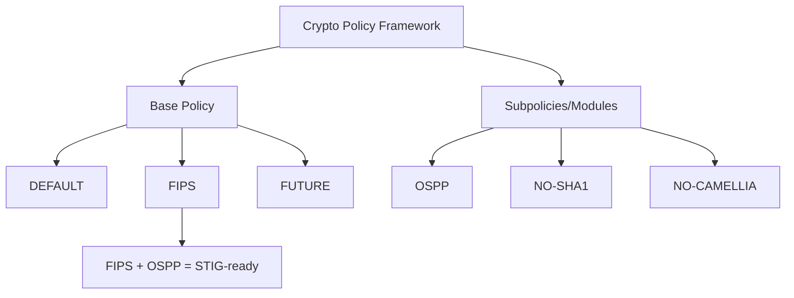

# How to Apply the FIPS:STIG Combined Cryptographic Policy on RHEL

Author: [nawazdhandala](https://www.github.com/nawazdhandala)

Tags: RHEL, FIPS, STIG, Crypto Policy, Linux

Description: Configure the combined FIPS and STIG cryptographic policy on RHEL to meet both FIPS 140-3 and DISA STIG requirements simultaneously.

---

RHEL introduced a system-wide cryptographic policy framework that makes it possible to apply a single policy across all crypto libraries at once. When you need to meet both FIPS and STIG requirements, the FIPS:OSPP subpolicy gives you the strictest configuration that satisfies both standards. This guide walks through how to apply it and what it changes.

## Understanding Crypto Policies on RHEL

RHEL ships with several predefined crypto policies:

```bash
# List available policies
ls /usr/share/crypto-policies/policies/

# The main policies:
# DEFAULT - Balanced security and compatibility
# LEGACY  - Maximum compatibility (less secure)
# FUTURE  - Forward-looking (more restrictive)
# FIPS    - FIPS 140-3 compliant
# EMPTY   - No restrictions (for building custom policies)

# List available subpolicies (modifiers)
ls /usr/share/crypto-policies/policies/modules/
```



## Apply the FIPS Policy

First, enable the base FIPS policy:

```bash
# Check current policy
update-crypto-policies --show

# Enable FIPS mode (this also sets the crypto policy to FIPS)
fips-mode-setup --enable

# Reboot is required
systemctl reboot

# Verify after reboot
update-crypto-policies --show
fips-mode-setup --check
```

## Apply the OSPP Subpolicy for STIG Compliance

The OSPP (Operating System Protection Profile) subpolicy adds restrictions required by STIG:

```bash
# Apply the FIPS policy with the OSPP subpolicy
update-crypto-policies --set FIPS:OSPP

# This takes effect immediately for new connections
# Existing connections use the old policy until restarted

# Verify the policy
update-crypto-policies --show
# Expected output: FIPS:OSPP
```

## What FIPS:OSPP Changes

The combined policy applies these additional restrictions over plain FIPS:

### SSH restrictions

```bash
# Check available SSH ciphers
ssh -Q cipher
# FIPS:OSPP restricts to: aes128-ctr, aes256-ctr, aes128-cbc, aes256-cbc,
# aes128-gcm@openssh.com, aes256-gcm@openssh.com

# Check available SSH MACs
ssh -Q mac
# Limited to: hmac-sha2-256, hmac-sha2-512

# Check available key exchange algorithms
ssh -Q kex
# Restricted to ECDH and DH with sufficient key sizes
```

### TLS restrictions

```bash
# Check available TLS protocols
openssl s_client -help 2>&1 | grep -E "tls|ssl"

# Only TLS 1.2 and 1.3 are available
# TLS 1.0 and 1.1 are disabled

# Check available cipher suites
openssl ciphers -v 'ALL' 2>/dev/null | wc -l
```

### Key size requirements

```bash
# RSA minimum key size: 2048 bits (3072 recommended)
# ECDSA: P-256, P-384, P-521
# DH: 2048 bits minimum

# Verify RSA key size requirements
openssl genpkey -algorithm RSA -pkeyopt rsa_keygen_bits:1024 2>&1
# Should fail - key too small for FIPS:OSPP
```

## Verify the Combined Policy

```bash
# Check what the policy looks like for each backend
ls /etc/crypto-policies/back-ends/

# View OpenSSL backend configuration
cat /etc/crypto-policies/back-ends/openssl.config

# View GnuTLS backend configuration
cat /etc/crypto-policies/back-ends/gnutls.config

# View NSS backend configuration
cat /etc/crypto-policies/back-ends/nss.config

# View Java backend configuration
cat /etc/crypto-policies/back-ends/java.config
```

## Create a Custom Subpolicy

If FIPS:OSPP is too restrictive or not restrictive enough, create a custom subpolicy:

```bash
# Create a custom subpolicy module
cat > /etc/crypto-policies/policies/modules/CUSTOM-STIG.pmod << 'EOF'
# Custom STIG subpolicy for our environment

# Disable specific ciphers
cipher = -CAMELLIA-128-CBC -CAMELLIA-256-CBC -CAMELLIA-128-CTR -CAMELLIA-256-CTR

# Set minimum RSA key size to 3072
min_rsa_size = 3072

# Set minimum DH parameter size
min_dh_size = 3072

# Disable CBC mode for SSH (use CTR and GCM only)
ssh_cipher = -AES-128-CBC -AES-256-CBC
EOF

# Apply the custom policy
update-crypto-policies --set FIPS:CUSTOM-STIG

# Verify
update-crypto-policies --show
```

## Test Applications with the New Policy

After applying the combined policy, test all your services:

```bash
# Test SSH connection
ssh -v user@remote-host 2>&1 | grep "kex:\|cipher:\|MAC:"

# Test HTTPS
curl -v https://your-web-app.example.com 2>&1 | grep "SSL connection"

# Test database connections
psql -h db.example.com -U user -c "SELECT 1;"

# Test LDAP
ldapsearch -x -H ldaps://ldap.example.com -b "dc=example,dc=com" 2>&1 | head -5
```

## Troubleshoot Policy Issues

```bash
# If a service fails after the policy change, check which algorithms it needs
strace -e trace=openat service-binary 2>&1 | grep crypto

# Compare available ciphers between policies
update-crypto-policies --set FIPS
openssl ciphers -v 'ALL' 2>/dev/null > /tmp/fips-ciphers.txt

update-crypto-policies --set FIPS:OSPP
openssl ciphers -v 'ALL' 2>/dev/null > /tmp/fips-ospp-ciphers.txt

diff /tmp/fips-ciphers.txt /tmp/fips-ospp-ciphers.txt
```

## Document the Policy for Auditors

```bash
# Generate a policy report
cat > /var/log/compliance/crypto-policy-report.txt << EOF
Crypto Policy Report
====================
Date: $(date)
Hostname: $(hostname)
RHEL Version: $(cat /etc/redhat-release)
Active Policy: $(update-crypto-policies --show)
FIPS Status: $(fips-mode-setup --check 2>&1)

SSH Ciphers:
$(ssh -Q cipher 2>/dev/null)

SSH MACs:
$(ssh -Q mac 2>/dev/null)

SSH KEX:
$(ssh -Q kex 2>/dev/null)

TLS Cipher Suites:
$(openssl ciphers -v 'ALL' 2>/dev/null)
EOF
```

## Revert If Needed

If the combined policy breaks something critical:

```bash
# Go back to plain FIPS
update-crypto-policies --set FIPS

# Or revert to DEFAULT (not recommended if FIPS is required)
# update-crypto-policies --set DEFAULT

# Restart affected services
systemctl restart sshd
```

The FIPS:OSPP policy on RHEL gives you a single command to apply both FIPS and STIG cryptographic requirements. It is the most straightforward way to handle crypto compliance, and the system-wide approach means you do not have to configure each application individually. Set it once, verify it works, and the crypto policy framework handles the rest.
