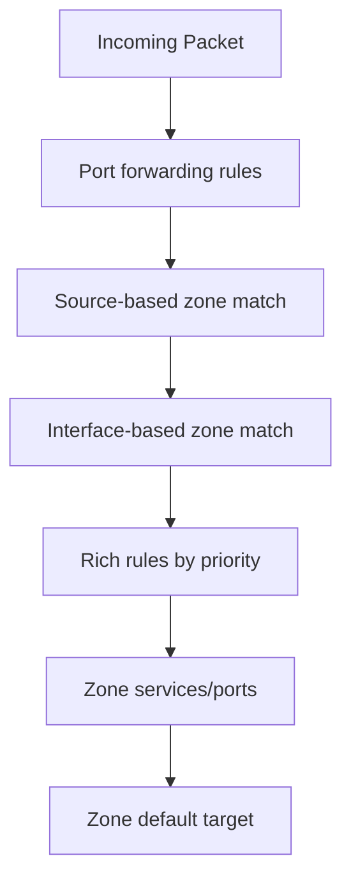

# How to Use Firewalld Rule Priorities to Control Traffic Flow on RHEL

Author: [nawazdhandala](https://www.github.com/nawazdhandala)

Tags: RHEL, Firewalld, Rule Priorities, Security, Linux

Description: Understanding and using firewalld rule priorities on RHEL to control the order in which rich rules are evaluated, enabling deny-before-allow and other complex patterns.

---

Firewalld processes rules in a specific order, and understanding that order is critical when you have conflicting rules. For example, if you allow HTTP for everyone but want to block a specific IP from accessing HTTP, the order matters. Firewalld rich rules support a priority system that lets you control evaluation order.

## Default Rule Processing Order

Firewalld evaluates rules in this order:



Within a zone, rules are processed as follows:
1. Rich rules with lower priority numbers (evaluated first)
2. Rich rules with higher priority numbers
3. Standard zone services and port rules
4. Zone default action (accept, reject, or drop)

## Rich Rule Priority

Rich rules support a `priority` attribute. The default priority is 0. Lower numbers are evaluated first, and the range is -32768 to 32767.

```bash
# High priority rule (evaluated first) - block a specific IP
firewall-cmd --zone=public --add-rich-rule='rule priority="-100" family="ipv4" source address="10.0.1.200" drop' --permanent

# Normal priority rule - allow SSH from a subnet
firewall-cmd --zone=public --add-rich-rule='rule family="ipv4" source address="10.0.1.0/24" service name="ssh" accept' --permanent

firewall-cmd --reload
```

In this example, traffic from 10.0.1.200 is dropped before the subnet allow rule is evaluated, even though 10.0.1.200 is part of 10.0.1.0/24.

## Deny-Before-Allow Pattern

A common security pattern is to deny specific sources before allowing broader access:

```bash
# Priority -200: Block known bad actors first
firewall-cmd --zone=public --add-rich-rule='rule priority="-200" family="ipv4" source address="203.0.113.0/24" drop' --permanent
firewall-cmd --zone=public --add-rich-rule='rule priority="-200" family="ipv4" source address="198.51.100.50" drop' --permanent

# Priority 0 (default): Allow web traffic from everyone else
firewall-cmd --zone=public --add-service=http --permanent
firewall-cmd --zone=public --add-service=https --permanent

firewall-cmd --reload
```

## Allow-Before-Deny Pattern

The reverse pattern: allow specific sources and deny everyone else:

```bash
# Priority -100: Allow specific IPs first
firewall-cmd --zone=public --add-rich-rule='rule priority="-100" family="ipv4" source address="10.0.1.0/24" service name="ssh" accept' --permanent
firewall-cmd --zone=public --add-rich-rule='rule priority="-100" family="ipv4" source address="10.0.2.5" service name="ssh" accept' --permanent

# Priority 100: Deny SSH from everyone else
firewall-cmd --zone=public --add-rich-rule='rule priority="100" family="ipv4" service name="ssh" drop' --permanent

# Remove the default SSH service to avoid confusion
firewall-cmd --zone=public --remove-service=ssh --permanent

firewall-cmd --reload
```

## Practical Example: Rate Limiting with Exceptions

Allow your monitoring server unlimited access while rate limiting everyone else:

```bash
# Priority -100: Monitoring server gets unlimited access
firewall-cmd --zone=public --add-rich-rule='rule priority="-100" family="ipv4" source address="10.0.2.10" accept' --permanent

# Priority 0: Rate limit SSH for everyone else
firewall-cmd --zone=public --add-rich-rule='rule service name="ssh" accept limit value="3/m"' --permanent

firewall-cmd --reload
```

## Viewing Rule Priorities

```bash
# List rich rules (they show in priority order)
firewall-cmd --zone=public --list-rich-rules

# Show full zone configuration
firewall-cmd --zone=public --list-all
```

## How Priorities Interact with Services

Standard services added with `--add-service` do not have a priority. They are evaluated after all rich rules. This means:

- A rich rule with priority 0 is evaluated before standard services
- A deny rich rule at any priority will override a standard service allow

```bash
# This service allows HTTP for everyone in the zone
firewall-cmd --zone=public --add-service=http --permanent

# This rich rule blocks HTTP from a specific IP, evaluated before the service
firewall-cmd --zone=public --add-rich-rule='rule priority="-1" family="ipv4" source address="10.0.1.99" service name="http" drop' --permanent

firewall-cmd --reload
```

## Debugging Rule Evaluation

When rules are not behaving as expected, check the underlying nftables rules:

```bash
# Show the nftables ruleset generated by firewalld
nft list ruleset

# Filter for a specific chain
nft list chain inet firewalld filter_IN_public
```

This shows the actual order rules are processed by the kernel.

## Common Priority Ranges

Here is a convention that works well for organizing rules:

| Priority Range | Purpose |
|---|---|
| -32768 to -1000 | Emergency blocks |
| -999 to -100 | Deny rules (block specific sources) |
| -99 to -1 | Allow exceptions (bypass rate limits, etc.) |
| 0 | Default (standard rich rules) |
| 1 to 99 | Conditional allows |
| 100 to 999 | Catch-all denies |
| 1000+ | Logging rules |

## Logging with Priority

Use logging rules at a lower priority to log before accept/deny:

```bash
# Priority -150: Log traffic from a suspicious subnet before deciding
firewall-cmd --zone=public --add-rich-rule='rule priority="-150" family="ipv4" source address="192.168.100.0/24" log prefix="SUSPECT: " level="warning" limit value="10/m"' --permanent

# Priority -100: Then drop it
firewall-cmd --zone=public --add-rich-rule='rule priority="-100" family="ipv4" source address="192.168.100.0/24" drop' --permanent

firewall-cmd --reload
```

Note: A log-only rule (without accept/drop/reject) just logs and then passes the packet to the next rule. This is how you log before taking action.

## Summary

Rule priorities give you precise control over firewalld's evaluation order. Use negative priorities for rules that should be checked first (blocks, exceptions), zero for standard rules, and positive priorities for catch-all denies or logging. The key pattern is: deny-before-allow for blocking specific sources, or allow-before-deny for whitelisting. Always verify with `nft list ruleset` if rules are not behaving as expected, and remember that standard services (added with `--add-service`) are evaluated after rich rules.
