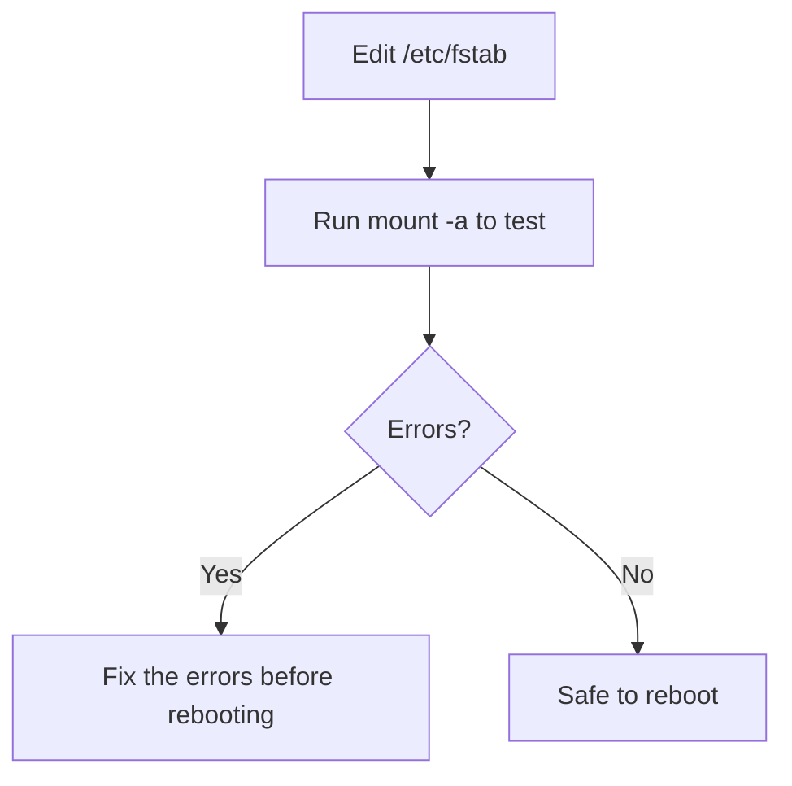

# How to Fix a Corrupt /etc/fstab That Prevents Booting on RHEL

Author: [nawazdhandala](https://www.github.com/nawazdhandala)

Tags: RHEL, Fstab, Boot, Recovery, Linux

Description: Learn how to recover a RHEL system that fails to boot due to a corrupt or misconfigured /etc/fstab, using emergency mode, rescue mode, and installation media.

---

## How a Bad fstab Breaks Your System

The `/etc/fstab` file tells the system which filesystems to mount at boot and how to mount them. If you add an entry for a device that does not exist, use a wrong UUID, specify a bad mount option, or introduce a syntax error, the system may fail to mount filesystems during boot and drop you into emergency mode, or worse, hang indefinitely.

Common fstab mistakes that cause boot failures:

- Wrong UUID after replacing a disk
- A removed NFS share that the system tries to mount at boot
- A typo in the filesystem type or mount options
- Missing `nofail` option on non-critical filesystems
- An entry pointing to a device that was removed or renamed

## Recognizing the Problem

When a bad fstab prevents booting, you will typically see one of these:

- The system drops to an emergency shell with a message about failed mount points
- The system hangs trying to mount a network filesystem
- You see `systemd` errors about `local-fs.target` failing

## Recovery Method 1: Emergency Mode

If the system drops to an emergency shell on its own, you are already in the right place.

```bash
# Remount root filesystem read-write
mount -o remount,rw /

# Edit fstab to fix the problem
vi /etc/fstab

# After fixing, test the changes
mount -a

# If mount -a succeeds, reboot
systemctl reboot
```

## Recovery Method 2: Boot into Emergency Mode from GRUB

If the system does not drop to emergency mode automatically:

1. Reboot and access the GRUB menu
2. Press `e` to edit the default entry
3. Add `systemd.unit=emergency.target` to the end of the `linux` line
4. Press `Ctrl+X` to boot

```bash
# Once in emergency mode
mount -o remount,rw /

# Check fstab for obvious problems
cat /etc/fstab

# Edit and fix
vi /etc/fstab
```

## Recovery Method 3: Installation Media Rescue

If you cannot access GRUB or emergency mode:

```bash
# Boot from RHEL installation media
# Select Troubleshooting > Rescue
# Let it mount the system under /mnt/sysimage

# Edit fstab in the mounted system
vi /mnt/sysimage/etc/fstab

# Save and reboot
reboot
```

## Common fstab Fixes

### Wrong UUID

```bash
# Find the correct UUIDs for your devices
blkid

# Compare with what is in fstab
cat /etc/fstab

# Update the UUID to match the actual device
vi /etc/fstab
```

### Missing Device

If fstab references a device that no longer exists (removed disk, detached storage):

```bash
# Comment out the offending line
# Change:
# UUID=abcd-1234  /data  xfs  defaults  0  0
# To:
# UUID=abcd-1234  /data  xfs  defaults  0  0  # DISABLED - device removed
```

Or add the `nofail` option so the system boots even if the device is missing:

```bash
# Add nofail option
UUID=abcd-1234  /data  xfs  defaults,nofail  0  0
```

### NFS Mount Hanging at Boot

If an NFS mount is causing the system to hang:

```bash
# Add nofail and timeout options to NFS entries
nfs-server:/share  /mnt/nfs  nfs  defaults,nofail,timeo=5,retrans=2,_netdev  0  0
```

The `_netdev` option tells systemd to wait for the network before trying to mount, and `nofail` prevents a boot failure if the NFS server is unreachable.

### Syntax Errors

A common syntax problem is missing fields or extra spaces. Each fstab line needs exactly six fields:

```bash
<device>  <mount-point>  <fs-type>  <options>  <dump>  <pass>
```

```bash
# Correct format example
/dev/mapper/rhel-root  /     xfs   defaults  0  0
UUID=abc-123           /boot xfs   defaults  0  0
/dev/mapper/rhel-swap  none  swap  defaults  0  0
```

## Preventing Future fstab Issues

### Always Test Before Rebooting

```bash
# After editing fstab, test it
sudo mount -a

# If mount -a returns no errors, the fstab is probably correct
echo $?  # Should be 0
```

### Use nofail for Non-Critical Mounts

```bash
# Any filesystem that is not critical for boot should use nofail
UUID=data-uuid  /data  xfs  defaults,nofail  0  0
```

### Use x-systemd.device-timeout for Removable Storage

```bash
# Set a timeout for devices that might not always be present
UUID=usb-uuid  /media/usb  ext4  defaults,nofail,x-systemd.device-timeout=10  0  0
```

### Keep a Backup

```bash
# Back up fstab before making changes
sudo cp /etc/fstab /etc/fstab.backup.$(date +%Y%m%d)
```



## Validating fstab Entries

```bash
# Check that all UUIDs in fstab match actual devices
while read -r line; do
    uuid=$(echo "$line" | grep -oP 'UUID=\K[^ ]+')
    if [ -n "$uuid" ]; then
        if ! blkid | grep -q "$uuid"; then
            echo "WARNING: UUID $uuid not found on any device"
        fi
    fi
done < /etc/fstab

# Check filesystem types match
findmnt --verify
```

The `findmnt --verify` command on RHEL checks fstab entries against actual device properties and reports mismatches.

## Wrapping Up

A bad fstab entry is one of the most common causes of boot failures, and also one of the easiest to fix once you know how. The recovery process is always: get to a shell (emergency mode, rescue mode, or installation media), remount root read-write, fix the fstab, and reboot. The best prevention is to always run `mount -a` after editing fstab and to use the `nofail` option on any filesystem that is not strictly required for the system to boot.
