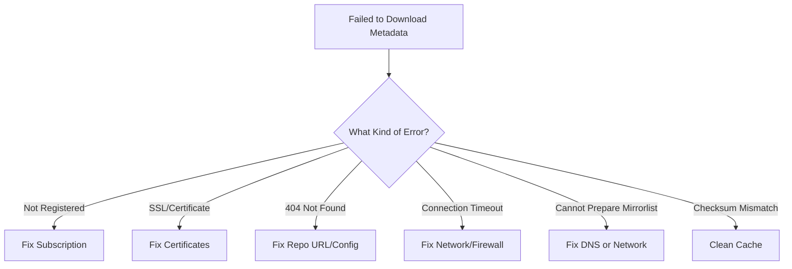

# How to Fix Failed to Download Metadata for Repo Errors on RHEL 9

Author: [nawazdhandala](https://www.github.com/nawazdhandala)

Tags: RHEL, DNF, Repository Errors, Troubleshooting, Linux

Description: A troubleshooting guide for fixing "Failed to download metadata for repo" errors on RHEL 9, covering subscription issues, certificate problems, DNS resolution, proxy settings, and cache corruption.

---

If you have worked with RHEL for any amount of time, you have seen this error:

```
Failed to download metadata for repo 'rhel-9-for-x86_64-baseos-rpms': Cannot prepare internal mirrorlist
```

Or one of its many variations. It is one of the most common errors on RHEL systems, and it can have a dozen different causes. I have debugged this error more times than I can count, so let me save you some time and walk through the most likely causes and fixes.

## Step 1: Identify the Exact Error

First, get more details about what is failing:

```bash
# Run a command that triggers the error and capture full output
sudo dnf repolist --verbose 2>&1
```

The error message usually tells you which repo is failing and gives a hint about why. Common variants include:

- "Cannot prepare internal mirrorlist" - usually a network or DNS issue
- "Yum/DNF repo error: Status code: 404" - repo URL is wrong or repo does not exist
- "SSL certificate problem" - certificate issues
- "This system is not registered" - subscription problem
- "Curl error: Connection timed out" - network connectivity issue



## Step 2: Check Subscription Status

This is the most common cause on RHEL systems. If the system is not registered or the subscription expired, you cannot access Red Hat repos.

```bash
# Check subscription status
sudo subscription-manager status

# Check system identity
sudo subscription-manager identity
```

If the system is not registered:

```bash
# Register the system
sudo subscription-manager register --username your-username --password your-password

# Attach a subscription
sudo subscription-manager attach --auto
```

If it is registered but showing issues:

```bash
# Refresh subscription data
sudo subscription-manager refresh

# Check that the expected repos are enabled
sudo subscription-manager repos --list-enabled
```

## Step 3: Check Certificate Issues

RHEL uses client certificates for repo authentication. If they are expired or missing, you get SSL errors.

```bash
# Check entitlement certificate expiration dates
sudo openssl x509 -in /etc/pki/entitlement/*.pem -noout -dates 2>/dev/null | head -10

# Check if entitlement certificates exist
ls -la /etc/pki/entitlement/

# Check the CA certificate
ls -la /etc/rhsm/ca/
```

If certificates are missing or expired:

```bash
# Remove old entitlement certificates
sudo rm -f /etc/pki/entitlement/*.pem

# Re-register to get fresh certificates
sudo subscription-manager unregister
sudo subscription-manager register --username your-username --password your-password
sudo subscription-manager attach --auto
```

If you are seeing SSL certificate verification errors for third-party repos:

```bash
# Check if the CA bundle is intact
ls -la /etc/pki/tls/certs/ca-bundle.crt

# Reinstall CA certificates if needed
sudo dnf reinstall ca-certificates
```

## Step 4: Check DNS Resolution

If the system cannot resolve Red Hat's CDN hostnames, you get the "cannot prepare internal mirrorlist" error.

```bash
# Test DNS resolution for Red Hat's CDN
dig cdn.redhat.com
nslookup cdn.redhat.com

# Test resolution for subscription management
dig subscription.rhsm.redhat.com
```

If DNS is not resolving:

```bash
# Check the DNS configuration
cat /etc/resolv.conf

# Test with a known DNS server
dig cdn.redhat.com @8.8.8.8
```

Fix your DNS configuration in `/etc/resolv.conf` or through NetworkManager:

```bash
# Add a DNS server via NetworkManager
sudo nmcli con mod "System eth0" ipv4.dns "8.8.8.8 8.8.4.4"
sudo nmcli con up "System eth0"
```

## Step 5: Check Network Connectivity

Make sure the system can actually reach Red Hat's servers.

```bash
# Test connectivity to Red Hat's CDN
curl -I https://cdn.redhat.com

# Test connectivity to subscription management
curl -I https://subscription.rhsm.redhat.com

# Check if port 443 is reachable
openssl s_client -connect cdn.redhat.com:443 -brief
```

If you are behind a firewall, make sure these destinations are allowed:
- `cdn.redhat.com` (port 443)
- `subscription.rhsm.redhat.com` (port 443)

```bash
# Check if there is a firewall blocking outbound connections
sudo firewall-cmd --list-all

# Quick connectivity test
curl -v --max-time 10 https://cdn.redhat.com 2>&1 | head -20
```

## Step 6: Check Proxy Settings

If your environment uses a proxy, both DNF and subscription-manager need to know about it.

### DNF Proxy Configuration

```bash
# Check current DNF proxy settings
grep proxy /etc/dnf/dnf.conf
```

Add proxy settings if needed:

```ini
[main]
proxy=http://proxy.example.com:3128
proxy_username=proxyuser
proxy_password=proxypass
```

### Subscription-Manager Proxy Configuration

```bash
# Check current subscription-manager proxy settings
sudo subscription-manager config --list | grep proxy

# Set proxy for subscription-manager
sudo subscription-manager config \
  --server.proxy_hostname=proxy.example.com \
  --server.proxy_port=3128 \
  --server.proxy_user=proxyuser \
  --server.proxy_password=proxypass
```

### Environment Variables

Some tools respect `http_proxy` and `https_proxy` environment variables:

```bash
# Set proxy environment variables
export http_proxy=http://proxy.example.com:3128
export https_proxy=http://proxy.example.com:3128
export no_proxy=localhost,127.0.0.1

# Test with the proxy
curl -I https://cdn.redhat.com
```

## Step 7: Clean and Rebuild the Cache

Corrupted cache files are a frequent cause, especially after network interruptions during metadata downloads.

```bash
# Clean all cached data
sudo dnf clean all

# Remove any leftover cache files manually
sudo rm -rf /var/cache/dnf/*

# Rebuild the cache
sudo dnf makecache
```

## Step 8: Check Repository Configuration

Sometimes the repo configuration itself is wrong, especially for custom or third-party repos.

```bash
# List all repo config files
ls /etc/yum.repos.d/

# Check the Red Hat generated repo file
cat /etc/yum.repos.d/redhat.repo | head -30
```

If the `redhat.repo` file is empty or missing:

```bash
# Regenerate it by refreshing subscriptions
sudo subscription-manager refresh
```

For custom repos, verify the URL is correct:

```bash
# Test the baseurl of a custom repo
curl -I https://repo.example.com/rhel9/repodata/repomd.xml
```

### Disabling a Broken Repo Temporarily

If you need to install packages immediately and one repo is broken:

```bash
# Disable the broken repo for this transaction
sudo dnf install httpd --disablerepo=broken-repo-id

# Or disable it permanently
sudo dnf config-manager --set-disabled broken-repo-id
```

## Step 9: Check the Release Lock

If you have locked the system to a specific minor release that no longer receives updates:

```bash
# Check if a release lock is set
sudo subscription-manager release --show

# Unset the release lock
sudo subscription-manager release --unset

# Clean cache after changing release
sudo dnf clean all
```

## Step 10: Check System Time

Certificate validation depends on correct system time. If your clock is way off, SSL certificates will appear invalid.

```bash
# Check current system time
timedatectl

# If the time is wrong, sync with NTP
sudo timedatectl set-ntp true
sudo systemctl restart chronyd

# Verify time sync
chronyc tracking
```

## The Full Troubleshooting Checklist

When you hit this error, work through these checks in order:

```bash
# 1. Check subscription status
sudo subscription-manager status

# 2. Clean the cache
sudo dnf clean all

# 3. Test DNS
dig cdn.redhat.com

# 4. Test connectivity
curl -I https://cdn.redhat.com

# 5. Check certificates
ls -la /etc/pki/entitlement/

# 6. Check proxy
grep proxy /etc/dnf/dnf.conf

# 7. Check system time
timedatectl

# 8. Check release lock
sudo subscription-manager release --show

# 9. Try refreshing subscription data
sudo subscription-manager refresh

# 10. Rebuild the cache
sudo dnf makecache
```

## Fixing the Error on Air-Gapped Systems

If your system has no internet access, you should not be pointing at Red Hat's CDN at all. You need a local mirror or Satellite server.

```bash
# Disable all Red Hat CDN repos
sudo subscription-manager repos --disable="*"

# Add your local repo
sudo vi /etc/yum.repos.d/local.repo
```

```ini
[local-baseos]
name=Local BaseOS Mirror
baseurl=http://mirror.internal.com/rhel9/baseos/
enabled=1
gpgcheck=1
gpgkey=file:///etc/pki/rpm-gpg/RPM-GPG-KEY-redhat-release

[local-appstream]
name=Local AppStream Mirror
baseurl=http://mirror.internal.com/rhel9/appstream/
enabled=1
gpgcheck=1
gpgkey=file:///etc/pki/rpm-gpg/RPM-GPG-KEY-redhat-release
```

## Summary

The "Failed to download metadata for repo" error has many possible causes, but the most common ones are subscription problems, DNS issues, and stale cache. Start with the basics - check your subscription, clean the cache, and verify network connectivity. Nine times out of ten, one of those three fixes will resolve it. For the remaining cases, dig into certificates, proxy settings, and repo configuration. Keep the troubleshooting checklist handy, and you will get through these errors quickly.
