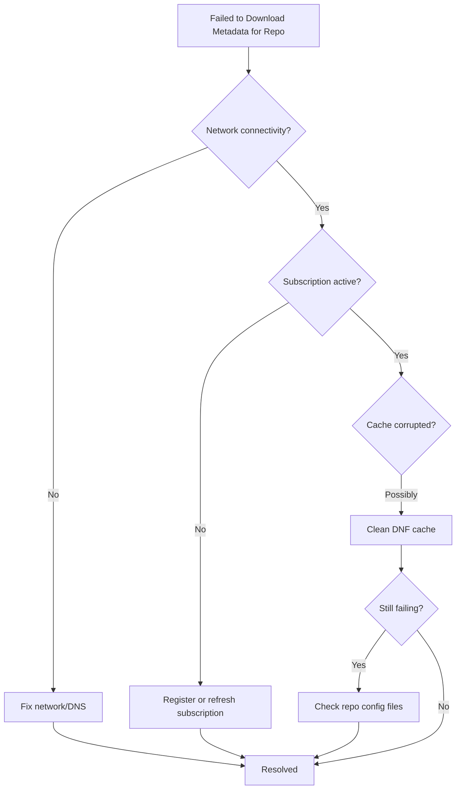

# How to Fix 'Failed to Download Metadata for Repo' Errors on RHEL

Author: [nawazdhandala](https://www.github.com/nawazdhandala)

Tags: RHEL, DNF, Repository, Troubleshooting, Package Management

Description: Resolve 'Failed to download metadata for repo' errors on RHEL by fixing subscription issues, cleaning caches, and repairing repository configurations.

---

When you run `dnf update` or install packages on RHEL, you might encounter the error "Failed to download metadata for repo." This error prevents package management operations and can be frustrating, but it usually points to a handful of common causes. This guide walks you through diagnosing and fixing the issue step by step.

## Common Causes

The error typically falls into one of these categories:



## Step 1: Check Network Connectivity

Before diving into repository configuration, verify that your system can reach the internet and resolve DNS:

```bash
# Test basic connectivity
ping -c 3 8.8.8.8

# Test DNS resolution
dig cdn.redhat.com +short

# Test HTTPS connectivity to Red Hat CDN
curl -I https://cdn.redhat.com
```

If DNS is not working, check your resolver configuration:

```bash
# View current DNS settings
cat /etc/resolv.conf

# If using NetworkManager, check the connection DNS
nmcli dev show | grep DNS
```

## Step 2: Verify Subscription Status

RHEL requires an active subscription to access Red Hat repositories. Check your subscription status:

```bash
# Check if the system is registered
sudo subscription-manager status

# View current subscriptions
sudo subscription-manager list --consumed

# Check repository list
sudo subscription-manager repos --list-enabled
```

If the system is not registered or the subscription has expired:

```bash
# Register the system
sudo subscription-manager register --username your-username --password your-password

# Auto-attach a subscription
sudo subscription-manager attach --auto

# Or attach a specific pool
sudo subscription-manager list --available
sudo subscription-manager attach --pool=POOL_ID_HERE
```

If the system was previously registered but certificates are stale:

```bash
# Refresh the subscription data
sudo subscription-manager refresh

# Regenerate identity certificates
sudo subscription-manager identity --force
```

## Step 3: Clean the DNF Cache

Corrupted or stale cache files are a very common cause of metadata download failures:

```bash
# Clean all cached data
sudo dnf clean all

# Remove the cache directory manually for a thorough cleanup
sudo rm -rf /var/cache/dnf/*

# Rebuild the cache
sudo dnf makecache
```

## Step 4: Check Repository Configuration Files

Examine your repository files for errors:

```bash
# List all repo files
ls -la /etc/yum.repos.d/

# Check the contents of each repo file
cat /etc/yum.repos.d/redhat.repo
```

Look for common issues in repo files:

- Malformed URLs (typos, missing protocol)
- Incorrect `gpgkey` paths
- `enabled=1` on repos that should be disabled
- Duplicate repository IDs

If you have third-party repos that are causing problems, you can temporarily disable them:

```bash
# Disable a specific problematic repo
sudo dnf config-manager --set-disabled problematic-repo-id

# Try the update again with only Red Hat repos
sudo dnf update
```

## Step 5: Check for SSL/TLS Certificate Issues

Sometimes the issue is related to SSL certificates, especially if your organization uses a proxy or content mirror:

```bash
# Test SSL connection to the repo URL
openssl s_client -connect cdn.redhat.com:443 -servername cdn.redhat.com < /dev/null 2>/dev/null | head -20

# Check if CA certificates are up to date
sudo dnf reinstall ca-certificates

# Update the CA trust store
sudo update-ca-trust
```

If your organization uses a custom CA for a local mirror, add it to the trust store:

```bash
# Copy the custom CA certificate
sudo cp custom-ca.pem /etc/pki/ca-trust/source/anchors/

# Update the trust store
sudo update-ca-trust extract
```

## Step 6: Check for Proxy Issues

If your system connects through a proxy, make sure DNF is configured correctly:

```bash
# Check current DNF proxy settings
grep proxy /etc/dnf/dnf.conf
```

Add or fix proxy settings in `/etc/dnf/dnf.conf`:

```ini
# /etc/dnf/dnf.conf
[main]
gpgcheck=1
installonly_limit=3
clean_requirements_on_remove=True
best=True
skip_if_unavailable=False
proxy=http://proxy.example.com:8080
proxy_username=proxyuser
proxy_password=proxypassword
```

Also set the proxy for subscription-manager:

```bash
# Configure proxy for subscription-manager
sudo subscription-manager config --server.proxy_hostname=proxy.example.com \
    --server.proxy_port=8080 \
    --server.proxy_user=proxyuser \
    --server.proxy_password=proxypassword
```

## Step 7: Reset Repository Configuration

If nothing else works, you can reset the repository configuration to its default state:

```bash
# Remove the current repo configuration
sudo rm /etc/yum.repos.d/redhat.repo

# Regenerate it from subscription-manager
sudo subscription-manager repos
```

For third-party repos, reinstall the release package:

```bash
# Example: reinstall the EPEL release package
sudo dnf reinstall epel-release
```

## Step 8: Enable Debug Logging

If the problem persists, enable verbose logging to get more details:

```bash
# Run DNF with debug verbosity
sudo dnf update -v --debuglevel=10 2>&1 | tee /tmp/dnf-debug.log
```

Review the log file for specific error messages that point to the root cause.

## Quick Troubleshooting Checklist

| Check | Command |
|-------|---------|
| Network connectivity | `ping -c 3 cdn.redhat.com` |
| Subscription status | `sudo subscription-manager status` |
| Clean DNF cache | `sudo dnf clean all` |
| Rebuild cache | `sudo dnf makecache` |
| List enabled repos | `sudo dnf repolist` |
| Check repo files | `ls /etc/yum.repos.d/` |
| SSL certificates | `sudo update-ca-trust` |
| Proxy configuration | `grep proxy /etc/dnf/dnf.conf` |

## Summary

The "Failed to download metadata for repo" error on RHEL is almost always caused by network issues, subscription problems, or corrupted cache data. By working through these steps in order, you can quickly isolate and fix the root cause. Start with the simplest fixes like cleaning the cache and checking network connectivity, then move on to subscription and SSL certificate issues if needed.
